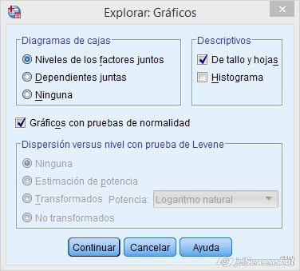
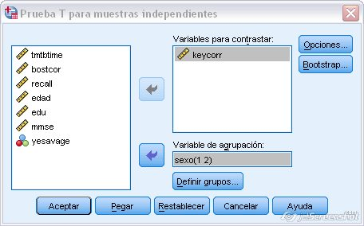

#  Introducción a los procedimientos de investigación en Psicología

El objetivo de toda investigación psicológica es la obtención de conocimiento *válido*. Para ello, es necesario que ese conocimiento se haya obtenido mediante un procedimiento *sistemático* que llamamos método *científico*. Precisamente, el origen de la Psicología como ciencia se encuentra en la utilización de un método diferente al filosófico para el estudio de la vida mental [@metodos1]. 

Aunque hay ocasiones en las que se ha señalado la existencia de distintos métodos de investigación en Psicología, conviene aclarar que compartimos la opinión de que la lógica de la investigación científica configura un único método de investigación, existiendo varias estrategias o procedimientos para alcanzar estos objetivos. Son varios los criterios utilizados para clasificar las distintas estrategias de investigación.[@metodos1]. Uno de los más relevantes es la existencia de manipulación o no de la variable independiente (VI). Mediante este criterio distinguimos entre los estudios ***manipulativos*** y los ***no manipulativos***. Dentro de los manipulativos incluimos los *diseños experimentales* y los *cuasiexperimentales*. Entre los no manipulativos distinguimos los *selectivos* (@ato2 los denomina *asociativos*) de los *observacionales*.

En este tema vamos a estudiar algunos diseños de investigación así como las técnicas estadísticas asociadas a los mismos. Realizaremos una clasificación de los diseños de investigación y posteriormente pasaremos a estudiar los conceptos básicos relacionados con la inferencia estadística.

## Lógica de la investigación científica

La investigación científica intenta resolver problemas mediante un procedimiento que parte de la formulación de una serie de hipótesis. Con objeto de contrastar dichas hipótesis, el investigador diseña un estudio en el que recogerá información que le permitirá tomar decisiones acerca de la validez de las mismas. 

La generación de problemas de la investigación científica no obedece a ninguna estrategia sistemática, sino que en muchos casos es el resultado de la casualidad o el azar. Sin embargo, generar problemas relevantes mejora cuando se dispone de un profundo conocimiento de la temática sobre la que se investiga. Aunque la inspiración no tiene reglas, resulta conveniente que se posea un buen conocimiento del campo de investigación con el que se podrá evaluar la idoneidad y relevancia del mismo. 

El diseño de investigación si tiene una sistemática bien consolidada. Consiste en un plan estructurado de acción que pretende realizar las *acciones comparativas* en condiciones de validez. Aunque existen muchos criterios de clasificación (estrategia, número de variables, grado de intervención, etc.), aquí vamos a centrarnos en el que consideramos más relevante y que se relaciona con el *tipo de estrategia* seguida por el investigador para realizar las acciones comparativas (medir la covariación o concomitancia entre dos fenómenos) en base a los objetivos de investigación. Se distinguen dos estrategias:


1. *Transversal*: Utiliza grupos diferentes para estudiar cada uno de los valores de la variable independiente. Supongamos que queremos conocer qué procedimiento es el mejor para conseguir reducir peso. Tenemos cuatro tratamientos (sin tratamiento, dieta, fármacos y dieta + ejercicio). Seleccionamos una muestra de individuos y asignamos aleatoriamente cada uno de ellos a uno de los tratamientos. A cada individuo se le pesa antes de comenzar el tratamiento y después de recibir el tratamiento. Comparamos la diferencia de peso en cada una de las cuatro condiciones.

2. *Longitudinal*: Utiliza un único grupo que recibe todos los valores de la variable independiente en momentos distintos. Supongamos que queremos estudiar cómo influye el paso del tiempo en el recuerdo. Para ello, se le pide a los individuos que lean una historia durante 15 minutos. Pasada una hora se les pide que escriban todo lo que recuerdan. Asimismo, se le vuelve a pedir que escriban todo lo que recuerdan al cabo de un día, al cabo de una semana y al cabo de un mes. 

Por lo general, estas dos estrategias suelen aparecer conjuntamente en muchos diseños de investigación.

##  Validez de las investigaciones

La validez de un estudio depende la naturaleza de las variables y sus definiciones, del diseño de investigación y de la técnica estadística utilizada.  

###  Validez de las variables y definiciones

En toda investigación científica se trabaja con conceptos que deben ser *operacionalizados* para que puedan ser medidos y presenten un significado unívoco. Los problemas de validez surgen cuando las operaciones realizadas no tienen nada que ver con el constructo estudiado o su vinculación es parcial.

Las variables pueden medirse mediante cuatro *escalas de medida* (nominal, ordinal, intervalo y razón). La elección del tipo de medida determinará el tipo de análisis de los datos. Hay ocasiones en las que se han utilizado los términos de *cualitativo* y *cuantitativo* para clasificar los distintos tipos de variables [@ato]. Dentro de las  variables cualitativas suelen diferenciarse las variables en función de que su escala de medida sea nominal u ordinal. Las variables cuantitativas se distinguen en función de que su dominio sea discreto o continuo. 

Otra clasificación frecuente en Psicología es la distinción entre *variable independiente* (VI) o *variable predictora* (VP), *variable dependiente* (VD) y *variables extrañas* (VE). En ocasiones se habla de  *variable criterio* en los contextos en los que no hay manipulación en el diseño de investigación. En estos estudios a la VD también se le denomina *variable de respuesta* (VR) y la VI como variable predictora.

###  Validez del diseño de investigación

Con el diseño tenemos que asegurarnos de que las variables extrañas están debidamente controladas (*validez interna*). Para ello, resulta conveniente utilizar técnicas de control tales como la manipulación de la VI, la aleatorización, el mantenimiento constante de dichas variables o el control estadístico. Asimismo, es importante considerar la generalización los resultados del estudio a otras situaciones. En este caso, estamos hablando de **validez externa**.


###  Validez  de conclusión estadística

La elección de la técnica estadística también influye en la validez de la investigación. Una técnica mal seleccionada puede llevarnos a sacar conclusiones inadecuadas. Afecta a la determinación de la existencia de covariación entre las variables y a su grado. El procedimiento para obtener conclusiones estadísticas es el *contraste de hipótesis*. Este procedimiento consiste en la toma de decisiones sobre dos hipótesis rivales y excluyentes en base a la probabilidad calculada de un estadístico. Más adelante se desarrollará este concepto para su completa comprensión.

Entre los errores que se cometen mediante la contrastación de hipótesis es el considerar que existe relación cuando no existe (*error tipo I* o riesgo $\alpha$), o considerar que no existe relación cuando la hay (*error tipo II* o riesgo $\beta$). Otro error posible es la sobre-estimación o infra-estimación de la relación. Posibles factores que pueden afectar a la conclusión estadística es la baja potencia y la violación de los supuestos. También es importante considerar la magnitud del efecto y la significación práctica y clínica de los resultados. 


###  Contraste de hipótesis estadísticas

Dentro de la inferencia estadística buscamos realizar *comparaciones* y establecer *relaciones* mediante la *estimación de parámetros* y el *contraste de hipótesis*. El primer procedimiento puede hacerse mediante la estimación *puntual* o por *intervalos*. En cambio, el contraste de hipótesis es la toma de decisiones acerca de si un conjunto de datos corrobora una hipótesis. Supone cubrir una serie de etapas: 

  + ***1) Formulación de las hipótesis:*** Se plantean la *hipótesis nula* ($H_0$) que considera que las variaciones existentes entre las condiciones se debe al azar y la *hipótesis alternativa* ($H_1$)  que niega la hipótesis nula y considera que las variaciones en una variable están relacionada con los cambios en la otra. Las hipótesis pueden ser *bidireccionales* (no conocemos el sentido de la relación como por ejemplo $\mu_1 = \mu_2$) o *unidireccionales* (el investigador plantea donde se encontrarán las diferencias como por ejemplo $\mu_1 \leq \mu_2$ ). 
  
  + ***2) Definición del estadístico de contraste:*** Su cálculo supone la realización de un estudio empírico en el que se ha extraído una muestra aleatoria de la población. Este estadístico debe tener una distribución de probabilidad conocida.
  
  + ***3) Regla de decisión:*** Se basa en la compatibilidad que existe entre la hipótesis nula y los datos empíricos [@pardo]. Permite determinar la probabilidad de que $H_0$ sea cierta en base a nuestros resultados. Para determinar el grado de apoyo de $H_0$ se divide a la distribución teórica en dos regiones (*región de confianza* y *región crítica*). La región de confianza es la zona de la distribución teórica en la que se acepta $H_0$. Existe consenso en considerar que esta región alcance el 95% de probabilidad. La región crítica es la zona complementaria a la región de confianza (por lo que cubre el 5% de la distribución) y si el estadístico pertenece a esa zona se rechaza $H_0$. Si la hipótesis es bilateral la región crítica estará a ambos lados de la distribución teórica. En cambio, si la hipótesis es unilateral la región de confianza estará situada en una de las colas de las distribución.


***Ejemplo 1.1:*** A continuación, se presentan los resultados de un estudio en el que se quiso comparar el aprendizaje de los niños dependiendo del tipo de método (*fonético* versus *global*). Cada niño sólo fue entrenado con un único método y se quería conocer ***si había diferencias significativas entre ambos métodos***. Nos estamos planteando una hipótesis ***bidireccional***: 


```{r,echo = F,warning=FALSE}
suppressMessages(require(tidyverse))
Fonetico <- c(6,6,3,4,2,5,7)
Global <- c(4,5,6,7,8,4,8)
ejemplo1<- data.frame(Fonetico,Global)
tab1<- knitr::kable(t(ejemplo1),booktabs = T,caption= "Datos del ejemplo 1.1")
#kableExtra::row_spec(tab1,0, bold= F)
#kableExtra::column_spec(tab1,0, bold= T)
```


+ $H_0$: No hay diferencias en el aprendizaje ($\mu_{F} = \mu_G$)
+ $H_1$: El aprendizaje es mejor con el método global ($\mu_{F} \neq \mu_G$)

Para contrastar esta hipótesis necesitamos un estadístico con distribución de probabilidad conocida. En este caso, es el estadístico *t* de Student:


$$
\bar{Y}_{\bar{Y}_{1} - \bar{Y}_{2}}= \bar{Y}_{1} - \bar{Y}_{2}
$$

$$
Var(\bar{Y}_{1} - \bar{Y}_{2}) = \sigma_{1}^{2}/n_{1} + \sigma_{2}^{2}/n_{2}
$$

$$
t = \frac{\bar{Y}_{\bar{Y}_{1} - \bar{Y}_{2}}}{Var(\bar{Y}_{1} - \bar{Y}_{2})} \sim t(n-2)
$$
En nuestro ejemplo, el valor del estadístico *t* puede obtenerse con el programa R:


```{r,echo = F,  message=FALSE}
rendimiento <- c(2,5,4,4,2,5,7,4,5,6,7,8,7,8)
metodo <- gl(2,7)
```


```{r,echo= F,results='markup',message=FALSE,tidy = T,tidy.opts=list(width.cutoff=50)}

a<-t.test (rendimiento~metodo,var.equal = T)
a

```

\noindent Encontramos que el valor de estadístico *t* vale `r round(a$statistic,3)` y su valor de probabilidad es `r round(a$p.value,3)`. En base a estos resultados podemos rechazar $H_0$. Esto significa que el estadístico *t* se aleja bastante de la predicción establecida mediante la hipótesis nula. Es decir, existe muy poca compatibilidad entre nuestros datos y $H_0$.

Para aceptar estos resultados debemos confirmar que se cumplen los supuestos de la prueba (normalidad de las muestras y homogeneidad de las  varianzas [^1.1]):


```{r echo =F,message=FALSE}
library(car)
# Normalidad para el grupo Fonético:
shapiro.test(rendimiento[1:7])
# Normalidad para el grupo Fonético:
shapiro.test(rendimiento[8:14])
leveneTest(rendimiento~metodo)
```

[^1.1]: En este caso no es necesario calcular la normalidad de los errores, ya que si las muestras son normales también serán normales los errores. Esto se verá con más claridad en el próximo tema.


***Ejemplo 1.2:*** A continuación, se presentan los resultados de un estudio en el que se quiso comparar el aprendizaje de los niños dependiendo del tipo de método (*fonético* versus *global*). Cada niño sólo fue entrenado con un único método y se esperaba  encontrar un mayor rendimiento con el método global. Aquí nos planteamos una hipótesis ***unidireccional***:


```{r,echo = F,warning=FALSE}
tab1
```


+ $H_0$: No hay diferencias en el aprendizaje ($\mu_{F} \geq \mu_G$)
+ $H_1$: El aprendizaje es mejor con el método global ($\mu_{F} < \mu_G$)

Para contrastar esta hipótesis necesitamos un estadístico con distribución de probabilidad conocida. En este caso, el estadístico es el mismo y tiene el mismo valor. Sólo cambia su probabilidad:


```{r,echo= F,results = 'markup',tidy = T,tidy.opts=list(width.cutoff=50)}

a<-t.test(rendimiento~metodo,var.equal = T,alternative ='less')
a
```


***Ejemplo 1.3:*** Con los mismos datos del ejemplo anterior supongamos que el investigador está interesado en conocer si  la media del rendimiento en la población de los estudiantes es 6. Para ello formula las siguientes hipótesis:

+ $H_0$: $\mu_{rendimiento}$ = 6 
+ $H_1$: $\mu_{rendimiento} \neq$ 6 

Como no conocemos el sentido de la dirección asumimos que la hipótesis es bilateral. Para contrastar esta hipótesis necesitamos conocer si la distribución de la variable sigue una ley normal. En caso de que se cumpla esta hipótesis realizaremos el contraste con la prueba *t* para una muestra. Si no se cumple, usaremos la *prueba de Wilcoxon para una muestra*. El estadístico de Shapiro-Wilks indica que se cumple la normalidad de la variable por lo que usamos la prueba *t*.


```{r}
shapiro.test(rendimiento)
t.test(rendimiento)
```

Rechazamos la hipótesis de que el valor medio de la variable rendimiento es 6 en la población.

***Ejemplo 1.4:*** Supongamos que construimos un examen para evaluar los conocimientos de los estudiantes de Psicología en la materia de **Diseño y Análisis de Datos II**. El examen tendrá 10 preguntas con 3 opciones de respuesta y solo una correcta. Queremos conocer cuántas preguntas debe responder correctamente el alumno para estar seguros de que domina la materia y de que no ha respondido por azar. Las hipótesis en este contraste estadístico serán:

+ $H_0$: El alumno no sabe por lo que responde al azar ($\pi_{acierto} \leq$ `r round(1/3,3)`)
+ $H_1$: El alumno sabe. No responde al azar ($\pi_{acierto} >$ `r round(1/3,3)`)

\noindent Ahora necesitamos determinar cuántas preguntas suponen responder por azar. Está claro si el alumno acierta sólo 1 pregunta la probabilidad de que haya respondido por azar 0 ó 1 es muy alta. En la siguiente figura se aprecia que los  valores más probables están comprendidos entre 2 y 4:


```{r, echo=FALSE,fig.cap = "Distribución binomial",warning=FALSE,message=FALSE}
hist.binom <- function(n, p, ...)
{
  # plots a relative frequency histogram of the binomial distribution
  k <- 0:n
  p <- dbinom(k, n, p)
  names(p) <- as.character(0:n)
  barplot(p,space=0, main = "Distribución binomial (n = 10, p = 1/3)", xlabel =
            'Aciertos', ylabel = 'Probabilidad')
}

hist.binom(10,1/3)
```


```{r,resuts = 'markup',warning=FALSE,message=FALSE}
# Probabilidad igual a 2:
dbinom(2,10,1/3)
# Probabilidad igual a 3:
dbinom(3,10,1/3)
# Probabilidad igual a 4:
dbinom(4,10,1/3)
```

\noindent Por tanto, necesitamos encontrar el número de preguntas acertadas que tengan una probabilidad de ser acertadas por azar $\leq$ 0,05. Esto se consigue con 6 preguntas acertadas. Con 5 preguntas acertadas estaríamos por encima del nivel de riesgo establecido por convención del 5%:

```{r,results = 'asis',warning=FALSE,message=FALSE}
# Probabilidad menor o igual a 6:
pbinom(6,10,1/3)
# Probabilidad de la región crítica con 6 preguntas:
1 - pbinom(6,10,1/3)
# Probabilidad de la región crítica con 5 preguntas:
1 - pbinom(5,10,1/3)
```

\noindent No obstante, el criterio de 0,05 es un criterio establecido arbitrariamente y que supone la ausencia de factores contaminantes que estarían actuando en la situación real de examen y que podrían afectar al resultado del examen. Un profesor algo más exigente podría considerar la necesidad de aprobar acertando 7 preguntas. En este caso, la probabilidad de que un estudiante acertara por azar sería:


```{r,results = 'asis',warning=FALSE,message=FALSE}
# Probabilidad menor o igual a 7:
pbinom(7,10,1/3)
# Probabilidad de la región crítica con 7 preguntas:
1 - pbinom(7,10,1/3)
```

##  Potencia de un contraste

Dado que él área de una distribución teórica vale 1 sabemos que 1 - $\alpha$ es la probabilidad asociada a la región de confianza. O lo que es lo mismo, la probabilidad de aceptar $H_0$ cuando es cierta. Del mismo modo, 1 - $\beta$ es la probabilidad de rechazar $H_0$ cuando es falsa. A esta probabilidad se le llama **potencia de la prueba**. 


```{r, echo=FALSE,fig.cap= "Errores en la inferencia estadística",out.width="60%",warning=FALSE,message=FALSE,fig.align='center'}

```


@pardo consideran que la potencia de un contraste hace referencia "a la sensibilidad del contraste para detectar como falsa una hipótesis nula que realmente lo es. Cuanto mayor es la potencia, mayor es la de que una hipótesis nula falsa sea reconocida como tal. Si la potencia es baja, también será baja la probabilidad de detectar un efecto."

La potencia de la prueba depende del nivel de riesgo $\alpha$, del error típico de la distribución teórica y del valor real de $H_1$. Puede aumentarse modificando cualquiera de los tres factores mencionados, pero una forma sencilla de aumentarla es incrementando el tamaño de la muestra. Asimismo, mejorar el diseño del estudio o utilizar medidas con mayor fiabilidad y  validez también son estrategias posibles para mejorar la potencia estadística del contraste.

##  Tamaño del efecto

Hemos visto anteriormente que para determinar la potencia de la prueba un elemento necesario es fijar el valor real de $H_1$. Como este valor no se conoce *a priori* debemos determinarlo. Pues bien, la distancia del valor del estadístico entre $H_0$ y el valor real de $H_1$ es lo que se denomina ***tamaño del efecto***. Cuando se realizan comparaciones entre variables el tamaño del efecto hace referencia a la magnitud de la diferencia, mientras que cuando se estudian relaciones el tamaño del efecto se refiere a la intensidad de la relación.

Dado que la potencia de un contraste depende del tamaño muestral podemos encontrar diferencias de medias muy pequeñas que sean significativas. Bastará con tener un tamaño de muestra suficientemente grande. Por tanto, la significación estadística permite contrastar hipótesis, pero no es un buen indicador de la ***relevancia*** de la relación.

Existen una gran variedad de medidas del tamaño del efecto. @pardo consideran que todas ellas pueden clasificarse en dos grandes tipos: 1) basadas en la *estandarización de la diferencia* entre las medias y 2) las basadas en la *proporción de varianza explicada*. En los siguientes temas se estudiarán algunos de ellos.


## Contrastes de hipótesis en los programas estadísticos

### Contrastes para 1 variable

El árbol de decisión para estos contrastes es el siguiente:

```{r, echo=FALSE,fig.cap= "Contrastes para 1 variable",out.height="250px",warning=FALSE,message=FALSE}

```


####  Prueba t para 1 muestra mediante el programa JAMOVI

Se selecciona el módulo de *"Pruebas T" y marcamos la opción *"Prueba T para una muestra". En la ventana de la prueba T para una muestra aparece por defecto seleccionada la prueba T y marcando la opción de *"Comprobación de supuestos"* puede obtenerse el resultado de la prueba de normalidad. Para realizar el análisis es necesario indicar el valor de prueba en la sección de *"Hipótesis"* (en nuestro ejemplo se ha introducido  el valor de 47). Por defecto, aparece marcada la opción del contraste bilateral aunque existen opciones para estudiar los contrastes unilaterales. Asimismo, tendríamos que marcar la opción de *"Rangos de Wilcoxon"* en el caso de que no se acepte la hipótesis de normalidad. 


```{r, echo=FALSE,fig.cap= "Prueba t para una muestra en JAMOVI",out.width="60%",warning=FALSE,message=FALSE}

```


```{r, echo=FALSE,fig.cap= "Prueba t para una muestra en JAMOVI",out.width="60%",warning=FALSE,message=FALSE}

```


####  Prueba t para 1 muestra en el programa SPSS


##### Prueba de normalidad de Shapiro-Wilk


Para determinar la normalidad será necesario aplicar la prueba de Shapiro-Wilks. En el programa SPSS se hace marcando *Analizar + Explorar + Gráficos + Gráficos con pruebas de normalidad*. Los resultados obtenidos pueden observarse en las siguientes imágenes.


```{r, echo=FALSE,fig.cap= "Prueba de normalidad Shapiro-Wilks en el programa SPSS",out.width="70%"}

```


```{r, echo=FALSE,fig.cap= "Prueba de normalidad en SPSS",out.width="300px"}

```

\newpage

```{r, echo=FALSE,fig.cap= "Prueba de normalidad en SPSS",out.width="200px"}

```


```{r, echo=FALSE,fig.cap= "Resultados de la prueba de normalidad",out.width="300px"}
knitr::include_graphics("figurasR/shapiro4b.png")
```


La prueba t para 1 muestra se realiza marcando *Analizar + Comparar medias + Prueba T para una muestra*: 


```{r, echo=FALSE,fig.cap= "Prueba t para una muestra en el programa SPSS",out.width="250px"}

```


```{r, echo=FALSE,fig.cap= "Prueba t para una muestra en el programa SPSS",out.width="300px"}

```


\noindent Será necesario introducir la VD a estudiar en el cuadro de "Variable a contrastar". El valor del contraste es cero por defecto, pero habrá que introducir el valor de la hipótesis a contrastar.

#####  Prueba de Wilcoxon para una muestra

Necesitamos marcar *Analizar + Pruebas no paramétricas + Cuadro de diálogos antiguos + 2 muestras relacionadas*. Observamos que el programa SPSS nos pide introducir dos variables, ya que esta prueba está diseñada para estudiar la relación entre dos variables. Sin embargo, puede utilizarse introduciendo la variable en cuestión y como segunda variable una nueva que hemos creado con el valor de contraste de nuestras hipótesis (en la figura aparece con el nombre de Mdn):


```{r, echo=FALSE,fig.cap= "Prueba de Wilcoxon en el SPSS",out.width="250px"}

```


```{r, echo=FALSE,fig.cap= "Prueba de Wilcoxon en el SPSS",out.width="300px"}

```


###  Contrastes para 1 VI cualitativa y una VD cuantitativa


El árbol de decisión para los diseños en los que solo hay 1 medida por sujeto (muestras independientes) es:


```{r, echo=FALSE,fig.cap= "Técnicas para dos muestras independientes"}
knitr::include_graphics("figurasR/esquemabicondicionales.jpg")
```


#### Prueba t para muestras independientes en JAMOVI

Se selecciona la opción de muestras independientes en el modulo de *"Pruebas T"*. Se introduce la variable dependiente (cuantitativa) en el cuadro de *"Variables dependientes"* y la variable cualitativa en el cuadro de *"Variable de agrupación"*. Se seleccionan las opciones para comprobar los supuestos de la prueba y se elige la prueba (T de student, T de Welch o U de Mann-Whitney), dependiendo de los supuestos que se cumplan.


```{r, echo=FALSE,fig.cap= "Prueba t para muestras independientes en JAMOVI",out.width="70%"}

```


####  Prueba t para muestras independientes en SPSS

Se realiza marcando *Analizar + Comparar medias + Prueba T para muestras independientes*: 


```{r, echo=FALSE,fig.cap= "Prueba t para muestras independientes en SPSS",out.width="60%"}

```


```{r, echo=FALSE,fig.cap= "Prueba t para muestras independientes en SPSS",out.width="70%"}

```


#### Prueba U de Mann-Whitney para muestras independientes en SPSS

Se obtiene marcando *Analizar + Pruebas no paramétricas + Cuadro de diálogos antiguos + 2 muestras independientes*.


```{r, echo=FALSE,fig.cap= "Prueba U para muestras independientes en SPSS",out.width="70%"}

```


```{r, echo=FALSE,fig.cap= "Prueba U para muestras independientes en SPSS",out.width="70%"}

```


### Pruebas para muestras relacionadas (2 medidas por unidad de observación)


El árbol de decisión para este apartado es el siguiente:


```{r, echo=FALSE,fig.cap= "Pruebas para dos muestras relacionadas"}

```


La variable sobre la que se realiza el contraste es la diferencia entre las medidas de los dos momentos. Por tanto, el análisis de estos diseños se convierte en el análisis sobre 1 muestra que ya se ha estudiado anteriormente.

#### Prueba t para muestras relacionadas en el programa JAMOVI

Se selecciona la opción de *"Muestras Apareadas"* en el modulo de *"Pruebas T"*. Se introduce las dos variables dependientes (cuantitativas) en el cuadro de *"Variables Apareadas". Se selecciona la opción para "Comprobación de supuestos" de la prueba y se elige la prueba (T de student o W de Wilcoxon), dependiendo de que se cumpla el supuesto de normalidad. Estos resultados son los mismos que si se hubieran calculado la diferencia entre las dos medidas y se hubiera aplicado la prueba T para una muestra.


```{r, echo=FALSE,fig.cap= "Prueba t para muestras relacionadas en JAMOVI",out.width="70%"}

```


#### Prueba t para muestras relacionadas en el programa SPSS

Se realiza marcando *Analizar + Comparar medias + Prueba T para muestras relacionadas*:


```{r, echo=FALSE,fig.cap= "Prueba t para muestras relacionadas en SPSS",out.width="50%"}

```


```{r, echo=FALSE,fig.cap= "Prueba t para muestras relacionadas en SPSS",out.width="70%"}

```


##### Prueba de Wilcoxon para 2 muestras relacionadas

Necesitamos marcar *Analizar + Pruebas no paramétricas + Cuadro de diálogos antiguos + 2 muestras relacionadas*.


```{r, echo=FALSE,fig.cap= "Prueba de Wilcoxon para muestras relacionadas en SPSS",out.width="70%"}

```


```{r, echo=FALSE,fig.cap= "Prueba de Wilcoxon para muestras relacionadas en SPSS",out.width="70%"}

```


