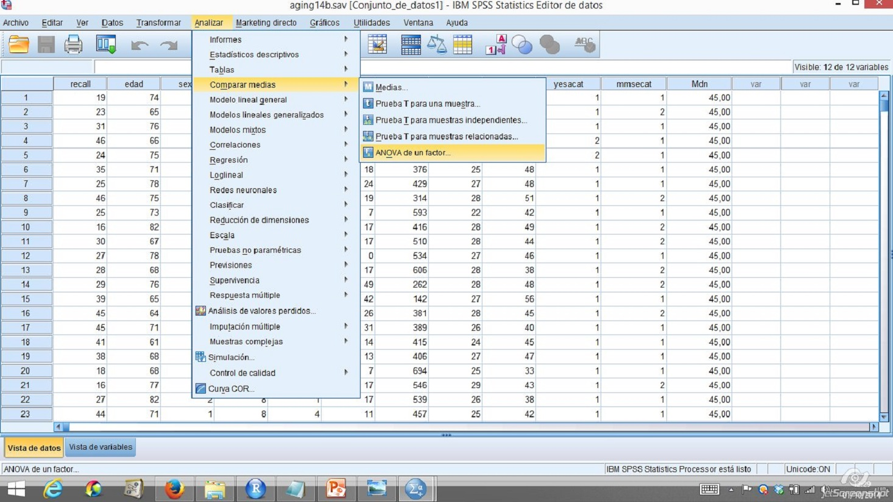

# Relación entre una variable cualitativa y otra cuantitativa (I): Diseños transversales


El objetivo de este tema es introducir las técnicas de análisis de los diseños que estudian las relaciones entre una variable independiente (VI) cualitativa y una variable dependiente (VD) cuantitativa mediante la comparación de grupos. En el caso más sencillo tendremos un *factor* (variable cualitativa) con dos valores (*niveles* o *condiciones*). Esto se traduce en la creación de dos grupos. A uno de ellos se le denomina *grupo control* y al otro *grupo experimental*. @ato2 distinguen dos tipos de factores: 1) *de tratamiento*: son valores que asigna el investigador a los grupos y 2) *de clasificación:* cuando la administración no está controlada por el investigador (p.ej., el género).

En este tipo de estudios se pretende buscar diferencias entre las distintas condiciones (valores de la VI). Establecer estas diferencias puede hacerse de muchas formas. Por ejemplo, en el caso del estudio de la dieta, podemos preguntarnos por el número de individuos que bajaron de peso o por el promedio de pérdida de peso en el grupo. Dependiendo de la medida que utilicemos, las técnicas estadísticas serán distintas.

Asimismo, no todas las diferencias van a ser importantes. Por ejemplo, si encontramos que el grupo de dieta mostró una diferencia media de 10 gramos con el grupo que no recibió tratamiento podemos considerar que no es una diferencia relevante. Determinar si una diferencia será significativa o no será misión de la técnica estadística utilizada.

Por último, las diferencias que encontremos pueden ser de tipo exploratorio (p. ejemplo, cuando se establecen relaciones de covariación sin pretensión de causalidad al no poder garantizarse la eliminación de explicaciones alternativas mediante el control de VVEE), o de tipo explicativo donde la covariación entre la VI y la VD se ha establecido en un contexto en el que se han utilizado procedimientos de control de VVEE para eliminar hipótesis rivales.

En este tipo de diseños pueden utilizarse diversas técnicas de control que van desde el *mantenimiento constante de la VE*, la *eliminación*, la equiparación de valores mediante el método de *bloqueo* y/o el *control estadístico*. @ato2 consideran que la tradición skinneriana basada en estudios de laboratorio con un gran control de las condiciones ambientales usa fundamentalmente la eliminación y el mantenimiento constante como formas de control. Por el contrario, en otras áreas de la Psicología, es más frecuente el uso del control estadístico y, en particular, de la *aleatorización* dentro del contexto denominado *experimento aleatorio*. Aplicado a este tipo de diseños el experimento aleatorio en su forma más pura consiste en seleccionar aleatoriamente los valores de la VI y asignar aleatoriamente los participantes a las distintas condiciones del estudio. Con ello, se espera que el azar neutralice cualquier VE presente en el estudio. En otros casos, la aleatorización no será completa y se restringirá en algún modo.

## Criterios de selección de la técnica estadística

En la siguiente figura aparece el árbol de decisión para elegir la técnica estadística adecuada cuando el diseño es transversal:


```{r, echo=FALSE,fig.cap= "Clasificación de las técnicas de análisis",out.width="70%"}

```


Como puede observarse en el diagrama son dos criterios los que nos permiten determinar la técnica estadística adecuada. En primer lugar, será necesario determinar si las muestras de los distintos grupos proceden de una distribución normal. Para ello, puede  utilizarse la prueba de *Shapiro-Wilks*. Si no existe evidencia de que las muestras estudiadas procedan de una población normal o que la distribución de los errores es normal se utilizará la técnica de *Kruskal-Wallis*.

En el caso de que haya información suficiente para asumir el supuesto de normalidad será necesario determinar si las varianzas de los grupos son homogéneas o no. Para ello, puede utilizarse la *prueba de Levene*. En el caso de que no se cumpla este supuesto se utilizará la prueba de *Brown-Forsythe* [^2.1]. Si los  datos de nuestro estudio cumplen todos los supuestos utilizaremos la  técnica de *Anova de 1 factor completamente aleatorizado*.

[^2.1]: Otra posibilidad es utilizar la técnica de Welch.

## ANOVA de 1 factor completamente aleatorizado

Se asume el supuesto de que los distintos grupos representan muestras aleatorias que proceden de poblaciones normales con igual media y varianza y que los errores siguen una distribución normal. La formulación del modelo estadístico es:


$$
Y_{ij} = \mu_{i} + \epsilon_i
$$

\noindent donde $Y_{ij}$ es la variable dependiente para el sujeto *i* del grupo *j* y  $\mu_{i}$ es el valor esperado (la media). El último elemento del modelo $\epsilon_{ij}$ es el llamado error o término residual.

Como en todo contraste estadístico, se plantean dos hipótesis, $H_0$ o hipótesis nula y $H_1$, hipótesis alternativa. En este modelo se definen de la siguiente forma:

\begin{itemize}
\item $H_{0}$: $\mu_{1} = \mu_{2} = \cdots \mu_{j}$ (todas las medias son iguales)
\item $H_{1}$: $\mu_{i} \neq \mu_{j}$ (i $\neq$ j) (no todas las medias son iguales)
\end{itemize}

El contraste compara las diferencias entre medias muestrales con la variabilidad experimental para decidir si ésta ha podido generar esas diferencias o no. Tanto la diferencia entre las medias (MCA) como la variabilidad experimental (varianza intrasujeto ó MCE) son dos formas de estimar la varianza poblacional. Bajo el supuesto de hipótesis nula, ambas varianzas deben ser iguales.

La comparación de ambas varianzas sigue una distribución de probabilidad (distribución F) que permite realizar el contraste estadístico:

$$
F = \frac{MC_{A}}{MC_{E}} \sim F(gl_{MC_{A}},gl_{MC_{E}})
$$

Se rechaza $H_{0}$ si el estadístico F cae dentro de la región crítica; en caso contrario, se mantiene. Si se rechaza esta hipótesis se concluye que no todas las medias son iguales.

*Ejemplo 2.1 :* A continuación, se presentan los datos de un estudio en el que se quiso comparar los resultados en una prueba de atención de tres grupos de 5 niños (A = sanos, B = con tumor astrocitoma y C = con tumor meduloblastoma)

```{r Ej1,echo=FALSE, results="asis"}
aciertos = c(30,35,15,21,24,16,5,22,23,22,10,7,15,6,12)
grupo = factor(c(1,1,1,1,1,2,2,2,2,2,3,3,3,3,3),
labels= c("A","B","C"))
metodo2 = c(1,1,1,1,1,2,2,2,2,2,3,3,3,3,3)
a= matrix(aciertos,5,3,dimnames= list(c("s1","s2","s3","s4","s5"),c("A","B","C")))
dat<- data.frame(aciertos,grupo)
#write.csv2(dat, file="ejemploanova1F2.csv")
#library(xtable)
# a=xtable(a,caption="Datos del ejemplo 2.1")
# print(a,comment = F)
knitr::kable(a,caption ="Datos del ejemplo 2.1")
```


```{r,echo = FALSE,fig.cap = 'Boxplot de los resultados del ejemplo 2.1',fig.align='center'}
plot(aciertos~grupo, col=c("green","red","orange"),horizontal=T,
main="Figura ejemplo 1" ,xlab="Grupos",ylab= "Aciertos")
```


```{r, anova1F, echo = F,results = 'asis'}
b <- anova(lm(aciertos~grupo)) 
library(xtable)
# b=xtable(b,caption="Resultados del ejemplo 2.1")
# print(b,comment = F)
knitr::kable(b,caption ="Resultados del ejemplo 2.1")

```

Los resultados de aplicar el modelo estadístico permiten rechazar la hipótesis nula de que no hay diferencias entre los grupos. Pueden obtenerse los valores de los parámetros que aparecen en el modelo:

$$
Y_{ij} = \mu_{i} + \epsilon_i
$$

$Y_{ij}$ es cada una de las puntuaciones. Así, por ejemplo, $Y_{1A}$ será el valor del sujeto 1 en el grupo de los sanos $Y_{1A}$ = 30. Asimismo, $Y_{1B}$ será la puntuación del primer sujeto del grupo astrocitoma ($Y_{1B}$ = 16). $\mu_i$ será la media del grupo. Por tanto, $\mu_1$ será para el grupo de los individuos sanos  `r  mean(aciertos[1:5])`. Para el grupo astrocitoma será `r  mean(aciertos[6:10])`. Por último, para el grupo meduloblastoma tendremos `r mean(aciertos[11:15])`; $\epsilon_{ij}$ es un valor específico para cada individuo. Es la diferencia entre la puntuación predicha por el modelo y la puntuación obtenida por el individuo. Así, para el sujeto 1 del grupo sano la puntuación predicha será  $Y_{1Apred}$ =  25 y su error $\epsilon_{ij}$ = 30 - 25 = 5. 

Otra forma de plantear este modelo es descomponiendo la puntuación de los sujetos en dos elementos: 1) la variabilidad explicada por el modelo y 2) la variabilidad no explicada por el modelo (error). De este modo, la predicción del modelo (media del grupo) puede descomponerse en dos elementos (media total + diferencia de la media del grupo con respecto a la media total):

$$
Y_{ij} = \mu_{..} + (\mu_j - \mu_{..}) + \epsilon_{ij}
$$

\noindent donde $\mu_{..}$ es la media de todas las puntuaciones; $(\mu_j - \mu_{..})$ es la diferencia de la media del grupo y la media total y $\epsilon_{ij}$ es el error. En el caso de la primera puntuación del grupo sano sería:

              30 = `r mean(aciertos)` + `r mean(aciertos[1:5]) - mean(aciertos)`+ `r 30 - mean(aciertos[1:5])` 
        
## Comprobación de los supuestos

Es necesario determinar si las muestras son independientes. Esto se asume siempre y cuando hayan sido extraídas al azar [^2.2]. Asimismo, se necesita determinar si las muestras proceden de una población normal con la misma varianza. También tendremos que comprobar que la distribución de los errores sigue una ley normal. 

[^2.2]: @ato2 proponen utilizar el test de Durbin-Watson para comprobar la independencia de los residuales del modelo.

**Prueba de normalidad** para cada uno de los grupos:

*Grupo 1:*
```{r, echo=FALSE}
shapiro.test(aciertos[1:5])
```

*Grupo 2:*
```{r, echo=FALSE}
shapiro.test(aciertos[6:10])
```

*Grupo 3:*
```{r, echo=FALSE}
shapiro.test(aciertos[11:15])
```

**Prueba de homogeneidad de varianzas:**

```{r, echo=FALSE,results = 'asis'}
library(car)
c <- leveneTest(aciertos~grupo)
b=xtable(c,caption="Prueba de Levene del ejemplo 1")
print(b,comment = F)
```

## Tamaño del efecto

El tamaño del efecto pretende determinar la importancia del efecto encontrado, ya que es bastante posible encontrar diferencias significativas, que son insustanciales,  cuando los tamaños muestrales son muy grandes. Es decir, encontrar diferencias significativas no siempre implica que existan diferencias entre las medias a nivel poblacional. Aunque existen distintas medidas del tamaño del efecto, aquí vamos a considerar la medida de eta parcial corregida al cuadrado y omega cuadrado que es la medida preferida por distintos investigadores [@pardo].
  
El estadístico eta cuadrado parcial corregida se define como:

$$
\hat{\eta}^2_{pcorregida} = 1 - [(1 - \hat{\eta}^{2}(N - 1)/(N - J))] 
$$

\noindent donde,

$$
\hat{\eta}^{2} = \frac{\sum{n_j(\bar{Y}_j - \bar{Y})^2}}{(Y_{ij} - \bar{Y})^2} = \frac{(J - 1)MCA}{(J - 1) MCA + (N - J)MCE}
$$

\noindent donde *N* es el número total de sujetos estudiados; *J*, el número de grupos; MCA, la media cuadrática debida a los tratamientos (predicha por el modelo), y MCE es la media cuadrática debida al error.  

El valor de $\eta^{2}$ representa el grado de asociación (no sólo lineal) entre la VI y la VD. En el caso del diseño que nos ocupa $\eta^{2}$ = $R_{XY}$ (coeficiente de correlación). Por tanto, puede interpretarse como la proporción de varianza compartida por las dos variables. Es decir, indica como se reduce la incertidumbre acerca de la VD en base al conocimiento del valor que presenta el individuo en la VI.

El estadístico omega cuadrado se define como:

$$
\hat{\omega}^{2} = \frac{(J - 1)(MCA-MCE)}{(J - 1)MCA + (N - J+ 1)MCE}
$$

Los valores 0.01, 0.06 y 0.14 representan tamaños de efecto bajo, medio y grande respectivamente para ambas medidas. Si el valor de $\omega^{2}$ es menor de 0 consideramos, por convención, que su valor es cero.

Aplicado a los datos del ejemplo 2.1 tenemos:

$$
\hat{\eta}^{2} =  \frac{(J - 1)MCA}{(J - 1) MCA + (N - J)MCE} =
\frac{(3 - 1)281.27}{(3 - 1) 281.27 + (15 - 3)43.77} = 0.517
$$

$$
\hat{\omega}^{2} = \frac{(J - 1)(MCA-MCE)}{(J - 1)MCA + (N - J+ 1)MCE} = \frac{(3 - 1)(281.27-43.77)}{(3 - 1)281.27 + (15 - 3+ 1)43.77} = 0.458
$$


Observamos que el valor de $\hat{\eta}^{2}$ es mayor que el de $\hat{\omega}^{2}$, ya que presenta estimaciones sesgadas del tamaño del efecto. No obstante, considerando el valor de $\hat{\omega}^{2}$ podemos considerar que los tamaños de efecto en este estudio son grandes aplicando el criterio propuesto por Cohen (**0.01, 0.06 y 0.14**).

Cuando no se cumplen los supuestos del ANOVA, @ato2 proponen utilizar una medida directa de comparación de medias definida como $r = z\sqrt{N}$ donde *z* es la aproximación normal del estadístico U del contraste Mann-Whitney o del contraste de Kruskall-Wallis. Los criterios de clasificación son **0.1** (bajo), **0.3** (medio) y **0.5** (alto). También recomiendan el estadístico ***Delta*** de Cliff.

##  Comparaciones a posteriori

Si el contraste estadístico indica que existen diferencias significativas entre las variables resulta necesario determinar cuáles son esas diferencias. Para ello, se han propuesto distintos métodos. Aquí solo mencionaremos algunos de ellos: el procedimiento basado en el criterio de Bonferroni, el criterio de Sidak y la prueba de Tukey.
  
###  Criterio de Bonferroni

En un determinado estudio existen ${2 \choose n}$ parejas de medias que han de ser comparadas. En el caso del ejemplo 1, tenemos que decidir si $\mu_A \neq \mu_B$, $\mu_A \neq \mu_C$ ó 
$\mu_C \neq \mu_B$. Si solo tuviéramos que realizar una comparación la tasa de error sería $\alpha$ (error tipo I). Si $\alpha$ vale 0,05 la probabilidad de cometer un error tipo I será 0,05. Sin embargo, cuando realizamos más de una comparación esta probabilidad será diferente. Mientras mayor sea el número de comparaciones a realizar, mayor será la probabilidad de rechazar la hipótesis nula cuando es verdadera (error tipo I). En nuestro caso, si tenemos que realizar 3 comparaciones la probabilidad de no cometer un error tipo I será:

$$
P(ningún\; error\; tipo\; I) = {3 \choose 0}.05^0.95^3 = 0.857
$$

Por lo que cometer algún error tipo I será 1 - 0,857 = 0,143. Es decir, la tasa de error tipo I aumenta a medida que aumentamos el número de comparaciones. En general, podemos considerar que la probabilidad de cometer al menos un error tipo I en *k* comparaciones utilizando $\alpha$ en cada comparación es:

$$
P(un\; error\; tipo\; I\;o\;mas) = 1 - (1 - \alpha)^k 
$$

El criterio de Bonferroni es uno de los procedimientos utilizados para corregir la tasa de error. Consiste en dividir el nivel de significación $\alpha$ (habitualmente $\alpha$ = 0,05) por el número de comparaciones que pueden realizarse en el diseño. En nuestro ejemplo será $\alpha_{CB}$ = 0,05/3 = 0,01667. Esta corrección tiene sentido en el caso de que se aplique varias veces una misma prueba estadística en un estudio, ya que la probabilidad de rechazar $H_0$ aumenta a medida que se incrementan las comparaciones posibles. Un criterio ligeramente diferente es el propuesto por Sidak. Este método es algo menos conservador que el de Bonferroni, ya que se cumple que $\alpha_{CB} \leq \alpha_{CS}$ Con ambos criterios se  asume que las comparaciones son independientes.


$$
\alpha_{CS} = 1 - (1 - \alpha)^{1/k}  
$$

Aplicado a los datos del ejemplo 2.1 tenemos:

*Comparación del grupo A con el C:*

```{r, echo=FALSE}
a<- aciertos[1:5]
b<- aciertos[6:10]
c<- aciertos[11:15]
t.test(a,c,var.equal =T)
```

*Comparación del grupo C con el B:*

```{r, echo=FALSE}
a<- aciertos[1:5]
b<- aciertos[6:10]
c<- aciertos[11:15]
t.test(c,b,var.equal =T)
```


Encontramos que sólo existen diferencias significativas entre el grupo A de los individuos sanos y el grupo C de los niños con el tumor de meduloblastoma. Como el nivel de riesgo es igual a 0,005, menor que el criterio de significación de Bonferroni (0.0167), concluimos que existen diferencias significativas entre ambos grupos. Aplicando el criterio de Sidak obtendríamos las mismas conclusiones en este caso: 

$$
\alpha_{CS} = 1 - (1 - \alpha)^{1/k}  = 1 - (1 - 0,05)^{1/3} = 0.01695
$$

### Prueba de Tukey

Se basa en la distribución del rango *estudentizado*. Esta distribución tiene en cuenta el número de comparaciones entre medias existentes en el diseño. Se parte de la obtención de lo que Tukey denominó diferencia de medias significativas (*DMS*) que es la diferencia mínima que debe existir entre dos medias para considerar que sus medias muestrales son distintas:
  
$$
DMS_{Tukey} = q_{J,N-J; 1- \alpha_{F}}\sqrt{MCE/n}
$$

\noindent donde *q* es el cuantil de la distribución del rango estudentizado que corresponde a un nivel de significación $\alpha_F$ con *J* medias y *N - J* grados  de libertad. Aplicado al ejemplo 2.1 los resultados serían los siguientes:


```{r,tuey, echo = F,results = 'markup'}
library(TukeyC)
b2 <- aov(aciertos~grupo)
TukeyHSD(b2)
```


```{r,tukey, echo = F,results = 'markup',eval=F}
mod <- aciertos~grupo
dm <- model.matrix(mod)

library(TukeyC)
t1 <- with(dat,TukeyC(x = dm,
                   y= 'aciertos',
                   model = 'aciertos~grupo',
                   which = 'grupo'))
                   
summary(t1)
plot(t1)

```

En este caso también encontramos diferencias significativas entre 
los grupos A y C. 

## Comparaciones de tendencia

Cuando la variable factor (VI) del estudio admite la ordenación, se pueden realizar las denominadas comparaciones de tendencia que nos indica el tipo de relación existente entre las variables. Pueden compararse tantas tendencias como número de niveles de factor menos 1 (*J* - 1). La tendencia más básica es la lineal que supone incrementos (o decrementos) constantes en los distintos valores del factor. Sin embargo, también es posible encontrar tendencias de tipo cuadrático, cúbico, etc. En la siguiente figura se muestran algunas de estas posibilidades.


```{r, echo=FALSE,fig.cap= "Tipos de tendencia",out.width="90%"}

```

Para determinar la existencia de una tendencia es necesario realizar comparaciones entre las medias de los niveles del factor. Estas medias se multiplican por una serie de coeficientes que varían dependiendo de la tendencia que queremos contrastar y de los niveles que presenta el factor. Así, por ejemplo, si la VI tiene 3 niveles los coeficientes para las tendencias lineal y cuadrática podrían ser:

$$
  \psi_{lineal} = (-1)\mu_1 + 0\mu2 + (1)\mu_3
$$

$$
  \psi_{cuad} = (1)\mu_1 + (-2)\mu2 + (1)\mu_3
$$

Con la primera comparación se está definiendo una tendencia lineal ascendente y con la segunda una tendencia cuadrática.

Para contrastar el tipo de tendencia existente en los datos se parte de la hipótesis nula de que no existe tendencia alguna:
  
$$
  \psi_{lineal} = 0
$$
El rechazo de esta hipótesis supone la existencia de tendencia y aceptación de la hipótesis alternativa $H_1: \psi_{lineal} \neq 0$).

## Estadísticos F robustos: Brown-Forsythe y Welch


Cuando no se cumple el supuesto de homogeneidad de varianzas puede utilizarse el estadístico de Brown-Forsythe:

$$
F_{BF} = \frac{\sum n_j(\bar{Y}_j - \bar{Y})^2}{\sum (S_{j}^2 - n_jS_{j}^2/N)}
$$

Este estadístico se distribuye según el modelo de probabilidad F con *J-1* y *gl* grados de libertad. Y *gl* se obtiene mediante la siguiente expresión:

$$
gl = \frac{1}{\sum k_{j}^2/(n_j - 1)} \;\; con \;
k_{j}^2 = \frac{S_{j}^2 - n_jS_{j}^2/N}{\sum (S_{j}^2 - n_jS_{j}^2/N)}
$$


La propuesta de Welch es otra alternativa cuando no se cumple el supuesto de homogeneidad de varianzas. Su fórmula es:


$$
F_{W} = \frac{\sum w_j(\bar{Y}_j - \bar{Y^{*}})^2/(J-1)}{1+2(J-2)\Lambda/3}
$$
\noindent donde

$$
w_j = \frac{n_j}{S_j^{2}}
$$

$$
\bar{Y}^{*} = \sum{w_j}{\bar{Y}}/\sum{w_j}
$$
$$
\Lambda = \frac{3\sum{[1-(w_j/\sum{w_j})]}^{2}/(n_j-1)}{J^{2} - 1}
$$


### Comparaciones a posteriori

Existen diferentes métodos para realizar las comparaciones a posteriori en el caso de que no se cumpla la homogeneidad de varianzas. Cuando los tamaños muestrales son grandes varios autores recomiendan el método de Games y Howell [@pardo]:

$$
DMS_{GH} = q_{J,gl; 1-\alpha_F}\sqrt{(S_{j}^2/n_{j} + S_{j'}^2/n_{j'})/2}
$$

\noindent donde *q* es el valor de la distribución del rango estudentizado. 

Si los tamaños muestrales son pequeños se recomienda usar la DMS propuesta por Dunnet:

$$
DMS_{T3-Dunnet} = q_{J,gl; 1-\alpha_F}\sqrt{S_{j}^2/n_{j} + S_{j'}^2/n_{j'}}
$$

\noindent donde *q* es el valor de la distribución del rango máximo estudentizado. Este estadístico esta basado en el estadístico T2 de Tamhane. La diferencia es que el estadístico T2 utiliza la distribución T de Student y la desigualdad de Sidak para controlar la tasa de error.  


## Prueba de Kuskal-Wallis (KW)

Esta prueba no necesita que se cumplan los supuestos de normalidad y homogeneidad propias del ANOVA. Además, puede utilizarse cuando los datos son de tipo ordinal. Este método pretende contrastar la hipótesis de que  *J* muestras aleatorias independientes proceden de la misma población (o de distintas poblaciones). Para ello, se asignan rangos desde 1 hasta N al conjunto de las $Y_{ij}$ observaciones del diseño como si fuera un única muestra (si hay empates se aplica el promedio de los rangos implicados). Al final se obtiene un rango $R_{ij}$ para cada una de las observaciones.


```{r, echo=FALSE,fig.cap= "Esquema del diseño para la prueba de Kruskall-Wallis",out.width="70%"}
knitr::include_graphics("figurasR/kw1c.png")
```


El estadístico H de Kruskal-Wallis viene definido de la siguiente forma:

$$
H = \frac{12}{N(N+1)}\sum_{j=1}^{J}\frac{R_j}{n_j} - 3(N - 1)
$$

Bajo la hipótesis nula de que las *J* poblaciones tienen la misma forma, el estadístico H se distribuye según un modelo de probabilidad *ji-cuadrado* con *J - 1* grados de libertad. El rechazo de esta  hipótesis supone que los *J* promedios comparados no son iguales.

*Ejemplo 2.2:*

Supongamos que estamos interesados en el estudio de los 3 métodos de enseñanza para mejorar el rendimiento de los escolares. Los resultados fueron los siguientes:


```{r Ej2,echo=FALSE, results="asis"}
aciertos2 = c(26,35,17,23,24,22,5,22,21,20,7,7,18,6,12)
grupo = factor(c(1,1,1,1,1,2,2,2,2,2,3,3,3,3,3),
labels= c("A","B","C"))
metodo2 = c(1,1,1,1,1,2,2,2,2,2,3,3,3,3,3)
a= matrix(aciertos2,5,3,dimnames= list(c("s1","s2","s3","s4","s5"),c("A","B","C")))
dat<- data.frame(aciertos2,grupo)
library(xtable)
# a=xtable(a,caption="Datos del ejemplo 2.2")
# print(a,comment = F)
knitr::kable(a,caption="Datos del ejemplo 2.2")
```


```{r,echo = FALSE}
# library(ggplot2)
# ggplot(dat,aes(x = grupo, y = aciertos2))+
#   geom_boxplot(colors=grupo)
  
plot(aciertos2~grupo, col=c("green","red","orange"),horizontal=T,xlab="Método", ylab= "Rendimiento",main = "Figura del ejemplo 2.2")
```

Observamos que los grupos son bastante asimétricos. En particular, se tiene que el grupo B muestra una distribución muy alejada de la normalidad. Esto puede comprobarse mediante el estadístico de Shapiro-Wilks:


*Media del grupo A:*
```{r,echo = FALSE}
shapiro.test(aciertos2[1:5])
```

*Media del grupo B:*
```{r,echo = FALSE}
shapiro.test(aciertos2[6:10])
```
*Media del grupo C:*
```{r,echo = FALSE}
shapiro.test(aciertos2[11:15])
```

En este caso es adecuado aplicar el estadístico de Kruskal- Wallis.


```{r,echo = FALSE,results = 'asis',message=FALSE}
#library(misty)
kruskal.test(aciertos2~grupo)

b <- rank(aciertos2,ties.method = 'average')
a= matrix(b,5,3,dimnames= list(c("s1","s2","s3","s4","s5"),c("A","B","C")))
dat<- data.frame(aciertos,aciertos2,b,grupo)
#write.sav(dat,"dat_kw.sav")
library(xtable)
# a=xtable(a,caption="Rangos del ejemplo 2.2")
# print(a,comment = F)
knitr::kable(a,caption="Rangos del ejemplo 2.2")
```

En la tabla 2.5 aparece el rango para cada una de las puntuaciones. Calculando las medias de los rangos de cada uno de los grupos observamos que las menores puntuaciones están en el grupo C seguido del grupo B:

*Media del grupo A:*

```{r,echo= FALSE}
mean(b[1:5])
```

*Media del grupo B:*


```{r,echo= FALSE}
mean(b[6:10])
```

*Media del grupo C:*


```{r,echo= FALSE}
mean(b[11:15])
```

Al igual que en el caso del ANOVA, para conocer cuáles son las diferencias significativas entre los grupos será necesario realizar una prueba *post-hoc*.

### Comparaciones a posteriori

Cuando no se cumplen los supuestos de aplicación del ANOVA las comparaciones a posteriori se realizan mediante la técnica *U de Mann-Whitney* (MW)[^2.3]. Esta prueba sirve, al igual que la prueba T de Student para comparar dos muestras independientes. Resulta útil cuando no se cumple la hipótesis de normalidad o los datos son ordinales. 

[^2.3]:JAMOVI utiliza la prueba de Dwass-Steel-Critchlow-Fligner

Sean dos muestras aleatorias de tamaño $n_1$ y $n_2$. Sea $R_{i}$ el rango asignado a cada una de las puntuaciones cuando se toman todas en conjunto como si fuera una única muestra. A continuación, se calculan los siguientes estadísticos $S_1$ y $S_2$ que corresponden a la suma de los rangos de las observaciones del grupo 1 y grupo 2 respectivamente:

$$
S_1 = \sum_{i=1}^{n_1}R_{i1} \qquad y \qquad S_2 = \sum_{i=1}^{n_2}R_{i2} 
$$
Se verifica que la suma de los N rangos vale [@pardo]:

$$
S_1 + S_2 = \frac{N(N+1)}{2} 
$$

Si se asume que las dos muestras proceden de la misma población cabe esperar que $S_1$ y $S_2$ sean iguales o parecidos y que solo muestren pequeñas variaciones debidas al azar. Por tanto, el estadístico U sería cualquiera de los dos sumandos. Por ejemplo, U = $S_1$. 

Una vez definido el estadístico, el paso siguiente es determinar su distribución de probabilidad. Esta distribución no es muy complicada en el caso de que tengamos pocos valores y podremos calcular el valor de probabilidad exacto. Cuando el número de valores es relativamente grande será necesario realizar la siguiente aproximación:

$$
Z = \frac{U - \mu_U}{\sigma_U} \qquad donde \qquad \mu_U = \frac{n_1(N+1)}{2} \qquad y \qquad  \sigma_U = \sqrt{n_1n_2(N+1)/12}
$$
*Ejemplo*

En el ejemplo que se estudió cuando se introdujo la técnicas KW encontramos que había diferencias significativas por lo que será necesario determinar las diferencias entre los  distintos métodos de enseñanza. Necesitamos determinar que métodos son los que muestran diferencias significativas:

*Prueba de U de Mann-whitney para métodos A y B:*
```{r,echo= FALSE,warning=FALSE,message=FALSE}
wilcox.test(b[1:5],b[6:10],paired = F)
```

*Tamaño del efecto para métodos A y B:*
```{r,echo= FALSE,warning=FALSE,message=FALSE}
library(effsize)
cliff.delta(b[1:5],b[6:10],return.dm = T)
```


*Prueba de U de Mann-whitney para métodos A y C:*
```{r,echo= FALSE,warning=FALSE,message=FALSE}
wilcox.test(b[1:5],b[11:15],paired = F)
```

*Tamaño del efecto para métodos A y C:*
```{r,echo= FALSE,warning=FALSE,message=FALSE}
library(effsize)
cliff.delta(b[1:5],b[11:15],return.dm = T)
```


*Prueba de U de Mann-whitney para métodos B y C:*
```{r,echo= FALSE,warning=FALSE,message=FALSE}
wilcox.test(b[6:10],b[11:15],paired = F)
```

*Tamaño del efecto para métodos B y C:*
```{r,echo= FALSE,warning=FALSE,message=FALSE}
library(effsize)
cliff.delta(b[6:10],b[11:15],return.dm = T)
```


Si consideramos un criterio de significación $\alpha$ = 0,05 tenemos que corregir el azar debido a que hemos realizado más de un test. Aplicando el criterio de Bonferroni ($\alpha_C$ = 0,05/3 = 0.0167) concluimos que no hay ninguna diferencia significativa. La misma conclusión obtendríamos si aplicáramos la corrección de Sidak ($\alpha_C$ = 0,017).

El problema de utilizar la prueba de U de Mann-Whitney para realizar las comparaciones a posteriori es que no se mantienen los rangos del conjunto de observaciones, produciéndose un reajuste de los rangos en cada una de las comparaciones dos a dos. Existen varias alternativas a este procedimiento como la prueba de Dunn, la de Conover, el test de Nemenyi o la prueba de Dwass-Steel-Critchlow-Fligner (DSCF). En el programa de JAMOVI las comparaciones a posteriori se realizan mediante la prueba de DSCF. Se considera que un contraste es significativo si satisface:

$$
W_j = -\frac{n_i(ni+n_j+1)}{2}/\frac{n_in_j}{24}\times \Lambda > q_{\alpha,k}, \quad \text{para} \quad 1\leq i\leq j\leq k
$$

\noindent donde:

$$
\Lambda = n_i+n_j -1-\frac{\sum_{b=1}^{g_{ij}}{(t_{b}-1)tb(t_{b}+1)}}{(n_i +n_j)(n_i+n_j -1)}
$$

\noindent $q_{\alpha,k}$ es una cuantila de la distribución normal de los rangos para *k* grupos, $n_i$ es el número de sujetos del *i-ésimo* grupo, $n_j$ es el número de sujetos del *j-ésimo* grupo, $t_b$ es el número de ocurrencias en el rango *b* y $W_{ij}$ es la suma de los rangos para el *i-ésimo* grupo donde los rangos se han comparado con el grupo *j*. Los resultados de aplicar esta prueba aparecen a continuación. Encontramos que sólo aparecen diferencias entre los grupos A y C.


```{r,echo= FALSE, message = F}
library(PMCMRplus)
library(NSM3)
DSCF<- dscfAllPairsTest(b~grupo,data=dat)
DSCF
# DSCF1<- dscfAllPairsTest(b~grupo,data=dat, p.adjust= "BH")
# #DSCF1<- pSDCFlig(x= aciertos2, g=grupo)
# #str(DSCF)
# DSCF
# DSCF1
# # CT = kwAllPairsConoverTest(b ~ grupo, data=dat)
# # CT
# # 
# # NT = kwAllPairsNemenyiTest(b ~ grupo, data=dat)
# # NT
# # 
# DT = kwAllPairsDunnTest(b ~ grupo, data=dat)
# DT
# 
# DT1 = kwAllPairsDunnTest(b ~ grupo, data=dat, p.adjust= "bonferroni")
# DT1
# 
# DT2 = kwAllPairsDunnTest(b ~ grupo, data=dat, p.adjust= "BH")
# DT2

```


## ANOVA de un factor con JAMOVI

Este programa incluye un módulo específico para las técnicas de ANOVA donde aparecen dos posibilidades para realizar el ANOVA de 1 factor para muestras independientes: 1) Opción one-way ANOVA de un factor y 2) opción ANOVA. Asimismo, incluye en ese módulo la posibilidad de realizar el ANOVA no paramétrico de Kruskal-Wallis. 


```{r, echo=FALSE,fig.cap= "Opciones ANOVA en el programa JAMOVI",out.width="50%"}
knitr::include_graphics("figurasR/anova1fa_jamovi.png")
```

En la opción *"ANOVA de un factor"* es posible elegir entre la prueba de Fisher que asume homogeneidad de varianzas y la prueba de Welch que no asume igualdad de las varianzas. En esta opción se pueden introducir más de una VD. 

```{r, echo=FALSE,fig.cap= "Opciones ANOVA en el programa JAMOVI",out.width="50%"}

```

Asimismo, con esta opción podemos elegir entre distintos métodos de comparación a posteriori tanto para la situación en la que existe homogeneidad de varianzas (Tuckey) como en el caso de que no exista homogeneidad de varianzas (Games-Howell).


```{r, echo=FALSE,fig.cap= "Opciones ANOVA en el programa JAMOVI",out.width="50%"}

```


Si se elige la opción de *"ANOVA"* sólo estará disponible la posibilidad de comparar grupos con varianzas homogéneas. Sin embargo, esta opción presenta la ventaja de obtener diferentes medidas del tamaño del efecto y pueden incluirse varias VVII para estudiar el efecto de la interacción entre ellas. 


```{r, echo=FALSE,fig.cap= "Opciones ANOVA en el programa JAMOVI",out.width="50%"}

```

Si se elige la opción de ANOVA no paramétrico se obtendrá el valor del estadístico K-W así como la medida de tamaño de efecto $\epsilon^{2}$ y las comparaciones *a posteriori* de Dwass-Steel-Critchlow-Fligner.


```{r, echo=FALSE,fig.cap= "Opciones para ANOVA no paramétrico en el programa JAMOVI",out.width="50%"}
knitr::include_graphics("figurasR/anova1fh_jamovi.png")
```


## ANOVA de un factor con SPSS

Este  análisis puede realizarse en el programa SPSS con dos  procedimientos: Procedimiento de *Comparar medias* y procedimiento de *Modelo lineal general*. Si se utiliza la primera opción hay que seguir la siguiente secuencia  *Analizar + Comparar medias + ANOVA de un factor*:


```{r, echo=FALSE,fig.cap= "ANOVA de un factor en SPSS",out.width="60%"}

```

Este procedimiento dispone de varias opciones. Pulsando en la opción de *"Contrastes"* se puede realizar comparaciones de tendencias (polinómicas).


```{r, echo=FALSE,fig.cap= "Prueba t para muestras relacionadas en SPSS",out.width="60%"}

```


\noindent También se pueden realizar comparaciones *a posteriori* tanto cuando se cumple el supuesto de igualdad de varianzas como en el caso de que no se cumpla este supuesto.


```{r, echo=FALSE,fig.cap= "Comparaciones a  posteriori para ANOVA de 1 factor en SPSS",out.width="60%"}

```

\noindent Pulsando el botón de *Opciones* podemos acceder a los descriptivos, a la prueba de homogeneidad de varianzas y a las pruebas de Brown-Forsythe y Welch.


```{r, echo=FALSE,fig.cap= "Botón de opciones de ANOVA de un factor en SPSS",out.width="60%"}

```

Si se utiliza el procedimiento de *Modelo lineal general* hay que seguir la siguiente secuencia  *Analizar + Modelo lineal general + Univariado*. Mediante este procedimiento también se dispone de las opciones anteriormente vistas.

Para realizar la prueba de Kruskal-Wallis hay que seguir la siguiente secuencia *Analizar + Pruebas no paramétricas + muestras independientes*. El programa realiza de manera automática el contraste de Kruskal-Wallis y las comparaciones *a posteriori* usando la corrección de Bonferroni.


```{r, echo=FALSE,fig.cap= "Prueba de Kruskal-Wallis en SPSS",out.width="60%"}

```


```{r, echo=FALSE,fig.cap= "Comparaciones en la prueba Kruskal-Wallis en SPSS",out.width="60%"}

```


