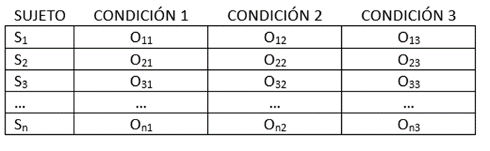

# Relación entre una variable cualitativa y otra cuantitativa (II): Diseños longitudinales

La principal característica de este tipo de diseños es que se administran todos los valores del *factor* (VI) a cada uno de los sujetos. Por tanto, se disponen de varias *medidas repetidas* no independientes por cada sujeto presente en la investigación. La estructura del diseño básico con 3 momentos de observación sería la siguiente:


```{r, echo=FALSE,fig.cap= "Esquema del diseño unifactorial de  medidas repetidas",fig.align='center',out.width="60%"}

```


Supongamos que estamos interesados en presentar imágenes relacionadas con emociones de alegría, tristeza o neutra y ver cómo afectan a una respuesta psico-fisiológica. Para realizar este estudio podríamos haber creado 3 grupos de individuos y asignarle al azar las imágenes de un contenido distinto. Por tanto, habría un grupo en el que sólo verían imágenes de alegría, otro imágenes de tristeza y otro imágenes de tipo neutro. 

Sin embargo, también cabe la posibilidad de seleccionar un único grupo y presentarle en momentos distintos cada una de las imágenes (alegría, tristeza y neutras). La ventaja de actuar así es que reduciríamos el número de sujetos presentes en el estudio con lo que se facilitaría el costo de la investigación. En cambio, tendríamos la dificultad de que las observaciones registradas en cada individuo no son independientes pudiéndose producir efectos de *secuenciación* que pueden ser de dos tipos generales: 1) efectos de *arrastre* como consecuencia de aplicar un tratamiento sin que haya desaparecido el efecto de otro aplicado previamente, y 2) *efectos de la práctica* resultado de la mejora de la respuesta de los sujetos como consecuencia de la repetición [@ato2; @pardo]. Una forma de eliminar estos efectos de secuenciación es mediante el ***contrabalanceo*** que consiste en administrar los tratamientos en orden distintos a cada participante en la investigación. Este contrabalanceo puede aplicarse aleatoriamente pudiendo ser completo o incompleto. Para profundizar en estos procedimientos es conveniente consultar alguna obra de metodología general [@Leon]. El árbol de decisión para estos ensayos aparece en la siguiente figura.


```{r, echo=FALSE,fig.cap= "Árbol de decisión",fig.align='center',out.width="70%"}

```


## Modelo ANOVA 1 factor de medidas repetidas (A1MR)

La estrategia de análisis para este tipo de diseños si se cumple el supuesto de normalidad de los residuales parte del siguiente modelo:

$$
Y_{ij} = \mu + s_i + \alpha_{j} + \epsilon_i
$$

\noindent donde $Y_{ij}$ es la puntuación del sujeto *i* en la condición *j*, $\mu$ es la media total del diseño, $s_i$ son efectos aleatorios del individuo *i* ($s_i = \mu_i - \mu$) y se suponen distribuidos según una ley normal (NID(0,$\sigma^2$)), $\alpha_j = \mu_j - \mu$ son efectos fijos constantes para cada nivel de tratamiento independientemente de los sujetos, $\epsilon_i$ es $Y_{ij} - s_i-\alpha_{j}$ son efectos residuales aleatorios específicos para cada puntuación. En este modelo se asumen que las covarianzas entre los tratamientos y entre los individuos no existen.

La hipótesis nula de este modelo es:

$$
H_0: \alpha_1 = \alpha_1 = \cdots = \alpha_J =0
$$

Por tanto, el modelo asociado a esta hipótesis (*modelo reducido*) es el siguiente:


$$
Y_{ij} = \mu + s_i + \epsilon_i
$$

Los estimadores por máxima verosimilitud de los componentes del modelo son:

$$
\hat{\mu} = \bar{Y}_{++} 
$$

$$
\hat{\alpha}_j = \bar{Y}_{+j} - \bar{Y}_{++} 
$$

$$
\hat{s}_i = \bar{Y}_{i+} - \bar{Y}_{++} 
$$


La variabilidad total de este estudio puede descomponerse en distintos elementos: 1) ***varianza intersujetos:*** debida a los tratamientos, 2) ***varianza intrasujeto*** debida a cada uno de los sujetos, y 3) ***varianza del error*** la que se da entre cada puntuación y sus correspondientes medias marginales. 

Estas tres fuentes de variación pueden calcularse mediante las siguientes expresiones:

- Varianza intersujetos:

$$
MC_A = n\sum_{j}(\bar{Y}_{+j}-\bar{Y})^2/(J-1)
$$

- Varianza intrasujetos:

$$
MC_S = J\sum_{i}(\bar{Y}_{i+}-\bar{Y})^2/(n-1)
$$

- Varianza del error:
$$
MC_E = \sum_{i}\sum_{j}(Y_{ij}- \bar{Y}_{i+} - \bar{Y}_{+j}-\bar{Y})^2/[(J-1)(n-1)]
$$

Al igual que ocurría en el diseño de 1 factor completamente aleatorizado, puede compararse la variabilidad debida a los tratamientos con la variabilidad debida al error mediante el estadístico *F*:

$$
F = \frac{MC_A}{MC_E} \sim \mathcal{F}(j-1,[(j-1)(n-1)])
$$

\noindent donde $\mathcal{F}$ es la distribución teórica. Con este estadístico podemos contrastar que las *J* medias son iguales.

## Ejemplo 1 de diseño unifactorial de medidas repetidas

A continuación presentamos los resultados de un estudio en el que se quiso estudiar si el contenido emocional de una imagen provocaba cambios en una respuesta psicofisiológica:


```{r,echo = FALSE,results = 'asis',message=FALSE,warning=FALSE}
library(foreign)
library(xtable)
datos<- read.spss("data/ejemociones31-15.sav",to.data.frame = T)
tabla<- xtable(datos, caption = "Datos del ejemplo 4.1")
tab.cor<- cor(datos)
tabla2 <- xtable(tab.cor, caption = "Correlaciones del ejemplo 4.1")
cor1 <- cor(datos$tristeza,datos$neutra)
cor2 <- cor(datos$neutra,datos$alegria)
cor3 <- cor(datos$alegria,datos$tristeza)
mean.cor <- mean(cor1,cor2,cor3)
print(tabla, comment = F)
print(tabla2, comment = F)
```


```{r,echo = FALSE,fig.cap= "Datos del ejemplo 4.1",,message=FALSE,warning=FALSE}

boxplot(datos, col= c('red','green','orange'))

```

\noindent Calculamos las medias cuadráticas del diseño y tenemos:

- Varianza intersujetos:

$$
MC_A = n\sum_{j}(\bar{Y}_{+j}-\bar{Y}_{++})^2/(j-1) = 4((-9)^2 + 0^2 + 9^2)/2 = 648/2 = 324
$$

- Varianza intrasujetos:
$$
MC_S = J\sum_{i}(\bar{Y}_{i+}-\bar{Y}_{++})^2/(n-1) = 3((-1)^2 + (-1)^2 + 5^2 + (-3)^2)/3 = 108/3 = 36
$$

- Varianza del error:
$$
MC_E = \sum_{i}\sum_{j}(Y_{ij}- \bar{Y}_{i+}- \bar{Y}_{+j}-\bar{Y}_{++})^2/[(j-1)(n-1)] = ((72-75-67 + 76)^2 + \cdots + (86-73-85 + 76)^2)/(2*3) = 96/6 = 16
$$

$$
F = \frac{MC_A}{MC_E}= \frac{324}{16}= 20.25 
$$


La región crítica en este caso corresponde a $P(\mathcal{F}_{2,6} > F)$ = `r round(1- pf(20.25,2,6),3)`. Por tanto, rechazamos la hipótesis nula de que las medias de las distintas condiciones son iguales. Estos resultados coinciden con los obtenidos mediante el programa R.


```{r,echo = FALSE,results = 'asis',message=FALSE,warning=FALSE}
library(foreign)
library(xtable)
datos<- read.spss("data/ejemociones31-15.sav",to.data.frame = T)
tabla<- xtable(datos, caption = "Datos del ejemplo 4.1")
print(tabla, comment = F)
```

```{r,echo = FALSE,results = 'markdown',message=FALSE,warning=FALSE}
library(car)
mlm<- lm(cbind(datos$tristeza,datos$neutra,datos$alegria)~1)
emocion<- factor(c('tristeza','neutra','alegria'),ordered = F)
mlmaov <- Anova(mlm,idata= data.frame(emocion),idesign = ~emocion,type = 'III')
summary(mlmaov,multivariate = F)[4]
```

## Comprobación de los supuestos

Ya hemos mencionado que para que pueda aplicarse el modelo estadístico de A1FMR es necesario que se cumplan las condiciones de independencia, normalidad y homogeneidad de varianzas [^3.1]. Ahora bien, en este tipo de diseño la independencia hace referencia a que las medidas de un mismo sujeto no estén relacionadas. Asimismo, el efecto de la VI debe ser independiente de la interacción del sujeto con el tratamiento. Cuando se cumplen estos supuestos, el estadístico F se distribuye como un estadístico $\mathcal{F}_{gl_1,gl_2}$ donde $gl_1 = j - 1$ y $gl_2 = (j - 1)(n - 1)$. 

Estos supuestos están relacionados con las características de la matriz de varianzas-covarianzas del diseño que contiene la varianza de cada medida en la diagonal y las covarianzas entre cada par de medidas. Esta característica de la matriz se denomina **simetría compuesta** y decimos que la matriz es ***esférica*** cuando las varianzas y covarianzas son iguales. Sin embargo, es muy poco probable que los datos de las investigaciones psicológicas que utilizan este tipo de diseños lo cumplan, ya que es razonable considerar que los errores de un sujeto (y sus medidas) estén correlacionados entre sí en algún grado. Por tanto, para poder aplicar el modelo estadístico necesitamos relajar estos supuestos. Para ello, se considera suficiente que las covarianzas entre las medidas sean iguales. Más concretamente, es suficiente que las varianzas de las diferencias entre cada par de medidas sean iguales [^3.2]. Si se cumple esto, el estadístico F sigue la distribución teórica con $\mathcal{F}_{gl_1,gl_2}$ donde $gl_1 = j - 1$ y $gl_2 = (j - 1)(n - 1)$.

En el caso de que el estadístico F no siga la distribución anteriormente mencionada se vuelve liberal (aumenta la probabilidad de cometer errores tipo I), y puede demostrarse que sigue una distribución $\mathcal{F}_{gl_1,gl_2}$ donde $gl_1 = \epsilon(j - 1)$ y $gl_2 = \epsilon(j - 1)(n - 1)$ [@maxwell]. El valor de $\epsilon$, es desconocido y necesitamos estimarlo a partir de nuestros datos. Se han propuesto varias alternativas para estimarlo. Una de ellas, postulada por Greenhouse-Geisser, proponen una estimación de $\hat{\epsilon}$ que es más conservadora que la propuesta por Huyndt-Feldt ($\tilde{\epsilon}$). No obstante, el estadístico F es el más conservador de los tres por lo que si éste estadístico es significativo los otros dos también lo serán. En el ejemplo anterior los valores de $\epsilon$ son los siguientes:

```{r,echo = FALSE,results = 'markdown',message=FALSE,warning=FALSE}
summary(mlmaov,multivariate = F)[6]
summary(mlmaov,multivariate = F)[5]
```

[^3.1]: @pardo y @ato2 señalan con acierto que los modelos ANOVA son muy robustos en situaciones donde las variables no siguen una distribución normal salvo en aquellas en las que  los diseños no están balanceados o las distribuciones son muy asimétricas. Sin embargo, mantendremos aquí el cumplimiento de las dos condiciones con objeto de facilitar el aprendizaje.

[^3.2]: Si en el diseño sólo hay dos medidas por sujeto siempre se cumple el supuesto de esfericidad.


\noindent Observamos que el valor obtenido por Geiser-Greenhouse (0.75) es menor que el de Huyndt-Feldt (1.33 $\simeq$ 1). En ambos casos, los estadísticos nos llevan a rechazar la hipótesis de esfericidad. El resultado denominado *sphericity.test* con valor de 0.66 es el test de Mauchly.

Hay ocasiones en las que existen más medidas repetidas que sujetos. En estos casos, @pardo recomiendan utilizar el estadístico F modificando los grados de libertad con el menor valor de $\epsilon$. Si no se rechaza la hipótesis con esta opción, utilizar las estimaciones de $\epsilon$ propuestas anteriormente (la de Geisser-Greenhouse o Huyndt-Feldt, cualquiera de ellas vale).  


## Tamaño del efecto

Las medidas propuestas para el modelo de A1CA ($\eta^2$ corregida y $\omega^2$), también son válidas aquí. La preferida por los investigadores [@pardo] es [^3.2b]:

$$
\omega^2 = \frac{\sigma_{\alpha}^2}{\sigma_{s}^2+\sigma_{\alpha}^2+\sigma_{e}^2}
$$

[^3.2b]:Otra medida con resultados semejantes a $\omega^{2}$ es eta cuadrado generalizada ($\eta_g^{2}$).

\noindent cuando se compara el efecto relativo del tratamiento con respecto a los efectos totales del diseño. $\sigma_{\alpha}^2$ es la varianza debida a los tratamientos, $\sigma_{s}^2$ es la varianza debida a los sujetos y $\sigma_{e}^2$ es la varianza debida al error. 

@maxwell también proponen utilizar la medida de $\omega^2$ parcial:

$$
\omega^2 = \frac{\sigma_{\alpha}^2}{\sigma_{\alpha}^2+\sigma_{e}^2}
$$


$\omega^2$ parcial también puede calcularse a partir del estadístico F [^3.3]:

$$
\omega^2 = \frac{(j -1)(F - 1)}{(j - 1)(F - 1) + nj}
$$

[^3.3]: En el caso de que este cálculo resulte negativo se considera que $\omega^2$ vale cero


A partir de $\omega^2$ parcial también puede calcularse la medida de tamaño del efecto de Cohen:


$$
\hat{\delta} = \sqrt{\frac{\hat{\omega}^2}{( 1 - \hat{\omega}^2)}}
$$

\noindent Al igual que en el tema anterior los valores para considerar un  efecto bajo, medio o grande son 0.01, 0.06 y 0.14 respectivamente. En el caso de $\hat{\delta}$ sus valores son 0.1, 0.25 y y 0.4 respectivamente. 

\noindent Aplicado a los datos del estudio de las emociones:

$$
\omega^2 = \frac{(3 -1)(20.25 - 1)}{(3 - 1)(20.25 - 1) + 4*3} =0.76
$$


$$
\hat{\delta} = \sqrt{\frac{0.76}{( 1 - 0.76)}} = 1.79
$$

\noindent Ambos estadísticos indican que la relación entre el contenido emocional de las imágenes y la respuesta psicofisiológica es muy grande. 

## Potencia de la prueba

La potencia de la prueba nos permite determinar la probabilidad de que en un estudio se rechace la hipótesis nula cuando es falsa. La potencia de la prueba en un diseño A1MR depende de varios factores: 1) el nivel $\alpha$ de significación, la correlación entre las VVDD, el tamaño del efecto que se desea contrastar, el número de condiciones en el diseño, el valor estimado de $\epsilon$ y el número de sujetos. Aplicado al estudio de las emociones anteriormente presentado tenemos que hemos utilizado $\alpha$ = 0.05, la correlación media entre las distintas medidas es `r round(mean.cor,3)`, el tamaño del efecto medido con el estadístico $\delta$ es 1.79, tenemos 3 condiciones, el valor más conservador de $\epsilon$ es 0.75 y hemos estudiado a 4 sujetos. Utilizando el programa Gpower ( http://www.gpower.hhu.de). Bajo estas condiciones obtenemos un valor de potencia de 0.9949. Por lo general, suele considerarse razonable un valor de potencia de 0.8. Si hubiéramos utilizado tres sujetos la potencia también seguiría siendo razonable (0.901).   


## Comparaciones múltiples

La estrategia para realizar las comparaciones múltiples es similar a la utilizada en la estrategia transversal:

$$
\phi_i = \sum_{j} c_{j}Y_{ij}
$$

\noindent donde $Y_{ij}$ son las medidas de los individuos y $c_j$ son los coeficientes multiplicadores. En el caso concreto, de las comparaciones *a posteriori* @pardo proponen utilizar la prueba *t* para cada una de las diferencias. Así, por ejemplo, en nuestro caso la comparación entre la condición de tristeza y neutra será:


```{r,echo = FALSE,results = 'markdown'}
t.test(datos$tristeza,datos$neutra,paired = T)
```

\noindent Para el caso donde se compara la condición de tristeza y alegría será:


```{r,echo = FALSE,results = 'markdown'}
t.test(datos$alegria,datos$tristeza,paired = T)
```


\noindent Finalmente la comparación de la condición de neutra y alegría será:


```{r,echo = FALSE,results = 'markdown'}
t.test(datos$alegria,datos$neutra,paired = T)
```

\noindent Aplicando la corrección de Bonferroni (p = `r round(.05/3,3)`), encontramos que la condición de alegría es la que muestra diferencias significativas con respecto a las otras dos. 

En este tipo de diseños cabe cualquier otro tipo de combinación lineal. Así, por ejemplo, podríamos plantearnos comparar si las medidas de la condición de *tristeza* y la de *neutra* tomadas conjuntamente muestran diferencias significativas con respecto a la condición de *alegría*. En este caso, la comparación a realizar tendría los siguientes coeficientes [^3.4]:

$$
\phi_i = \frac{1}{2}Y_{iT} + \frac{1}{2}Y_{iN} - (1)Y_{iA}
$$

\noindent Una vez calculado el contraste se aplicaría la prueba *t* de Student para 1 muestra [^3.5]. Los resultados son los siguientes:


```{r,echo = F, results= 'markdown',message=FALSE,warning=FALSE}
cont <- (1/2)*datos$tristeza + (1/2)*datos$neutra - datos$alegria
shapiro.test(cont)
t.test(cont)
```

\noindent Atendiendo a los resultados, podemos considerar que la condición de alegría presenta cambios en la respuesta psicofisiológica significativos con respecto a las otras dos condiciones tomadas conjuntamente.


[^3.4]: Obsérvese que la suma de los coeficientes (1/2 + 1/2 - 1) suman cero.

[^3.5]: Si no se cumple el supuesto de normalidad habría que aplicar la prueba W de Wilcoxon.


## Prueba de Friedman

Cuando la variable no cumple el supuesto de normalidad o la VD está medida de manera ordinal lo recomendable es utilizar la prueba de Friedman para estudiar si existen diferencias significativas entre las distintas condiciones. Esta prueba es una extensión de la prueba W de Wilcoxon para dos medidas.

La hipótesis nula que se contrasta es que las respuestas asociadas a cada uno de los "tratamientos" tienen la misma distribución de probabilidad o distribuciones con la misma mediana, frente a la hipótesis alternativa de que por lo menos la distribución de una de las respuestas difiere de las demás. Para poder utilizar esta prueba las respuestas deben ser variables contínuas y estar medidas por lo menos en una escala ordinal.

La hipótesis nula que se contrasta es que las medianas de las distintas condiciones proceden de la misma población. Rechazar ésta hipótesis implica que los centros de la distribución proceden de poblaciones distintas. 

Para contrastar esta hipótesis hay que transformar las puntuaciones de cada individuo en puntuaciones ordenadas (rangos). Si hay empates las puntuaciones se sustituyen por el rango medio. 

## Ejemplo de diseño unifactorial de medidas repetidas


Si aplicamos esta técnica a los datos del ejemplo 1 tendremos los siguientes rangos:


```{r,echo = F,results='markup',message=FALSE,warning=FALSE}
library(knitr)
tabla<- xtable(datos, caption = "Datos del ejemplo 1")
#print(tabla, comment = F)
knitr::kable(datos,caption = "Datos del ejemplo 1")
```


Los rangos por filas de estas observaciones son:

```{r,echo = F,results ='markup',message=FALSE,warning=FALSE}
a1 <- rank(datos[1,])
a2 <- rank(datos[2,])
a3 <- rank(datos[3,])
a4 <- rank(datos[4,])
rangos <- as.data.frame(matrix(c(a1,a2,a3,a4),4,3, byrow = T))
#tabla.r<- xtable(rangos, caption = "Rangos del ejemplo 1")
# print(tabla.r, comment = F)
knitr:: kable(rangos,caption = "Rangos del ejemplo 1")
```


\noindent El estadístico Q de Friedman se calcula mediante la siguiente expresión:

$$
Q = \frac{12}{nj(j+1)} \sum_{1}^{j}R_{+j}^2 - 3n(j+1)
$$

\noindent donde $R_{+j}^2$ son los suma de los rangos por columna. El valor aplicado a nuestros datos es:

$$
Q = \frac{12}{4*3(3+1)}(4^2 + 8^2 + 12^2) - 3*4*4 = \frac{224}{4}-48 = 8
$$


\noindent tenemos que P($\chi^2$ > Q) = `r 1 - round(pchisq(8,2),3)` por lo que rechazamos la hipótesis nula de que los rangos medios de cada condición proceden de la misma población. Utilizando el programa R obtenemos los mismo resultados:


```{r,echo = F,,message=FALSE,warning=FALSE}
c <- friedman.test(as.matrix(datos))
c
```

## Modelo A1FMR con el programa JAMOVI


- Tenemos que seleccionar *Analysis + Repeated Measures ANOVA* tal y como aparece en la figura que se presenta a continuación.


```{r, echo=FALSE,fig.cap= "Selección del modelo A1FMR en JAMOVI",fig.align='center',out.width="70%"}

```


- Definimos las variables e introducimos cada variable en su lugar. Asimismo, damos nombre la variable dependiente:


```{r, echo=FALSE,fig.cap= "Definición de las variables en JAMOVI",fig.align='center',out.width="70%"}

```

\newpage

- Para comprobar la normalidad de las variables tenemos que utilizar el módulo  de "Exploración".


```{r, echo=FALSE,fig.cap= "Supuesto de normalidad en JAMOVI",fig.align='center',out.width="70%"}

```


- La esfericidad se comprueba con la opción "Comprobación de supuestos":


```{r, echo=FALSE,fig.cap= "Supuesto de esfericidad en JAMOVI",fig.align='center',out.width="70%"}

```


- Si se encuentran diferencias significativas utilizamos Bonferroni como procedimiento de comparaciones múltiples tal y como aparece en la siguiente figura.


```{r, echo=FALSE,fig.cap= "Comparaciones múltiples en JAMOVI",fig.align='center',out.width="70%"}

```


\newpage

## Prueba de Friedman con el programa JAMOVI

- Seleccionamos la prueba Friedman:


```{r, echo=FALSE,fig.cap= "Prueba de Friedman en JAMOVI",fig.align='center',out.width="70%"}

```


- Introducimos las variables y marcamos las comparaciones múltiples de Durbin-Conover.


```{r, echo=FALSE,fig.cap= "Comparaciones post hoc de Friedman en JAMOVI",fig.align='center',out.width="70%"}

```


\newpage

## Modelo A1FMR con el programa SPSS


- Tenemos que seleccionar *Analizar + Modelo lineal general + Medidas repetidas* tal y como aparece en la figura siguiente:


```{r, echo=FALSE,fig.cap= "Selección del modelo A1FMR en SPSS",fig.align='center',out.width="70%"}
knitr::include_graphics("figurasR/anovamr6b.jpg")
```


- Le damos nombre al factor, introducimos el número de niveles y pulsamos el botón de añadir


```{r, echo=FALSE,fig.cap= "Modelo A1FMR en SPSS: Identificación de los factores y niveles",fig.align='center',out.width="70%"}

```


\newpage

- Incluimos los tres niveles y marcamos el botón de *Opciones*. Este botón da lugar a otra ventana en la que podremos obtener descriptivos de cada variable, y pruebas para el diagnóstico del modelo. Marcando el botón de *Gráficos* podemos obtener el gráfico de las medias


```{r, echo=FALSE,fig.cap= "Modelo A1FMR en SPSS: Definición de los niveles",fig.align='center',out.width="70%"}

```


- El estudio descriptivo nos muestra los promedios de cada condición, su desviación estándar y el número de casos válidos


```{r, echo=FALSE,fig.cap= "Modelo A1FMR en SPSS: Descriptivos",fig.align='center',out.width="70%"}

```


- Introducimos el factor en el cuadro de *Mostrar medias* y elegimos la corrección de Bonferroni. 


```{r, echo=FALSE,fig.cap= "Modelo A1FMR en SPSS: Corrección de Bonferroni",fig.align='center',out.width="70%"}

```


- Observamos que el estadístico de Mauchly nos indica que se cumplen los supuestos de esfericidad. En la tabla, además del estadístico W de Mauchly (*W* = 0.667), aparecen la aproximación *Chi-cuadrado*, sus grados de libertad (*gl* = 2) y la significación (*p* = 0.667). También aparecen las estimaciones de $\epsilon$ de Geisser-Greenhouse ($\hat{\epsilon}$ = 0.75, el de Huyndt-Feldt $\tilde{\epsilon}$ = 1 y la estimación del limite inferior = 0.5).


```{r, echo=FALSE,fig.cap= "Modelo A1FMR en SPSS: Prueba de Mauchly",fig.align='center',out.width="70%"}

```


- Dado que se cumplen los supuestos de esfericidad, consideramos válida la prueba F


```{r, echo=FALSE,fig.cap= "Modelo A1FMR en SPSS: Prueba F",fig.align='center',out.width="70%"}

```


- Observamos que existen diferencias significativas entre las imágenes que representaban emociones de alegría con las que representaban emociones neutras


```{r, echo=FALSE,fig.cap= "Modelo A1FMR en SPSS: Post hoc",fig.align='center',out.width="70%"}

```


### Conclusiones según normas APA:


 ***Se encontró que hubo diferencias significativas entre las distintas emociones (F(2,6) = 20.25, p = .002, $\eta_{parcial}^{2}$ corregida = `r round(0.871/2,2)` indicando un efecto grande). La respuesta psicofisiológica fue significativamente menor cuando se presentaron estímulos alegres que cuando se presentaron los estímulos neutros (diferencia = -18, p = .042)***
 


## Prueba de Friedman con el programa SPSS

- Esta disponible en *Analizar + Pruebas no parametricas + Cuadro de diálogos antiguos + K muestras relacionadas*


```{r, echo=FALSE,fig.cap= "Prueba de Friedman en SPSS",fig.align='center',out.width="70%"}

```


- Se introducen las  variables en el cuadro central. Por defecto aparece marcada la opción de la prueba de Friedman. En el botón de *Exacta* podemos decidir si la significación se calcula medianta aproximación asintótica, de manera exacta o mediante simulación de montecarlo. El defecto es mediante aproximación asintótica.  


```{r, echo=FALSE,fig.cap= "Prueba de Friedman en SPSS: Variables",fig.align='center',out.width="60%"}
knitr::include_graphics("figurasR/friedman2b.jpg")
```


- Los resultados indican que hubo diferencias significativas. Si aparecen diferencias significativas hay que realizar pruebas a posteriori mediante la prueba de Wilcoxon para dos muestras si la variable diferencia no sigue una ley normal o la prueba T para una muestra si las diferencias siguen una ley normal. En la figura 14 los resultados de la prueba de Friedman se incluyen, los rangos medios de cada una de las medidas, el número de casos válidos (N = 4), el valor del estadístico Friedman (*Chi-cuadrado* = 8), sus grados de libertad (*gl* = 2), y su significación asintótica (0.018)


```{r, echo=FALSE,fig.cap= "Prueba de Friedman en SPSS",fig.align='center',out.width="60%"}

```

### Conclusiones

***Se encontró que la respuesta psicofisiológica varió en función del estímulo presentado ($\chi^{2}$(2,N =4)= 8, p = 0.018). Los contrastes a posteriori no mostraron esas diferencias significativas una vez aplicada la corrección de Bonferroni.***

