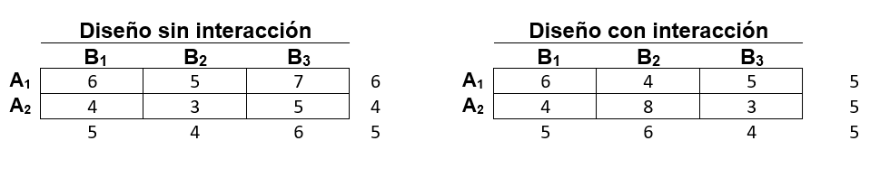
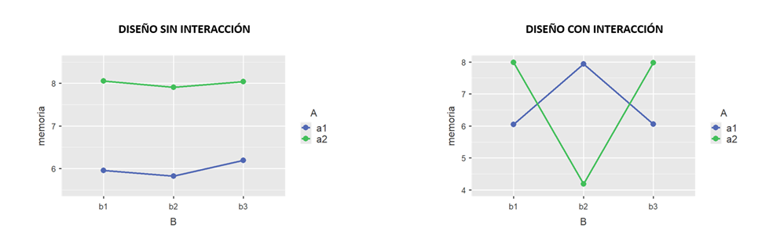
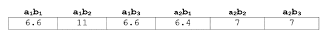
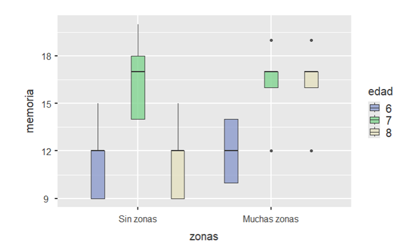
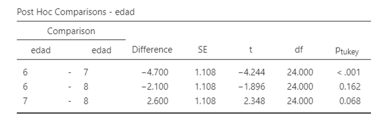

# Diseños factoriales (I): Diseño factorial completamente aleatorizado (A2FCA)

En este tema vamos a estudiar los diseños factoriales. A diferencia de los diseños anteriores donde estudiábamos el efecto de una VI categórica (*factor*) sobre una VD cuantitativa, aquí estudiaremos el efecto de 2 o más variables categóricas sobre una VD. En este primer tema nos centraremos en los diseños factoriales que utilizan una estrategia entresujetos en la que se crean grupos a los que se les asigna una condición del diseño experimental. La principal ventaja de estos diseños es que nos permite conocer el efecto conjunto de los dos factores ( \emph{\textcolor{red}{interacción}}). Desde el punto de vista formal, el concepto de *interacción* entre dos factores hace referencia a que el efecto de uno de ellos sobre la VD no es el mismo en todos los niveles del otro factor. 

Para facilitar la comprensión de este tipo de diseños nos centraremos en los diseños con dos factores. En el caso de que tuviéramos un diseño con dos variables A y B con 2 y 3 valores respectivamente,(diseño factorial 2x3). Por ejemplo, supongamos que queremos estudiar el efecto de la dieta (factor A, $a_1$ = Dieta A, $a_2$ = Dieta B) y las horas de sueño (factor B, $b_1$ = 2 horas, $b_2$ = 4 horas, $b_3$ = 6 horas) en la actividad motora de una grupo de ratas. Las condiciones serían las siguientes:


```{r, echo=FALSE,fig.cap= "Condiciones de un diseño factorial 2x3",fig.align= "center", out.width="500px"}
knitr::include_graphics("figurasR/condFactorial.png")
```


Mediante este diseño podemos conocer como afecta la dieta a la actividad motora ($a_{1+}$ - $a_{2+}$). Asimismo, este diseño también nos permite conocer el efecto de las horas de sueño sobre la actividad motora comparando los distintos niveles de la variable B (por ejemplo, comparando $b_{1+}$ - $b_{2+}$). Sin embargo, la principal ventaja es que también podemos conocer cómo afecta la dieta dependiendo del nivel que está presente de B (**efecto de interacción**). Esto se puede hacer por ejemplo comparando $a_1b_1$ - $a_2b_1$. En este caso, tendríamos la comparación que estudia el efecto de la dieta sobre la actividad motora cuando los animales sólo habían dormido dos horas. De la misma forma, podría conocerse el efecto de la dieta cuando los animales durmieron 4 o 6 horas.  

Otra ventaja que presentan este diseños es que se necesita un menor número de sujetos en comparación con los diseños completamente aleatorizados. En el caso del ejemplo mencionado anteriormente. Supongamos que tenemos 10 sujetos por condición. En total tendríamos 60 sujetos. Si quisiéramos estudiar por separado cada uno de los factores utilizando dos diseños completamente aleatorizados (uno para cada VI), tendríamos que duplicar el número de sujetos por grupo por lo que necesitaríamos 120 sujetos para obtener menos información que con el diseño factorial, ya que no conoceríamos las interrelaciones entre los dos factores. 


## Modelo estadístico


El modelo que se pretende contrastar es el siguiente:
$$
y_{ijk} =\mu+\alpha_i+\beta_j+ +(\alpha\beta)_{jk}+\epsilon_{ijk}
\left\{\begin{array}{ccrccr}
                                             i&=& 1,&2,&\dots,&a   \\
                                              j &=&1,&2,&\dots,&b   \\
                                            k &=&1,&2,&\dots,&n \\
\end{array}\right.
$$

\noindent donde $y_{ijk}$ es la medida del sujeto *i* en la condición *jk*, $\mu$ es una constante (la media global de todas las medidas), $\alpha_i$ es el efecto del tratamiento $a_i$, $\beta_j$ es el efecto del tratamiento $b_j$, $(\alpha\beta)_{jk}$ es el efecto de la combinación de tratamientos $a_jb_k$, y $\epsilon_{ijk}$ es el término del error. Por tanto, en este diseño interesa estudiar *dos efectos principales* (efecto de A y efecto de B) y un *efecto de interacción*.

Los efectos principales se definen de la siguiente forma:

$$
\alpha_j = \mu_{j+} - \mu_{++}
$$

$$
\beta_k = \mu_{+k} - \mu_{++}
$$

\noindent donde $\mu_{j+}$ es la media marginal de la fila *j*, $\mu_{+k}$ es la media de la columna *k* y $\mu_{++}$ es la media total. En total, hay tantos coeficientes como filas (o columnas) haya en el diseño sometidos a la siguiente restricción:

$$
\sum_{j=1}^{a} \alpha_j = 0
$$

$$
\sum_{k=1}^{b} \beta_k = 0
$$


El término de la interacción viene definido como:

$$
(\alpha\beta)_{jk}= \mu_{jk} - (\mu_{++} + \alpha_{j} + \beta_k)
$$

\noindent O lo que es lo mismo, este efecto es la diferencia de la media de la casilla del diseño menos la media total, el efecto de la fila *j* y menos el efecto de la columna *k*. Al igual que en el caso de los efectos principales, la suma de los efectos interactivos por filas o por columnas suman cero:


$$
\sum_{j=1}^{a} \alpha\beta_{jk} = 0
$$


$$
\sum_{k=1}^{b} \alpha\beta_{jk} = 0
$$

Las estimaciones mínimo cuadráticas de los coeficientes son:

$$
\alpha_j = \bar{Y}_{j+} - \bar{Y}_{++}
$$

$$
\beta_k = \bar{Y}_{+k} - \bar{Y}_{++}
$$

$$
(\alpha\beta)_{jk}= \bar{Y}_{jk} - \bar{Y}_{j} - \bar{Y}_k +\bar{Y}_{++}
$$

Los efectos principales tienen (a - 1) y (b - 1) grados de libertad; la interacción tiene (a - 1) x (b - 1) grados de libertad.

En este modelo se asume que existen JK poblaciones (una por cada grupo) que se distribuyen normalmente  con la misma varianza. Por tanto, podemos distinguir dos tipos de variabilidad: 1) La varianza *entregrupos* y 2) la *varianza intragupo*. La única diferencia con el diseño factorial de 1 solo factor es que la varianza entregrupos puede descomponerse en el efecto de A, el de B y en el de interacción AB. 

La estimación de la varianza intragrupo se realiza promediando las varianzas de cada grupo. A este término se le denomina **media cuadrática del error** (MCE):

$$
MCE = \bar{S}_{jk}^2  = \sum_{j}\sum_{k}S_{jk}^2/jk
$$

La estimación de la varianza entresujetos se realiza comparando la media de cada grupo con la media total y se denomina  **media cuadrática entresujetos** (MCI):

$$
MCI = n\sum_{j}\sum_{k}(\bar{Y}_{jk} - \bar{Y}_{++})^2/(jk-1)
$$

\noindent La descomposición de esta varianza se hace para cada uno de sus componentes. Para el factor A sería:


$$
MCA = nk\sum_{j}(\bar{Y}_{j+} - \bar{Y}_{++})^2/(j-1)
$$


\noindent Para el factor B sería:

$$
MCB = nj\sum_{k}(\bar{Y}_{+k} - \bar{Y}_{++})^2/(k-1)
$$

\noindent Par el factor de la interacción será:

$$
MC_{AB} = n\sum_{j}\sum_{k}(\bar{Y}_{ij} - \bar{Y}_{j+}- \bar{Y}_{+k}  +\bar{Y}_{++})^2/[(j-1)(k-1)]
$$


## Interacción entre factores

Conceptualmente podemos considerar que la *interacción* entre factores hace referencia a que *el efecto de una VI sobre la VD depende del valor que está presente de la otra VI*. Ahora bien, desde un punto de vista más formal el efecto interactivo se define de la siguiente forma:

$$
\alpha\beta_{jk}= \mu_{jk} - (\mu_{++} + \alpha_{j} + \beta_k)
$$

Existe interacción cuando $\alpha\beta_{jk} \neq$ 0 para algún *j* ó *k*. @pardo consideran que esta expresión puede interpretarse de dos formas:

1. Como *desviación que experimentan las medias de las casillas con respecto a los efectos principales de los factores*: 

    + No interacción: $\mu_{jk} = \mu_{j+} \mu_{+k} - \mu_{++}$ (para todo *j* y *k*)
    + Interacción: $\mu_{jk} \neq \mu_{j+} \mu_{+k} - \mu_{++}$ (para todo *j* y *k*)
  
2. Como *diferencias entre las medias de las casillas y las medias marginales*:

    + No interacción: $\mu_{jk} - \mu_{j'k} = \mu_{j+} - \mu_{j'+}$ (para todo *j*, *j'* ó *k*) 
    + Interacción: $\mu_{jk} - \mu_{j'k} \neq \mu_{j+} - \mu_{j'+}$ (para todo *j*, *j'* ó *k*) 
    
Estas dos conceptualizaciones del efecto interactivo al final se traducen en el concepto anteriormente mencionado  de la existencia de interacción siempre y cuando las diferencias de un factor (p. ejemplo, el factor A), son distintas dependiendo del valor que está presente del otro factor B. En la siguiente figura se presentan dos situaciones donde en la primera de ellas no existe interacción entre las variables y en la otra si. 


```{r, echo=FALSE,fig.cap= "Medias de dos diseños factoriales con y sin interacción",out.width="450px",fig.align='center'}

```


\noindent Gráficamente es muy fácil apreciar la existencia (o no) de interacción: cuando las líneas son paralelas no existe interacción. Por el contrario, si las líneas se cruzan o no son paralelas hablamos de interacción. En la figura 3 izquierda se observa con claridad que cualquier valor del factor B cambia en 2 unidades siempre, dependiendo de que esté presente el valor de $a_1$ o $a_2$. En cambio, en la figura de la derecha los cambios no son uniformes. Son mucho más elevados cuando el valor de B es $b_2$ que cuando el valor de B es $b_1$ ó $b_3$. Es más, se observa que el cambio significativo en el factor A es sólo cuando está presente $b_2$. Cuando están presentes los otros valores de B los cambios son muy parecidos. 


```{r, echo=FALSE,fig.cap= "Representación gráfica de dos diseños factoriales sin y con interacción",out.width="450px",fig.align='center'}

```


### Ejemplo 1 de diseño factorial

Supongamos que estamos interesados en estudiar si el efecto de la dieta ($a_1$ = Dieta A, $a_2$ = Dieta B) sobre la actividad motora depende de las horas de sueño $b_1$ = 2 horas, $b_2$ = 4 horas y $b_3$ = 6 horas). Los resultados de los sujetos aparecen a continuación:


```{r, echo=FALSE,fig.cap= "Representación gráfica del ejemplo 3.1",out.width="70%",fig.align='center'}
knitr::include_graphics("figurasR/ejemplo31.png")
```

\newpage


Analizando estos datos nos encontramos que existe un efecto interactivo entre la variable tipo de dieta y horas de sueño (ver Cuadro 2). Asimismo, podemos comprobar mediante el estadístico de Levene que se cumple el supuesto de homogeneidad (ver tabla 4.5). 

```{r,echo = FALSE,results='asis',warning=FALSE,message=FALSE}
library(xtable)
library(ez)
library(car)
datos<- read.csv2('data/anova32b.csv', head = T)
mod<-anova(lm(vd~horas*Dieta,data = datos))
#ezres <- ezANOVA(data =  datos, dv = vd, wid = X, between = #.c(horas,Dieta))
ta<- xtable(mod,caption= "Resultados del ejemplo 4.1")
#print(ta, comment = F)
vi <- gl(6,5,30)
levene<- leveneTest(datos$vd~vi)
ta2<- xtable(levene,caption= "Prueba de Levene del ejemplo 3.1")
#print(ta2, comment = F)

```


```{r, echo=FALSE,fig.cap= "Resultados ANOVA y prueba de Levene",out.width="450px",fig.align='center'}

```


En la siguiente figura observamos que el efecto de la dieta sobre la actividad motora es prácticamente inexistente cuando los animales durmieron 2 o 6 horas. Sin embargo, se produce una gran diferencia en la actividad motora con la dieta A cuando los animales durmieron 4 horas (condición $a_1b_2$). 


```{r, echo=FALSE,fig.cap= "Representación gráfica del ejemplo 3.1",out.width="70%",fig.align='center'}
knitr::include_graphics("figurasR/fact_ejemplo31_jamovi.png")
```


#### Cálculo de los efectos simples

Una vez que se constata la existencia de interacción en el diseño, el paso siguiente consiste en interpretar la interacción mediante la comparación de los efectos simples. Un efecto simple calcula la diferencia de dos valores de la VD en presencia de dos valores distintos de la VI, manteniendo constante el valor de una  tercera. Consideremos los valores medios de nuestro ejemplo 1: 


```{r, echo=FALSE,fig.cap= "Medias del ejemplo 3.1",out.width="400px",fig.align='center'}

```


\noindent Los efectos simples de la variable dieta serían:

1. Comparar los valores medios de las dieta A con la dieta B cuando los animales durmieron 2 horas:

$$
Efecto \; simple \; de \; A =  \mu_{a_1b_1}- \mu_{a_2b_1} = 6.6 - 6.4 = 0.2
$$

2. Comparar los valores medios de las dieta A con la dieta B cuando los animales durmieron 4 horas:

$$
Efecto \; simple \; de \; A =  \mu_{a_1b_2}- \mu_{a_2b_2} = 11 - 7 = 4
$$

3. Comparar los valores medios de las dieta A con la dieta B cuando los animales durmieron 6 horas:

$$
Efecto \; simple \; de \; A =  \mu_{a_1b_3}- \mu_{a_2b_3} = 6.6 - 7 = -0.4
$$

Para determinar el efecto de la interacción necesitamos comparar entre sí todos estos efectos simples. Así, en este diseño tendremos tres comparaciones:

1. Comparación del efecto simple de A (dieta) en $b_1$ (2 horas de sueño) con el efecto simple de A en $b_2$ (4 horas de sueño):

$$
\phi_1 = \mu_{a_1b_1}- \mu_{a_2b_1} - (\mu_{a_1b_2}- \mu_{a_2b_2}) = 6.6 - 6.4 - 11 + 7 = -3.8
$$

2. Comparación del efecto simple de A (dieta) en $b_1$ (2 horas de sueño) con el efecto simple de A en $b_3$ (6 horas de sueño):

$$
\phi_2 = \mu_{a_1b_1}- \mu_{a_2b_1} - (\mu_{a_1b_3}- \mu_{a_2b_3}) = 6.6 - 6.4 - 6.6 + 7 = 0.6
$$


3. Comparación del efecto simple de A (dieta) en $b_2$ (4 horas de sueño) con el efecto simple de A en $b_3$ (6 horas de sueño):

$$
\phi_1 = \mu_{a_1b_1}- mu_{a_2b_1} - (\mu_{a_1b_2}- mu_{a_2b_2}) = 11 - 7 - 6.6 + 7 = 4.4
$$

Observamos que las diferencias se establecen cuando se comparan los efectos simples de A con el valor $b_2$ (4 horas de sueño). En los otros las diferencias son pequeñas. No obstante, debemos considerar si esas diferencias encontradas cuando se comparan dos efectos simples se deben al azar. La comparación de los contraste anteriores y la varianza del error permite obtener un estadístico *t* que se distribuye como una distribución *t* teórica con 24 grados de libertad. Una estimación de la varianza del error puede hacerse promediando las varianzas de las condiciones del diseño. En nuestro caso, sería:


|  $\sigma_{a_1b_1}$   |  $\sigma_{a_2b_1}$ |$\sigma_{a_1b_2}$   |$\sigma_{a_2b_2}$   |$\sigma_{a_1b_3}$   |  $\sigma_{a_2b_3}$ |
|---|---|---|---|---|---|
|  1.95 | 1.82  | 2  |  1.87 | 1.95  | 1.87  |

Table: Desviaciones tipo de las condiciones del ejemplo 1

$$
Var_{error} = \frac{1.95+1.82+2+1.87+1.95+1.87}{6} = 1.91
$$


\noindent Calculando el estadístico *t* para cada uno de los contrastes:

+ Primer contraste:

$$
t = \frac{\phi_1}{Var_{error}} = \frac{-3.8}{1.91} = 1.99
$$

+ Segundo contraste:

$$
t = \frac{\phi_2}{Var_{error}} = \frac{0.6}{1.91} = 0.31
$$

+ Tercer contraste:

$$
t = \frac{\phi_3}{Var_{error}} = \frac{4.4}{1.91} = 2.30
$$


\noindent El estadístico *t* para un nivel de confianza del 95% tiene un valor de `r round(qt(.95, 24),2)` por lo que puede considerarse que el primer ($\phi_1$) y el tercer contraste ($\phi_3$) resultan significativos (F(2,24) = 3.9, p = .034, $\eta_p$ = 0.298, indicando un tamaño de efecto grande). Observando en la figura apreciamos que ***el efecto de la dieta con 4 horas de sueño fue significativamente distinto en comparación con el efecto de la dieta a las 2 horas (t(24) = 1.99, p =.029) y 6 horas de sueño (t(24) = 2.30, p =.015)***. 


### Ejemplo 2 de diseño factorial

Supongamos que estamos interesados en estudiar si la memoria de trabajo de escolares se veía afectada por las variables edad y cantidad de zonas verdes próximas al centro educativo. Los resultados de los primeros niños estudiados se muestran a continuación: Para realizar el análisis de los datos debemos asegurarnos de que se cumplen los supuestos de la prueba (normalidad y homogeneidad de las varianzas).En la siguiente figura se representan los datos por condición del estudio. 


```{r, echo=FALSE,fig.cap= "Boxplot del ejemplo 2",out.width="300px",fig.align='center'}

```


Realizando el análisis de la varianza observamos que la interacción no resulta significativa, siendo la edad el único factor significativo. Por tanto, en este diseño lo único que hay que hacer es determinar si existen diferencias significativas entre las distintas edades. Para ello hay que realizar algún procedimiento *post hoc* como el de Tukey.

\newpage

```{r, echo=FALSE,fig.cap= "Resultados del ejemplo 2",fig.align='center',out.width="450px"}
knitr::include_graphics("figurasR/anova_ejemplo2.png")
```


```{r, echo=FALSE,fig.cap= "Prueba de Tuckey para las comparaciones de edad del ejemplo 2",out.width="400px",fig.align='center'}

```


Los resultados indican que sólo hubo un ***efecto significativo de la edad F(2,24) = 9.04, p = 0.001, $\eta^2$ parcial = 0.43 indicando un tamaño del efecto grande). Las comparaciones a posteriori de Tukey indicaron que hubo diferencias significativas en la memoria de trabajo a los 6 años (M = 11.40) comparado con los 7 años de edad (M = 16.60, p < .001)***.

\newpage

## A2FC con el programa JAMOVI

Para analizar este tipo de diseños JAMOVI dispone de la opción *"Modelo lineal general"* dentro del módulo de *"Linear Models"*.


```{r, echo=FALSE,fig.cap= "Modelo lineal generalizado en JAMOVI",out.width="30%",fig.align='center'}

```

\noindent Una vez introducidos los datos el programa nos indica el resultado de la interacción. Observamos que la diferencia entre las medias de las dietas fue distinta a las 2 que a las 4 horas.


```{r, echo=FALSE,fig.cap= "Resultado de la interacción del ejemplo 3-1",fig.align='center',out.width="50%"}

```

\newpage


```{r, echo=FALSE,fig.cap= "Resultado de la interacción del ejemplo 3-1",fig.align='center',out.width="70%"}

```

En la siguiente figura se aprecia que las diferencias entre las dietas aparecieron cuando a los sujetos se les permitió dormir 4 horas. El contraste de los efectos simples lo confirman. 


```{r, echo=FALSE,fig.cap= "Representación gráfica del ejemplo 3-1",fig.align='center',out.width="60%"}
knitr::include_graphics("figurasR/fact_ejemplo31_jamovi.png")
```

```{r, echo=FALSE,fig.cap= "Comparación de los efectos simples del ejemplo 3-1",out.width="70%",fig.align='center'}

```

\newpage


## A2FC con el programa SPSS

+ El análisis de los modelos factoriales con el programa SPSS se hace a partir de la opción de los modelos lineales generalizados (*Analizar + Modelo lineal general + Univariante*).


```{r, echo=FALSE,fig.cap= "Modelo lineal generalizado en SPSS",out.width="70%",fig.align='center'}

```


Cuando se utiliza este procedimiento aparece una ventana en la que se introduce la VD y las VVII. El procedimiento es semejante al estudiado en el tema 2. La diferencia es que aquí introducimos dos o más variables en el cuadro de *factores fijos*. Asimismo, aparecen una serie de botones que permiten realizar las mismas comparaciones a posteriori que las realizadas en el tema 2. El botón de *gráficos* permite representar las medias de las distintas condiciones. Con el botón de *guardar* podemos almacenar las puntuaciones predichas, los errores, valores para el diagnóstico de los supuestos de la prueba. Por último, en el botón de *opciones* pueden obtenerse resúmenes estadísticos de las variables, pruebas de homogeneidad, estimaciones del tamaño del efecto y de la potencia entre otras posibilidades.


```{r, echo=FALSE,fig.cap= "Ventana para introducir las variables",out.width="70%",fig.align='center'}

```


Los resultados obtenidos permiten contrastar la hipótesis del diseño (en este caso corresponden a los del ejemplo 1): 


```{r, echo=FALSE,fig.cap= "Resultados del ANOVA factorial",out.width="70%",fig.align='center'}

```


+ En el caso de que la interacción sea significativa es conveniente crear una nueva variable (denominada *ab* en la siguiente figura), para estudiar el efecto de la interacción:


```{r, echo=FALSE,fig.cap= "Creación de la variable ab",out.width="70%",fig.align='center'}

```


+ Una vez creada la variable utilizamos el procedimiento de comparar medias estudiado en el tema 2 (*Analizar + Comparar medias + ANOVA de 1 factor*:


```{r, echo=FALSE,fig.cap= "Ventana para seleccionar la opción de modelo lineal",out.width="70%",fig.align='center'}
knitr::include_graphics("figurasR/anova1Fspss.jpg")
```


+ El paso siguente consiste en introducir la variable dependiente de nuestro diseño (vd en el ejemplo 4.1) en el cuadro denominado *Lista de dependientes*  y la  variable *ab*. En esta ventana pulsaremos el btón de *Contrastes* para introducir las comparaciones de los efectos simples. 


```{r, echo=FALSE,fig.cap= "Introducción de las variables",out.width="70%",fig.align='center'}
knitr::include_graphics("figurasR/anova2fInter2.png")
```


+ Para introducir los coeficientes de los contrastes es necesario seguir el orden de las condiciones que aparecen en el fichero de datos. En nuestro caso, el orden es el siguiente para realizar la primera comparación ($\phi_1$):


|  $\mu_{a_1b_1}$   |  $\mu_{a_2b_1}$ |$\mu_{a_1b_2}$   |$\mu_{a_2b_2}$   |$\mu_{a_1b_3}$   |  $\mu_{a_2b_3}$ |
|---|---|---|---|---|---|
|  1 | -1  | -1  |  1 | 0 | 0 |


```{r, echo=FALSE,fig.cap= "Coeficientes para el primer contraste",out.width="70%",fig.align='center'}

```


+ Los resultados para este contraste aparecen en la siguiente figura:


```{r, echo=FALSE,fig.cap= "Coeficientes y resultados para el primer contraste",out.width="70%",fig.align='center'}

```


  
