# Diseños factoriales (II): Diseño factorial con medidas repetidas (A2FMR y A2FMX)

En este tema vamos a estudiar los diseños factoriales con al menos un factor con medidas repetidas. Consideramos sólo los diseños balanceados (todas las condiciones del diseño tienen el mismo número de observaciones y/o sujetos). Asimismo, consideraremos sólo aquellos casos en los que todos los factores son fijos salvo los sujetos. Dos son los diseños que se estudiaran: 1) Diseño factorial *a*x*b* de medidas repetidas donde se utiliza la estrategia longitudinal para estudiar ambas variables, y 2) diseño factorial mixto *a*x*b* donde una variable se estudia mediante la estrategia intrasujeto y otra mediante la estrategia entresujetos.

La principal ventaja de este tipo de diseños es que se necesitan un número menor de sujetos para realizar la investigación si lo comparamos con un diseño completamente aleatorizado. Asimismo, permite conocer la variabilidad debida a los sujetos por lo que puede eliminarse este factor. Su principal inconveniente es la presencia de VVEE relacionadas con el hecho de aplicar varias condiciones a un mismo sujeto.  

En este tipo de diseños interesa conocer tres fuentes de variación (debidas a los tratamientos *A*, *B* y el de la interacción *AB*). La determinación de la significación de estas fuentes de variación se realiza comparando la correspondiente fuente de variación con la del error. En los diseños de medidas repetidas también hay otra fuente de variación conocida que es la de los sujetos (S). Por lo general, se asume que las interacciones entre esta fuente de variación de los sujetos y la de los tratamientos deben ser nulas. Por tanto, las interacciones SXA, SxB y SxAB son componentes del error del diseño y cada efecto debe ser comparado con su correspondiente término de error para el cálculo del estadístico F. 


## Diseño factorial intrasujeto

Presentamos primero el caso en el que los dos factores son estudiados mediante la estrategia del *sujeto como propio control* (medidas repetidas). Su modelo estadístico es:


$$
Y_{ijk} =\mu+\alpha_i+\beta_j+ \pi_k + (\alpha\beta)_{jk}+ (\alpha\pi)_{ji}+ (\beta\pi)_{ki}+(\alpha\beta\pi)_{jki}+\epsilon_{ijk}
\left\{\begin{array}{ccrccr}
                                             i&=& 1,&2,&\dots,&n   \\
                                              j &=&1,&2,&\dots,&a   \\
                                            k &=&1,&2,&\dots,&b \\
\end{array}\right.
$$

\noindent donde $Y_{ijk}$ es la medida de la VD del sujeto *i* en la condición *jk*; $\mu$ es una constante (la media global de todas las puntuaciones); $\alpha_j$ es el efecto del tratamiento $a_j$; $\beta_k$ es el efecto del tratamiento $b_k$; $\pi_i$ es el efecto asociado al sujeto *i*; $(\alpha\beta)_{jk}$ es el efecto de la combinación de tratamientos $a_jb_k$; $(\alpha\pi)_{ji}$ es el efecto de la interacción entre el tratamiento *j* del factor A y el sujeto *i*; $(\beta\pi)_{ji}$ es el efecto de la interacción entre el tratamiento *k* del factor B y el sujeto *i*; $(\alpha\beta\pi)_{jki}$ es el efecto de la interacción de tercer orden del nivel *j* del factor A, el *k-ésimo* nivel del factor B y el *i-ésimo* sujeto. Por último,  $\epsilon_{ijk}$ es el término del error. 

Al igual que en otros modelos de ANOVA factoriales, el investigador está interesado en estudiar los efectos principales y de interacción. Cada uno de estos efectos se realiza mediante la prueba F donde se comparan las medias cuadráticas de cada uno de los efectos con sus correspondientes medias cuadráticas del error. 

### Ejemplo 1: Diseño factorial de medidas repetidas

Un ejemplo de este tipo de diseños propuesto por @maxwell en el que se deseaba estudiar el efecto de la presencia de distractores (ruido o sin ruido) y la orientación del estímulo (0 , 4 y 8 grados) en una prueba de percepción donde se pretende discriminar entre dos estímulos. La VD fue el tiempo de reacción. Los resultados aparecen en la siguiente tabla:


```{r, echo= FALSE,results="asis",message=FALSE,warning=FALSE,fig.cap= "Tabla de datos",fig.align='center',out.width="90%",eval=FALSE}


```


```{r, echo= FALSE,results="asis",message=FALSE,warning=FALSE}
library(xtable)
library(foreign)
datos<- read.spss("data/ejemplo51.sav",to.data.frame = T)
tab1<- xtable(datos,caption= 'Datos del ejemplo 1')
#print(tab1,comment = F)
```


```{r, echo= FALSE,results="asis",message=FALSE,warning=FALSE,fig.cap= "Modelo AF2MR: Boxplot del ejemplo 1",fig.align='center',out.width="60%"}

knitr::include_graphics("figurasR/boxplot_ejemplo51.png")
```


```{r, echo= FALSE,results="asis",message=FALSE,warning=FALSE,fig.cap= "Modelo AF2MR: Resultados del ejemplo 1",fig.align='center',out.width="50%"}


```


Estos resultados son válidos siempre y cuando se cumpla el supuesto de esfericidad estudiado en el tema 3. Una vez comprobado este supuesto con la prueba de Mauchly pueden tomarse decisiones acerca de la significación de los efectos. En este ejemplo se obtienen los siguientes resultados en relación con la prueba de esfericidad. Podemos observar que los valores de $\epsilon$ de Geisser-Greenhouse (GG) son más pequeños que los de Huynh-Feldt (HF). Utilizar los valores de GG para realizar los contrastes de hipótesis supone aplicar una estrategia conservadora en el análisis de los datos.  


```{r, echo= FALSE,results="asis",message=FALSE,warning=FALSE,fig.cap= "Modelo A2FMR: Prueba de esfericidad",fig.align='center',out.width="70%"}

knitr::include_graphics("figurasR/esfericidad51_jamovi.png")
```


#### Tamaño del efecto

Aunque puede utilizarse el estadístico $\eta^2$ para determinar el tamaño del efecto, los autores prefieren estimar este estadístico mediante $\omega^2$. En este tipo de diseños la fórmula para calcularlo es:

  + Para el efecto A (ruido):
  
$$
\omega_{A}^2 = \frac{(a-1)(F_A - 1)}{(a-1)(F_A - 1)+ nab} = \frac{1*(33.766 - 1)}{1*(33.766 - 1) + 10*2*3} = 0.353
$$

 + Para el efecto B:
  
$$
\omega_{B}^2 = \frac{(b-1)(F_B - 1)}{(b-1)(F_B - 1)+ nab} = \frac{(3-1)*(40.719 - 1)}{(3-1)*(40.719 - 1) + 10*2*3} = 0.569
$$

+ Para el efecto AB:
  
$$
\omega_{AB}^2 = \frac{(a-1)(b-1)(F_{AB} - 1)}{(a-1)(b-1)(F_{AB} - 1)+ nab} = \frac{(3-1)*(45.310 - 1)}{(3-1)*(45.310 - 1) + 10*2*3} = 0.596
$$

\noindent Si hubiéramos utilizado el estadístico $\eta^2$ proporcionado por el programa SPSS obtendríamos los siguientes valores: 0.79 para el factor A, 0.819 para el factor B y 0.834 para el factor AB. Tal y como señalan @pardo estos valores están bastante inflados y no son un buen estimador del tamaño del efecto. Otra medida de tamaño del efecto equivalente al de $\omega^{2}$ es la de eta generalizada al cuadrado ($\eta_g^{2}$) que utiliza el programa JAMOVI [@jamovi].
 
#### Estudio de la interacción

Al igual que se mencionó en el tema 4, para estudiar los efectos interactivos lo que tenemos que hacer es comparar los efectos simples. En este diseño tenemos 3 efectos simples por lo que habrá que realizar tres comparaciones. La primera comparación sería la siguiente:


$$
\phi_1 = \mu_{ausente.a0} - \mu_{presente.a0} -  (\mu_{ausente.a4} - (\mu_{presente.a4}) =  \mu_{a_1b_1} - \mu_{a_2b_1} - (\mu_{a_1b_2} -  \mu_{a_2b_2})
$$


 + Para introducir los coeficientes de los contrastes es necesario seguir el orden de las condiciones que aparecen en el fichero de datos.  La forma más sencilla de realizar este contraste es creando una nueva variable con la suma de las puntuaciones de las medias que se comparan. En este caso, estamos realizando lo siguiente:


```{r, echo= FALSE,results="asis",message=FALSE,warning=FALSE,fig.cap= "Modelo A2FMR en JAMOVI: Comparación efectos simples",fig.align='center',out.width="70%"}


```


\noindent Esta nueva variable creada (*Contraste 1*) supone una combinación lineal (suma de varias puntuaciones correspondientes a 4 variables). Bajo el modelo de hipótesis nula la suma de esta variable debe ser igual a 0. Para contrastar esta hipótesis podemos utiliazar la prueba T para una muestra (o la prueba de Wilcoxon en el caso de que no se cumpla el supuesto de normalidad). Los resultados de este análisis nos indican que rechazamos la hipótesis nula. Es decir existe un efecto interactivo significativo cuando se comparan los efectos simples de A en $b_1$ y $b_2$. 


```{r, echo= FALSE,results="asis",message=FALSE,warning=FALSE,fig.cap= "Modelo A2FMR en JAMOVI: Resultado de la comparación del efecto de A en $b_1$ y $b_2$",fig.align='center',out.width="60%"}

knitr::include_graphics("figurasR/contraste1res_jamovi.png")
```


\noindent Observamos que el efecto resulta ser significativo de tipo positivo por lo que el efecto de A es distinto en $b_1$ que en $b_2$. En concreto, en $b_1$ el efecto de A vale `r mean(datos[,1] - datos[,4])`. En cambio, en $b_2$ el efecto de A vale `r mean(datos[,2] - datos[,5])`. Esto se aprecia muy bien en la gráfica:


```{r,echo = FALSE,fig.height = 3,fig.cap= "Gráfico de medias del ejemplo 5.1",message=FALSE,warning=FALSE}

library(ggplot2)
library(plyr)
library(grid)
library(gridExtra)
library(doBy)

# Preparación de datos

library(foreign)
library(reshape2)
library(lattice)
datos<- read.spss('data/ejemplo51.sav',to.data.frame = T)
datos2 <- melt(datos,variables.names = c('ausente.0',
          'ausente.4','ausente.8','presente.0',
          'presente.4','presente.8'),value.name = 'TR')

ruido <- gl(2,30,60,labels = c('ausente','presente'))
angulo <- factor(c(rep(1:3, each = 10),rep(1:3, each = 10)),
                    labels= c('0','4','8'))
datos3<- cbind(datos2,ruido)
datos4<-cbind(datos3,angulo)

aux<- summaryBy(TR~ruido*angulo, data = datos4,FUN = mean)

#Gráfico base

g = ggplot(aux, aes(x = angulo, y = TR.mean,colour =ruido,
          group = ruido)) +
geom_point(aes(shape = ruido),fill = 'black',size = 4)+
geom_line(aes(linetype = ruido),size = 1)+
scale_shape_manual(values = c(24,21))
update_labels(g,list(y = 'Media TR',x = 'Angulo'))
```


La segunda comparación entre los efectos simples sería la comparación del efecto de A cuando están presentes $b_1$ y $b_3$

$$
\phi_2 = \mu_{ausente.a0} - \mu_{presente.a0} -(\mu_{ausente.a8}  - \mu_{presente.a8})
$$

\noindent Creamos una nueva variable que denominamos *Contraste 2* de la siguiente forma:


```{r, echo= FALSE,results="asis",message=FALSE,warning=FALSE,fig.cap= "Modelo A2FMR en JAMOVI: Comparación de efectos simples",fig.align='center',out.width="60%"}

knitr::include_graphics("figurasR/contraste2_jamovi.png")
```


\noindent Los resultados obtenidos con este segundo contraste se muestran en la siguiente figura:


```{r, echo= FALSE,results="asis",message=FALSE,warning=FALSE,fig.cap= "Modelo A2FMR en JAMOVI: Comparación de efectos simples",fig.align='center',out.width="60%"}

knitr::include_graphics("figurasR/contraste2res_jamovi.png")
```

\noindent Encontramos de nuevo que el efecto de A en $b_1$ es mucho menor que cuando está presente $b_3$. El efecto de A en $b_1$ vale `r mean(datos[,1] - datos[,4])`. En cambio, cuando está presente $b_3$ el valor es `r mean(datos[,3] - datos[,6])`. Para terminar nos queda ver si existen diferencias en el efecto de A cuando está presente $b_2$ en comparación con la presencia de $b_3$. Sabemos que cuando está presente $b_2$ el efecto de A vale `r mean(datos[,2] - datos[,5])`, mientras que cuando está presente $b_3$ vale `r mean(datos[,3] - datos[,6])`. 

Para determinar la significación de esta comparación el procedimiento es el mismo que en los casos anteriores. La comparación sería la siguiente:


$$
\phi_3 = \mu_{ausente.a4} - \mu_{presente.a4} -  (\mu_{ausente.a8} - (\mu_{presente.a8}) =  \mu_{a_1b_2} - \mu_{a_2b_2} - (\mu_{a_1b_3} -  \mu_{a_2b_3})
$$


\noindent Los resultados de este tercer contraste sería:


```{r, echo= FALSE,results="asis",message=FALSE,warning=FALSE,fig.cap= "Modelo A2FMR en JAMOVI: Comparación de efectos simples",fig.align='center',out.width="60%"}


```


```{r, echo= FALSE,results="asis",message=FALSE,warning=FALSE,fig.cap= "Modelo A2FMR en JAMOVI: Comparación de efectos simples",fig.align='center',out.width="60%"}

knitr::include_graphics("figurasR/contraste3res_jamovi.png")
```

\noindent Estos resultados indican que también existen diferencias en la comparación de los efectos simples.

**Conclusiones según normas APA:** ***Se encontró la existencia de interacción entre las variables \emph{ángulo} y el \emph{distractor} (F(2,18) = 45.31, p< .001, $\eta_p^{2}$ = 0.67, indicando un TE grande). Se encontró que las  diferencias en las medidas de presencia - ausencia con ángulo de 0 grados fueron menores cuando el ángulo fue de 4 grados (t(9)= 6.7, p < .001). También la diferencia ausencia - presencia fue mayor a los 8 grados que a los 0 (t(9)= 9.1, p < .001). Asimismo, el efecto de la presencia del ruido fue mayor a los 8 grados que a los 4 (t(9)= 3.5, p = .007).***


## Diseño factorial mixto (A2FMX)

Hay ocasiones en las que interesa al investigador conocer si el efecto de una VI que se ha estudiado mediante medidas repetidas cambia en función de alguna VI de agrupamiento (por ejemplo, diferencias entre hombres y mujeres o diferencias entre grupos de pacientes distintos). A este tipo de diseños se les denomina *diseños factoriales mixtos*, ya que combinan la estrategia longitudinal con la transversal. El caso más sencillo de estos diseños es el que combina una VI estudiada mediante la estrategia longitudinal y otra VI que se estudia mediante la estrategia transversal. 

### Ejemplo 2: Diseño factorial mixto

Ilustramos este tipo de diseños con un estudio en el que se realizó un seguimiento de un grupo de pacientes lesionados en distintos momentos del tratamiento. La VI que se estudio de manera longitudinal es el paso del *tiempo* (inicio, mitad y final); la VI que agrupa a los sujetos es la *localización de la lesión* (hemisferio izquierdo *versus* hemisferio derecho). La VD fueron los resultados en una prueba de memoria. En la siguiente tabla se presentan los descriptivos para cada una de las condiciones:


```{r, echo= FALSE,results="asis",message=FALSE,warning=FALSE,fig.cap= "Datos del ejemplo 2",fig.align='center',out.width="70%"}


```


```{r, echo= FALSE,results="asis",message=FALSE,warning=FALSE}
library(xtable)
library(foreign)
datos<- read.spss("data/lesion2.sav",to.data.frame = T)
tab1<- xtable(datos,caption= 'Datos del ejemplo 5.2')
#print(tab1,comment = F,html.table.attributes = 'align="center"')
```


\noindent Una representación gráfica de las medias por condición aparece en la siguiente figura.


```{r,echo = FALSE,fig.height = 3.5,fig.cap= "Gráfica del ejemplo 5.2",message=FALSE,warning=FALSE}

# Preparación de datos

datos<- read.spss('data/lesion2.sav',to.data.frame = T)
datos52 <- melt(datos,variables.names = c('inicio','mitad','final'),
               variable.name = 'Tiempo', value.name = 'Memoria')


aux2<- summaryBy(Memoria~Tiempo*hemisferio, data = datos52,FUN = mean)

#Gráfico base

g2 = ggplot(aux2, aes(x = Tiempo, y = Memoria.mean,colour = hemisferio,
                    group = hemisferio)) +
  geom_point(aes(shape = hemisferio),fill = 'black',size = 4)+
  geom_line(aes(linetype = hemisferio),size = 1)+
  scale_shape_manual(values = c(24,21))+
  theme(plot.caption = element_text(hjust = 0.5))

#g2

```


```{r, echo= FALSE,results="asis",message=FALSE,warning=FALSE,fig.cap= "Gráfica del ejemplo 2",fig.align='center',out.width="70%"}


```


\noindent En la figura se aprecia que las diferencias en la prueba entre los dos grupos es pequeña en el momento final. También se aprecia que esas diferencias fueron máximas en la mitad de la intervención.


Los resultados de este ejemplo indican la existencia de una interacción significativa:

\newpage

```{r, echo= FALSE,results="asis",message=FALSE,warning=FALSE,fig.cap= "Modelo A2FMR en JAMOVI: Resultados del ejemplo 2",fig.align='center',out.width="70%"}


```

Para considerar como válidos estos resultados es necesario que se cumplan los supuestos del modelo (normalidad, homogeneidad de varianzas-covarianzas y esfericidad). En relación con el supuesto  de esfericidad la prueba de Mauchly confirma  su existencia:


```{r, echo= FALSE,results="asis",message=FALSE,warning=FALSE,fig.cap= "Modelo A2FMR en JAMOVI: Prueba de esfericidad del ejemplo 2",fig.align='center',out.width="70%"}


```


#### Medidas del tamaño del efecto

El estadístico $\eta^2$ parcial nos permite obtener una estimación del tamaño del efecto aunque ya se ha mencionado que no es un buen estimador siendo preferible utilizar el estadístico $\omega^2$ o $\eta_g^{2}$. Para este diseño la fórmula es:

  + Para el efecto de A:

$$
\omega_{A}^2 = \frac{gl_A(F_A - 1)}{gl_A(F_A - 1)+ nab}
$$

 + Para el efecto B:
  
$$
\omega_{B}^2 = \frac{gl_B(F_B - 1)}{gl_B(F_B - 1)+ nab} 
$$

+ Para el efecto AB:
  
$$
\omega_{AB}^2 = \frac{gl_{AB}(F_{AB} - 1)}{gl_{AB}(F_{AB} - 1)+ nab}
$$

#### Comparaciones múltiples

En el caso de que no resulte signficativo el efecto de la interacción AB y exista algún efecto principal (A y/o B) significativo habrá que continuar realizando las comparaciones *a posteriori* tal y como se indicó en los temas anteriores. Si el efecto interactivo AB resulta significativo será necesario realizar las comparaciones de los efectos simples. Para ello se calculan las diferencias entre las distintas medidas repetidas. Esas diferencias se comparan entre los distintos grupos tal y como se hizo en el tema 1 para la comparación de muestras independientes. En nuestro caso los resultados aparecen en la siguiente tabla:


```{r, echo= FALSE,results="asis",message=FALSE,warning=FALSE,fig.cap= "Modelo A2FMR en JAMOVI: Comparación de los efectos simples",fig.align='center',out.width="70%"}


```


\noindent Encontramos que las comparaciones inicio - final y mitad-menos final fueron significativas. muestran diferencias significativas. 

**Conclusiones según normas APA:** ***Se encontró la existencia de interacción entre las variables *tipo de lesión* y el *tiempo* (F(2,14) = 12.49, p< .001, $\eta_p^{2}$ = 0.67, indicando un TE grande). Se encontró que las  diferencias en las medidas inicio y final fueron mayores en los pacientes con lesión en el hemisferio derecho (t(8)= 3.92, p = .004). También la diferencia entre la mitad y final del estudio fue mayor en los lesionados en el hemisferio derecho (t(8)= 4.67, p = .002)}.***


## Análisis de los ejemplos con SPSS

### Análisis del ejemplo 1 con SPSS


\noindent Para analizar estos datos mediante el programa SPSS es necesario utilizar la opción *Analizar + Modelo lineal general + Medidas repetidas* tal y como aparece en la siguiente figura:

\newpage

```{r, echo= FALSE,results="asis",message=FALSE,warning=FALSE,fig.cap= "Selección del modelo A2FMR en SPSS",fig.align='center',out.width="60%"}

knitr::include_graphics("figurasR/anovamr6b.jpg")
```


\noindent Al igual que en el tema 3 necesitamos introducir los datos. En este caso debemos indicar que son dos los factores que existen en el diseño uno con dos valores (factor A) y otro con 3 (factor B). Hay que asignar un nombre a cada variable e indicar el número de niveles:


```{r, echo= FALSE,results="asis",message=FALSE,warning=FALSE,fig.cap= "Definición de las variables en el modelo A2FMR en SPSS",fig.align='center',out.width="60%"}

knitr::include_graphics("figurasR/variables51.png")
```


La prueba de esfericidad nos indica la idoneidad de estos resultados. Podemos observar que los valores de $\epsilon$ de Geisser-Greenhouse (GG) son más pequeños que los de Huynh-Feldt (HF). Utilizar los valores de GG para realizar los contrastes de hipótesis supone aplicar una estrategia conservadora en el análisis de los datos.  


```{r, echo= FALSE,results="asis",message=FALSE,warning=FALSE,fig.cap= "Modelo A2FMR: Prueba de esfericidad",fig.align='center',out.width="60%"}

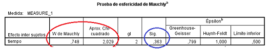
```

\newpage

\noindent En la siguiente figura aparece la tabla ANOVA con los resultados obtenidos en el estudio:


```{r, echo= FALSE,results="asis",message=FALSE,warning=FALSE,fig.cap= "Modelo A2FMR en SPSS: Tabla ANOVA",fig.align='center',out.width="60%"}

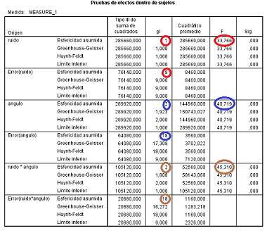
```


#### Estudio de la interacción

1. Creamos las nuevas variables que denominamos "Contraste". Para el *Contraste1" sería:

```{r, echo= FALSE,results="asis",message=FALSE,warning=FALSE,fig.cap= "Modelo A2FMR en SPSS: Comparación efectos simples",fig.align='center',out.width="60%"}

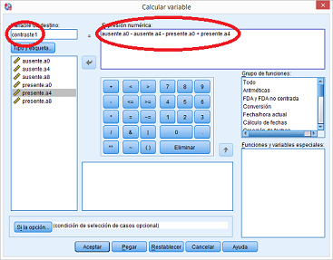
```

\noindent Analizamos esta variable mediante el procedimiento de "Prueba T para una muestra":

```{r, echo= FALSE,results="asis",message=FALSE,warning=FALSE,fig.cap= "Modelo A2FMR en SPSS: Comparación efectos simples: Contraste 1",fig.align='center',out.width="60%"}

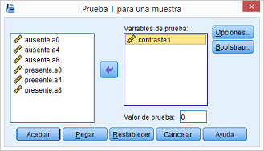
```


2. Creamos una nueva variable que denominamos *Contraste 2* de la siguiente forma:


```{r, echo= FALSE,results="asis",message=FALSE,warning=FALSE,fig.cap= "Modelo A2FMR en SPSS: Comparación de efectos simples",fig.align='center',out.width="60%"}

knitr::include_graphics("figurasR/contraste251c.png")
```


\noindent Los resultados obtenidos con este segundo contraste se muestran en la siguiente figura:


```{r, echo= FALSE,results="asis",message=FALSE,warning=FALSE,fig.cap= "Modelo A2FMR en SPSS: Comparación de efectos simples",fig.align='center',out.width="60%"}

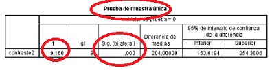
```


3. El tercer contraste es la diferencia en el efecto de A cuando está presente $b_2$ en comparación con la presencia de $b_3$. Para determinar la significación de esta comparación el procedimiento es el mismo que en los casos anteriores. Los resultados de este tercer contraste serían:


```{r, echo= FALSE,results="asis",message=FALSE,warning=FALSE,fig.cap= "Modelo A2FMR en SPSS: Comparación de efectos simples",fig.align='center',out.width="60%"}

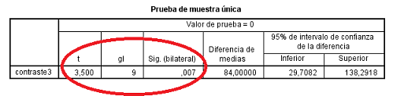
```


#### Efectos simples con el programa SPSS

El programa SPSS presenta una tabla donde aparecen las comparaciones entre los distintos efectos simples:


```{r, echo= FALSE,results="asis",message=FALSE,warning=FALSE,fig.cap= "Modelo A2FMR en SPSS: Comparación de efectos simples",fig.align='center',out.width="70%"}

knitr::include_graphics("figurasR/contrastesspssc.png")
```

\noindent En la tabla se comparan los efectos simples de A en los niveles 2 y 3 de B con respecto al nivel 1 de B. Ambos resultan ser significativos. Sólo falta la comparación del nivel 3 con el 2. Este se consigue en la ventana de *contrastes* marcando en vez de la primera categoría, la última:


```{r, echo= FALSE,results="asis",message=FALSE,warning=FALSE,fig.cap= "Modelo A2FMR en SPSS: Comparación de efectos simples",fig.align='center',out.width="70%"}

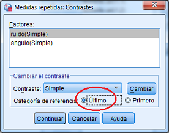
```


```{r, echo= FALSE,results="asis",message=FALSE,warning=FALSE,fig.cap= "Modelo A2FMR en SPSS: Comparación de efectos simples",fig.align='center',out.width="70%"}

knitr::include_graphics("figurasR/contrastes3spssb.png")
```


\noindent Vemos que también los resultados son significativos para esta tercera comparación. Asimismo, puede comprobarse que el valor de los estadísticos es igual, ya que el estadístico *F* es equivalente al estadístico *t* elevado al cuadrado. Así, en el contraste del nivel 2 con el nivel 3 el estadístico *F* vale 12,25 y el valor de $t^2$ = $3.5^2$ = 12.25. 

#### Estudio de los efectos principales

En el caso de que el efecto de la interacción no sea significativo este diseño también permite estudiar los efectos principales. Para ello, se aplica el mismo procedimiento que el utilizado cuando se estudiaron los diseños de medidas repetidas con 1 factor. Así, compararemos las diferencias entre las medias (varianza del tratamiento A o B) con su correspondiente término de error (interacción SxA en el caso de la VI A e interacción SxB en el caso de la VI B). Si estos contrastes resultan significativos habrá que continuar para determinar la significación entre las distintas condiciones. Esto puede hacerse con el procedimiento estudiado anteriormente en el programa SPSS (opción de *Contrastes + Comparaciones simples*), en el caso de que se cumpla el supuesto de la esfericidad. Si no se cumple este supuestos, pueden realizarse comparaciones dos a dos corrigiendo el nivel de riesgo con el criterio de *Bonferroni*.


```{r, echo= FALSE,results="asis",message=FALSE,warning=FALSE,fig.cap= "Modelo A2FMR en SPSS: Comparación de efectos simples",fig.align='center',out.width="70%"}

knitr::include_graphics("figurasR/contrastes4spssb.png")
```


### Análisis del ejemplo 2 con SPSS

Un resumen de las distintas condiciones en el diseños son las siguientes:


```{r, echo= FALSE,results="asis",message=FALSE,warning=FALSE,fig.cap= "Descriptivos",fig.align='center',out.width="70%"}

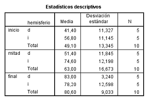
```

Para realizar el análisis de este tipo de diseños mediante el programa SPSS se utiliza el mismo procedimiento que en los diseños anteriores: *Analizar + Modelo lineal general + Medidas repetidas*. La única diferencia es que en este caso al introducir las variables es necesario incluir el factor entresujetos tal y como aparece en la siguiente figura:


```{r, echo= FALSE,results="asis",message=FALSE,warning=FALSE,fig.cap= "Modelo A2FMR en SPSS: Datos del ejemplo 2",fig.align='center',out.width="70%"}

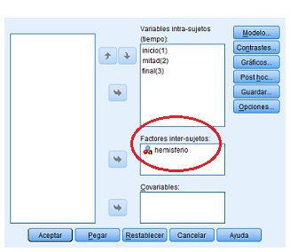
```


Los resultados de este ejemplo indican la existencia de una interacción significativa:

\newpage

```{r, echo= FALSE,results="asis",message=FALSE,warning=FALSE,fig.cap= "Modelo A2FMR en SPSS: Resultados del ejemplo 2",fig.align='center',out.width="70%"}

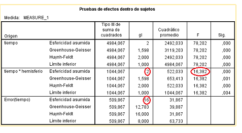
```


Para considerar como válidos estos resultados es necesario que se cumplan los supuestos del modelo (normalidad, homogeneidad de varianzas-covarianzas y esfericidad). En relación con el supuesto  de esfericidad la prueba de Mauchly confirma  su existencia:


```{r, echo= FALSE,results="asis",message=FALSE,warning=FALSE,fig.cap= "Modelo A2FMR en SPSS: Prueba de esfericidad del ejemplo 2",fig.align='center',out.width="70%"}


```


La prueba de Box-Cox nos permite contrastar el supuesto de homogeneidad de varianzas-covarianzas. Esta prueba se obtiene dentro de la ventana de *opciones* marcando la opción de *pruebas de homogeneidad*. Observamos que p = 0.05 por lo que aceptamos la hipótesis de que las matrices de varianzas y covarianzas del grupo con lesión en hemisferio izquierdo es semejante a la del hemisferio izquierdo.


```{r, echo= FALSE,results="asis",message=FALSE,warning=FALSE,fig.cap= "Modelo A2FMR en SPSS: Prueba de boxcox del ejemplo 2",fig.align='center',out.width="20%"}

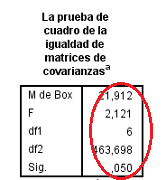
```

\newpage

\noindent Encontramos que la comparación entre el efecto simple del nivel 1 frente al 3 muestran diferencias significativas. Para encontrar la comparación entre el nivel 2 y el nivel 3 solo basta cambiar la categoría de referencia (hay que poner la última) en la opción de contrastes. También resulta significativa. 


```{r, echo= FALSE,results="asis",message=FALSE,warning=FALSE,fig.cap= "Modelo A2FMR en SPSS: Comparación de los efectos simples",fig.align='center',out.width="70%"}

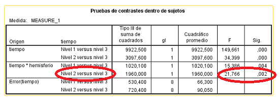
```

