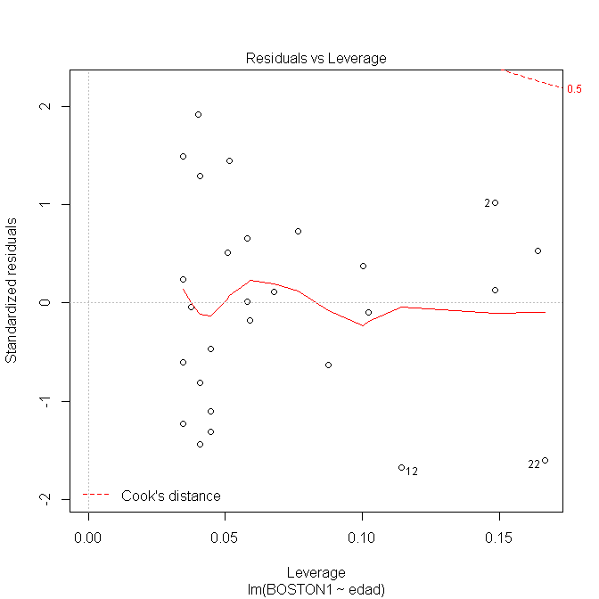
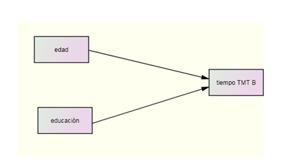
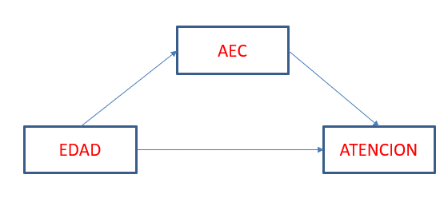

# Modelos de regresión lineal

El objetivo de este tema es introducir los conceptos básicos de la técnica estadística denominada \emph{Regresión lineal estadística}. Esta técnica pretende establecer relaciones entre una variable dependiente cuantitativa y una variable predictora (\emph{Análisis de regresión simple}) o varias variables predictoras (\emph{Análisis de regresión múltiple}). Aunque el objetivo principal es estudiar relaciones entre variables cuantitativas, el modelo de regresión lineal también puede utilizarse con variables cualitativas. Asimismo, realizaremos algunas incursiones dentro del análisis de "vias"  (\emph{path analysis} en el que se utilizan varias modelos de regresión para el estudio de relaciones moderadas y mediadas. 


El análisis de la regresión está estrechamente relacionado con el análisis de la correlación. La diferencia entre ambos depende de los objetivos del investigador. En el primer caso, se pretende establecer algún tipo de predicción, mientras que en el segundo se pretende medir el grado de relación entre dos variables. 

Con objeto de aplicar los conceptos aquí expuestos sobre una tema concreto presentamos los resultados de una investigación sobre  envejecimiento. Este estudio versa sobre el deterioro cognitivo de las personas mayores. En el fichero *reserva.sav* se presentan los resultados de una investigación en la que se estudió una muestra de personas mayores a las que se les midió las siguientes variables: edad, sexo, tiempo en TMT-B en el momento 1, puntuación total en el test de denominación de Boston, años de escolarización, puntuación en el test de Yesavage para medir depresión, tiempo en la prueba del TMT-B en un segundo momento, puntuación total en el test de Boston en un segundo momento, la puntuación en la prueba de actividades estimulantes de la cognición (AEC) y la diferencia entre las dos puntuaciones del Boston.


Los primeros 6 sujetos de las primeras 8 variables se presentan a continuación:

```{r, echo= FALSE,results="asis"}
library(foreign)
library(leaps)
library(MASS)
dat = read.spss("data/reserva.sav", use.value.labels=T,
to.data.frame=T)
datb<- dat[1:6,1:8]
knitr:: kable(datb,caption= "Primeros sujetos del fichero de datos")
``` 

```{r , echo= FALSE,results="asis"}
library(xtable)
a=dat[c(1:6),c(1:8)]
print(xtable(a,caption="Primeros sujetos del fichero"),comment  =F)
```

## Correlación

En la figura siguiente puede apreciarse visualmente que existe una relación entre la variable edad y la puntuación obtenida en el test de Boston. Se aprecia con cierta claridad que a medida que aumenta la edad disminuye la puntuación obtenida por las personas mayores en el test.


```{r,fig0,echo=FALSE,fig.height= 3,fig.cap = 'Relación entre la edad y BOSTON 1', resulTS='asis',message=FALSE}
library(ggplot2)
fig1<- ggplot(dat, aes(x= edad, y = BOSTON1 )) + geom_point(size=3) + geom_smooth(method= 'lm')
fig1 + xlab('Edad') + ylab('Puntuación en el Boston')
``` 

Por lo general, en la investigación científica se desea cuantificar las relaciones entre variables, siendo el *coeficiente de correlación de Pearson* una de las pruebas más utilizadas. Se define de la siguiente forma:

$$
r_{xy} \approx \frac{\sum_{j=1}^{n}Z_{X_{j}}Z_{Y_{j}}}{n}
$$
\noindent donde $Z_{X_{j}}$ y $Z_{Y_{j}}$ son las medidas del sujeto \emph{j} en las variables X e Y expresadas como desviaciones típicas con respecto a su media muestral:

$$
Z_{X_{j}}= \frac{X_{j}-\bar{X}}{SD_{X}} \hspace{10mm}
Z_{Y_{j}}= \frac{Y_{j}-\bar{Y}}{SD_{Y}}
$$

\noindent donde $SD_{X}$ y $SD_{Y}$ son la desviación tipo de las variables X e Y respectivamente; $\bar{X}$ y $\bar{Y}$ son las medias muestrales. 

El coeficiente de correlación ($r_{xy}$) oscila entre -1 y 1, siendo su valor cero cuando no existe relación entre las variables. Si la relación es \emph{directa}, $r_{xy}> 0$. Por el contrario, si la relación es \emph{inversa} $r_{xy}<0$. Si elevamos al cuadrado $r_{xy}$ obtenemos el \emph{coeficiente de determinación}. Nos indica el grado de varianza compartida entre las dos variables. En el caso de la relación entre la variable edad y primera medida del test de Boston el valor sería 0.2158. Es decir, ambas variables comparten el 22\% de varianza.

El coeficiente de correlación nos permite conocer el valor de la variable Y a partir de los valores de X. Es decir, si conocemos que una persona está 0,5 desviaciones típicas en edad (es mayor que la media), podremos predecir si esta persona se encuentra por encima o por debajo de la media en la puntuación en el Boston. Para ello, hacemos
uso de la siguiente expresión:

$$
\hat{Z}_{Y_{j}}= r_{xy}Z_{X_{j}} = -0.465*0.5 = -0,233
$$

Puede afirmarse que este sujeto se encuentra por debajo del valor medio en la puntuación del test de Boston. De hecho, su edad será:

$$
\hat{Z}_{X_{j}}=0.5 = \frac{X_{j} -67.93}{7.319}= 0.5*7.319 + 67.93 = 71.59 \approx 72 \; años \;de \; edad
$$
Por tanto, dado que la media de la puntuación en el test de Boston en la primera medición es 49,90 y su desviación tipo es 5,381 podemos hacer una primera estimación del valor que obtendría este sujeto:

$$
\hat{Z}_{Y_{j}}=-0.233 = \frac{Y_{j} -49,90}{5.381}= -2.33*5.381 + 49.40 = 37.346= Y_{j}
$$

Este resultado supone una primera aproximación al valor real del sujeto. Podemos considerar que es el valor esperado. Sin embargo, existirán diferencias entre los distintos sujetos que presenten una misma edad. Para determinar el intervalo de confianza será necesario introducirnos en los modelos de regresión. 

## Regresión simple

El modelo de regresión simple es:

$$
Y_{i}= \beta_{0} + \beta_{1}* x_{i} + \epsilon_{i}
$$

\noindent donde $Y_{i}$ es el valor de la respuesta del sujeto \emph{i}, $\beta_{0}$  y $\beta_{1}$ son los parámetros de la recta de regresión, $x_{i}$ es el valor del sujeto \emph{i} en la variable predictora. Por último, $\epsilon_{i}$ es el término de error correspondiente al sujeto \emph{i}.

Este modelo de regresión pretende relacionar dos variables de manera lineal. De hecho, la ecuación de la recta de regresión no es otra cosa que la ecuación de una recta que presenta la propiedad de ser la que menor error produce a la hora de representar las puntuaciones de los sujetos. A la variable X se le denomina variable \emph{independiente} o variable \emph{predictora} y a la variable Y se le denomina variable \emph{criterio} o \emph{dependiente}.

El valor del parámetro $\beta_{0}$ nos indica el punto de corte de la recta de regresión sobre el eje de ordenadas. En cambio, el valor del parametro $\beta_{1}$ nos indica la pendiente de la recta. Si este parámetro vale cero nos encontramos con la ausencia de relación entre las dos variables. Asimismo, si este parámetro es de signo negativo
tenemos una relación de tipo \emph{inverso}. Por el contrario, si el parámetro es positivo tendremos una relación \emph{directa} entre las dos variables.   

Utilizando la base de datos anterior vamos a estudiar las relaciones entre la edad y la puntuación en el test de Boston en la primera medición. Asimismo, queremos estudiar si están relacionadas las dos medidas del Boston.

```{r,fig1,echo=FALSE,fig.height=3,fig.cap = 'Relación entre las dos medidas del Boston' , results='asis', message=FALSE}
fig2<- ggplot(dat, aes(x= BOSTON1, y = BOSTON2)) + geom_point(size=3) + geom_smooth(method= 'lm')
fig2 + xlab('Puntuación en el Boston 1') + ylab('Puntuación en el Boston 2')

``` 


Podemos observar que entre las dos variables de la figura 1 existe una relación lineal de tipo \emph{inverso}. Es decir, a medida que aumenta la edad, los sujetos tienden a obtener una menor puntuación en el test de Boston. 

La recta de regresión obtenida para la figura 1 es:

```{r,reg1,echo=FALSE,results='asis'}
mod= lm(BOSTON1~edad,data=dat)
a<-xtable(mod,caption = "Regresión de la medida del BOSTON1 sobre la edad")
print(a, comment = F)
``` 

En otras ocasiones nos encontraremos con relaciones directas como en el caso de la figura 2. Se obtiene que a medida que aumenta la puntuación en el primer momento del Boston también aumenta la puntuación obtenida en el Boston en el momento 2. La recta de regresión obtenida para la figura 2 es:

```{r,reg2,echo=FALSE,results='asis'}
mod2= lm(BOSTON2~BOSTON1,data=dat)
a<-xtable(mod2,caption = "Regresión de la medida del BOSTON2 sobre BOSTON1")
print(a, comment = F)
``` 

En ambos casos el parámetro $\beta_{1}$ es significativo. La única diferencia es que en la relación de la figura 2 el valor es negativo (- 0.325) y en el de la figura 2 positivo (1.041). En el caso de la figura 2, la recta de regresión obtenida es:


$$
\hat{Y}_{i} =  71.90 - 0.325 *x_{i}
$$

Según estos resultados, el punto de corte de la recta con el eje de ordenadas está en 71.9 y a medida que las personas aumentan un año de edad su puntuación en el test de Boston disminuye 0.325 unidades. 

### Predictores categóricos

En el modelo de regresión las variables predictoras pueden ser cuantitativas o cualitativas. Un ejemplo de variable cualitativa puede ser el género. Los resultados del modelo de regresión que relaciona el género con la puntuación en el test de Boston aparece en la siguiente tabla:

```{r,reg3,echo=FALSE,results='asis'}
mod3= lm(BOSTON1~sexo,data=dat)
a<-xtable(mod3,caption = "Regresión de la medida del BOSTON1 sobre la variable sexo")
print(a, comment = F)
``` 

\noindent Observamos que la recta de regresión obtenida es:

$$
Y_{j} = 49,10 + 2,68* sexo \hspace{15mm} para\; hombres \;y
$$
$$
Y_{j} = 49,10 \hspace{35mm} para\; mujeres
$$
Como la variable sexo se ha categorizado como 0 si la persona es mujer y 1 si es hombre el valor esperado en la prueba de Boston será mayor para los hombres que para las mujeres. O lo que es lo mismo, la "intercept" de la ecuación de regresión se corresponde con el valor medio de las mujeres en el test de Boston. Esta es la codificación recomendable para facilitar la interpretación del modelo. Sin embargo, cualquier otra codificación es posible. No obstante, @hayes recomienda usar valores cuya diferencia entre los valores sea igual a 1. De este modo, el coeficiente $\beta_{1}$ se podrá interpretar como la diferencia exitente entre las medias de los dos grupos.  


### Realización de pronósticos

Una de las utilidades del modelo de regresión es la de permitir realizar predicciones. Continuando con el ejemplo 1, puede interesarnos conocer la puntuación que obtendría en el test de Boston una persona con 70 años. Utilizando la recta de regresión obtendríamos: 

$$
49.15 = 71.90 - 0.325*70
$$

Esta estimación representa el valor más probable, pero puede interesarnos realizar una estimación mediante intervalos de confianza. Pueden construirse dos tipos de intervalos dependiendo de que queramos realizar estimaciones con respecto a la media o con respecto al individuo. En el primer caso, la estimación se hace para todos los sujetos que tienen
una misma puntuación. En cambio, cuando nos interesa realizar un pronóstico individual el pronóstico se interpreta como la estimación asignada a un sujeto concreto con un valor concreto en la variable predictora [@sanmartin]. Estas estimaciones son más amplias que las de la media. La siguiente expresión nos permiten calcular el 
intervalo de confianza (IC) para los pronósticos individuales:
 
$$
S_{\hat{Y_{i}}|X_{i}}^{2} = MCE[1+\frac{1}{n}+(X_{i}-\bar{X})^2/\sum (X_{i}-\bar{X})^2] 
$$ 

Para el pronóstico con respecto a la media será la siguiente expresión:

$$
S_{\hat{\mu_{i}}|X_{i}}^{2} = MCE[\frac{1}{n}+(X_{i}-\bar{X})^2/\sum (X_{i}-\bar{X})^2] 
$$ 

Aplicados a los datos de nuestro ejemplo obtenemos (47,24;51,02) para el IC de la media y (39,13;59,13) para el pronóstico individual. Queda manifiesto que los pronósticos individuales son menos exactos que los referidos a la media. 


## Regresión lineal múltiple

La realidad supone la existencia de relaciones complejas por lo que el investigador suele estar interesado en modelos que incluyan más de dos variables. Para ello, dispone de una serie de herramientas estadísticas dentro de las cuales se incluyen las técnicas de regresión múltiple. El modelo estadístico para esta técnica se representa de la siguiente forma:

$$
Y_{i}= \beta_{0} + \beta_{1}* x_{1i} + \beta_{2}* x_{2i}+ \cdots + \beta_{p+1}* x_{pi}+\epsilon_{i}
$$

\noindent donde $x_{pi}$ son las variables predictoras y $\beta_{p+1}$ son los coeficientes de regresión.


Supongamos que estamos interesados en estudiar si la puntuación en la primera medida del Boston depende de la edad y del género. En la siguiente figura aparece representada la relación entre edad y medida 1 del Boston para hombres y para mujeres:


```{r,fig3,echo=FALSE,fig.height= 3,fig.cap = 'Relación entre la edad y el Boston 1 en función del género',results='asis',fig.align='center',message=FALSE}
fig3<- ggplot(dat, aes(x= edad, y = BOSTON1)) + geom_point(size=3) + geom_smooth(method= 'lm')
fig4<- fig3 + xlab('Edad') + ylab('Puntuación en el Boston 1')
fig4 + facet_grid(.~sexo) 

``` 

La gráfica indica que la relación entre edad y puntuación en el Boston sigue siendo negativa. Sin embargo, esta relación presenta mayor o menor intensidad dependiendo del género. En las mujeres la recta de regresión está menos inclinada indicando que la disminución en la puntuación en el Boston es bastante más atenuada que en los hombres. Realizando el análisis de regresión obtenemos los siguientes resultados:

```{r,rm1,echo=FALSE,results='asis'}
mod3= lm(BOSTON1~edad+sexo,data=dat)
a<-xtable(mod3,caption= "Regresión de la medida del Boston en el momento 1 en función de la edad y el sexo")
print(a, comment = F)
``` 

Estos resultados indican que el género tiene un efecto protector sobre el deterioro de la memoria semántica en las personas mayores. Comparando hombres y mujeres de la misma edad, las mujeres obtendrán una menor puntuación que los hombres en el test de denominación de Boston.

### Selección de modelos

Cuando se construye un modelo es deseable encontrar el mejor subconjunto de predictores que expliquen los datos de manera aceptable. Existen dos estrategias para la selección de variables [@ugarte]: 1) mediante la estimación de todos los modelos, y 2) mediante un procedimiento de pasos sucesivos.


#### Estimación de todos los modelos

Es un método que requiere el uso intensivo del ordenador, ya que cuando el número de variables es relativamente grande resulta difícil poder llevarlo a cabo de manera manual. Se elige el modelo que presenta el mejor criterio de ajuste. @ugarte consideran como criterios válidos el estadístico $R^{2}$ ajustado o el índice $C_{p}$. El programa R [@R] permite calcular todos los modelos posibles.

Para ver este procedimiento seguiremos con el mismo ejemplo y calcularemos todos los modelos de regresión posibles para estudiar el efecto de la edad, la educación y las AEC sobre la puntuación en la primera medida del test de Boston. Los resultados obtenidos son los siguientes:

```{r,rm3,echo=FALSE,results='markup'}
library(leaps)
modelos= regsubsets(BOSTON1~edad+edu+AEC,data=dat)
summary(modelos)
summary(modelos)$adjr2
``` 

Se aprecia en la tabla que el modelo con mejor ajuste ($R^{2}$) es el que incluye sólo las variables edad y educación ($R^{2}$ ajustado = 0.255). El modelo que incluyó sólo la edad presenta un $R^{2}$ ajustado de 0.178. Es decir, la variable edad explica aproximadamente un 17,8\% de la varianza de la variable puntuación en el test de Boston en la primera medición. Estos resultados contrastan con los obtenidos con el modelo que incluyó dos variables (edad y educación) cuyo valor de $R^{2}$ ajustado fue mayor (0.255). Una forma de valorar esta contribución consiste en cuantificar el grado de cambio al incorporar (eliminar) una variable a la ecuación:

$$
R_{cambio|X_{j}}^{2} = R_{12 \ldots p}^{2}-R_{12 \ldots p-1}^{2} = 0.255-0.178= 0.077
$$

La significación estadística del cambio en $R^{2}$ viene dada 
por la siguiente expresión:

$$
F_{cambio|X_{j}}= \frac{R_{cambio|X_{j}}^{2}(n-p-1)}{1 - R_{12 \ldots p}^{2}} = \frac{0.077*(30-2-1)}{1-0.255}=2.79
$$

Comparando este resultado con el de las tablas para una F con 1 y \emph{n-p -1} grados de libertad y un nivel de significación del 0.05 obtenemos un valor de F(1,27) = 4.21. Por tanto, a pesar de aumentar el índice de ajuste, éste incremento no resulta ser significativo por lo que el modelo óptimo no cambia. Introducir la variable educación en el modelo no mejora significativamente el ajuste. Si calculamos la raiz cuadrada de 2.79 obtenemos el valor del estadístico t correspondiente al parámetro beta de la variable educación tal y como puede observarse en la siguiente tabla:


```{r echo=FALSE,results='asis',message=FALSE}
library(leaps)
modelo2= lm(BOSTON1~edad+edu,data=dat)
#summary(modelo2)
a2<-xtable(modelo2,caption= "Regresión de la medida BOSTON1 en función de la edad y la educación")
print(a2, comment = F)
#summary(modelo)$adjr2
``` 


Mediante este procedimiento sólo se incluye la variable edad, ya que es la única que cumple el criterio de significación ($p(F) \leq.05)$. El resto de variables son excluidas por no cumplir dicho criterio.

El método de selección hacia atrás comienza con el modelo máximo. En cada paso, se elimina aquel predictor que cumple el criterio de eliminación (p(F)>.05) y con mayor nivel de significación. Este procedimiento continua hasta que todos los predictores presentes en el modelo son significativos o no quedan predictores en el modelo. Utilizando el mismo modelo, pero cambiando la opción de Método por \emph{Atrás} tal y como aparece en la siguiente figura nos encontramos que el programa comienza con el modelo máximo (las tres variables incluidas) y elimina aquellas variables que no cumplen el criterio (p(F)< .1). el resultado final es el mismo que en el caso anterior: 

```{r echo=T,results='markup',message=FALSE}
library(stats)
dat1<- dat[,c(1,5,7,8)]
names(dat1)
n.model<- lm(BOSTON1~1,data=dat1)
all<- lm(BOSTON1~.,data=dat1)
models<-step(all, scope =formula(all),direction ="backward")
summary(models)
``` 

El método de selección por pasos sucesivos es una combinación de ambos y que presenta la diferencia de que en este procedimiento una variable que ha salido en una etapa puede volver a entrar en otra. Lo mismo puede decirse para aquellas variables que han entrado en un momento determinado y que pueden salir en una fase posterior [@ato]. Los resultados aplicados al modelo anterior son idénticos.


```{r,rm3b,echo=T,results='markup',message=FALSE}
library(stats)
dat1<- dat[,c(1,5,7,8)]
n.model<- lm(BOSTON1~1,data=dat1)
all<- lm(BOSTON1~.,data=dat1)
models<-step(n.model, scope =formula(all),direction ="both")
summary(models)
```

En resumen pues, los tres procedimientos obtienen al final un modelo de regresión en el que la única variable predictora significativa es la edad. Los resultados finales del modelo se incluyen en la siguiente tabla:

```{r,rm2b,echo=FALSE,results='asis'}
mod3= lm(BOSTON1~edad,data=dat)
a<-xtable(mod3,caption= "Regresión de la medida BOSTON1 sobre la edad")
print(a,comment = F)
```  


### Importancia de las variables
 
No existe un criterio unívoco para determinar la importancia de una variable en el modelo de regresión. En ocasiones, se considera como más importante el que una variable contribuya en mayor medida al cambio esperado en la variable Y. En este caso, la importancia de las variables se puede establecer en base a los \textbf{coeficientes de regresión tipificados} [@sanmartin]. Sin embargo, también puede utilizarse el criterio de aquella variable que más contribuye al ajuste global. Si es el caso, entonces ha de utilizarse el cuadrado del \textbf{coeficiente de correlación semiparcial} para determinar la importancia de cada variable.


## Supuestos del modelo

Una vez obtenido el modelo conviene preguntarse por la idoneidad del mismo. Además del supuesto de linealidad ya mencionado, tambien es conveniente evaluar la normalidad de los errores y la homogeneidad de las varianzas de la variable Y condicionada a cada valor de X. Asimismo, es conveniente determinar la independencia de las observaciones.

#### Linealidad

El modelo de regresión asume que las relaciones entre las variables son lineales. Sin embargo, no todas las relaciones son de esta naturaleza. Por ejemplo, en la figura 4 podemos observar un tipo de relación curvilínea:


```{r,fig4, echo=FALSE,fig.height = 3,fig.cap = 'Relación entre los años de escolarización y el tiempo en realizar el TMT-B', results='asis',message=F}
fig3<- ggplot(dat, aes(x= edu, y = TMTB2))  + stat_smooth() +geom_point()
fig4<- fig3 + xlab('Años de escolarización') + ylab('Tiempo en el TMT-B')
fig4 
```

Cuando se dan este tipo de relaciones no es adecuado aplicar los modelos de regresión aqui estudiados, ya que la interpretación del parámetro $\beta_{1}$ sería incorrecta [@hayes]. En estas circunstancias han de utilizarse otro tipo de técnicas que superan el alcance de este texto. 

#### Normalidad

Este supuesto implica que los errores del modelo siguen una distribución normal. Para evaluar este modelo basta con calcular la diferencia entre las puntuaciones observadas y las predichas (residuales) y aplicar el estadístico de Shapiro-Wilks (SW) para determinar su significación. Aplicado al ejemplo de la figura 1 tenemos:

```{r,err, echo= TRUE,results= 'markup',message=FALSE,warning=FALSE}
shapiro.test(mod$residuals)
``` 

\noindent Obsérvese que el test SW no permite rechazar la hipótesis nula de normalidad de la distribución.

#### Homocedasticidad

Este supuesto indica que los errores son homogéneos para cada $\hat{Y}$. Existen varios métodos para evaluar este supuesto. El más fácil es mediante la evaluación visual de los residuales del modelo representados gráficamente frente a los valores predichos tal y como se realiza en la figura 5. Puede observarse que los errores se reparten de manera homogénea entre los distintos valores predichos.El resultado del incumplimiento de este supuesto implica reducir la potencia estadística de la prueba. Asimismo, los intervalos de confianza se ven afectados por la \emph{heterocedasticidad} de los errores.


```{r,sup, echo= FALSE,fig.height = 3,fig.alin= "center",fig.cap = 'Gráfico para estudiar la homocedasticidad',results= 'asis'}
plot(mod3$fitted,mod$residuals)
abline(h=0,col="red")
``` 


#### Independencia

Este supuesto implica que la información contenida en los errores de un sujeto no me proporciona información sobre los errores de otros sujetos presentes en el estudio. Por ejemplo, supongamos que estamos interesados en estudiar el rendimiento de los niños en un centro escolar. Obviamente, el rendimiento de los escolares puede depender de la calidad del profesor del que reciben sus enseñanzas. En este caso, todos los alumnos procedentes de un buen profesor presentarán mejores resultados que aquellos que recibieron sus enseñanzas con otro profesor de peor calidad. A la hora de analizar este modelo, los alumnos del profesor "excelente" tenderán a ser positivos en comparación con los de otros niños con peores profesores. 

El incumplimiento del supuesto de independencia afecta a los supuestos del modelo de regresión de la misma forma que el supuesto de homocedasticidad. Los errores estándar son infraestimados afectándose también los intervalos de confianza.  

#### Colinealidad

Existe colinealidad cuando dos variables predictoras presentan correlaciones my altas. O lo que es lo mismo, existe una relación funcional entre ambas. Si dos variables muestran una colinealidad alta, el procedimiento de estimación de mínimos cuadrados se verá afectado obteniéndose parámetros sesgados (la varianza de los coeficientes de regresión aumentan de manera considerable). 

Para detectar la existencia de una colinealidad alta el programa estadístico SPSS muestra dos estadísticos denominados \emph{Indice de tolerancia} (1 - $R_{j}^{2}$) y los \emph{factores de inflación de la varianza} (FIV). Este último es el inverso del índice de tolerancia. Valores mayores que 10 en los FIV suelen ir acompañados de los problemas de estimación asociados a un exceso de colinealidad.

Para solucionar los problemas de colinealidad se tienen varias propuestas. Eliminar alguna de las variables que presentan una relación muy alta (esta es la opción que utiliza SPSS cuando se elige la opción de pasos sucesivos). Otra posibilidad es agrupar las distintas variables altamente relacionadas mediante la técnica de \emph{componentes principales}. Por último, señalar que cuando se incluyen interacciones entre variables en el modelo es frecuente que aparezcan valores altos de FIV (factores de inflación de la varianza) que pueden solventarse centrando las variables predictoras.

#### Casos atípicos

Para considerar adecuada una recta de regresión, las predicciones deben ser adecuadas. Mediante una primera exploración puede determinarse la existencia de anomalías tanto en la variable dependiente como en las variables predictoras. 

Para determinar anomalías en la variable dependiente conviene realizar una exploración de los residuos ($E_{j}= Y_{j} - \hat{Y}_{j}$). Por lo general, son aceptables todos aquellos residuos \emph{studentizados} que se encuentren por debajo de 3 (en valor absoluto). Una forma de evaluar que se cumple este supuesto es mediante un gráfico de las puntuaciones predichas y estos residuos. Aplicado al modelo estudiado anteriormente (relación entre edad y medida 1 del Boston) la gráfica es la siguiente:

```{r,gr, echo=FALSE,fig.height = 4, results='asis',fig.cap= "Residuales del modelo"}
plot(mod3$fitted,rstudent(mod3),col="orange",pch=6)  
```

Observamos que todos los residuales se encuentran dentro del rango (-1,2), indicando un buen ajuste del modelo.

Al igual que existen puntuaciones anómalas con respecto a la variable Y, también pueden aparecer puntuaciones atípicas en relación con los valores de los predictores (\emph{leverage}). Para medir la influencia de este tipo de puntuaciones se calculan los índices $h_{i}$ que representan el grado de alejamiento del conjunto de puntuaciones
de un caso con respecto a las puntuaciones medias de todos los casos. @sanmartin señalan que una regla que funciona bien es revisar aquellos valores $h_{i}$ por encima de 0.5. 

Una medida basada en los $h_{i}$ es el estadístico distancias de Cook ($D_{i}$) que es la suma de los cambios que se producen en los coeficientes de regresión al ir eliminando cada caso del análisis:

$$
D_{i}=[h_{i}E_{S_{i}^{2}}]/[(p+1)(1-h_{i})]
$$

\noindent donde $h_{i}$ es el grado en el que una puntuación es atípica en $X_{j}$ y $E_{S_{i}}$ es el grado en que una puntuación es atípica con respecto a Y.

 Se considera que un caso debe ser considerado influyente cuando $D_{i} > 1$. En la siguiente gráfica observamos que las puntuaciones $D_{i}$ del modelo que relaciona la edad con la medida 1 del Boston se encuentran por debajo
de 1:


```{r, echo= FALSE,results="asis",message=FALSE,warning=FALSE,fig.cap= "Leverage del modelo",fig.align='center',out.width="60%"}


```


#### Interpretación de la regresión múltiple

Para ver como se interpretan los parámetros de un modelo de regresión múltiple
vamos a utilizar el ejemplo desarrollado anteriormente en el que se quiso relacionar el efecto el efecto de la educación formal y las actividades estimulantes (AEC) sobre la atención. El modelo a contrastar sería el siguiente:

$$
Atención_{i} = \beta_{0} + \beta_{1}*edad + \beta_{2}*educación +  \epsilon_{i}
$$

Los resultados que proporciona el programa R son los siguientes:


```{r,rm4,echo=T,results='markup',message=FALSE}

mod4<- lm(atencion~AEC+edu,data=dat)
summary(mod4)
```


En base a estos resultados el modelo quedaría explicitado mediante la siguiente
ecuación:

$$
Atención_{i} = -170.193 + 5.163*aec + 17.270*educación +  \epsilon_{i}
$$

Por tanto, las conclusiones siguiendo normas APA serían las siguientes:

>\emph{la atención de las personas mayores aumenta 17,27 unidades por cada año de >escolarización formal, permaneciendo constante el valor de estimulación cognitiva >(t(27) = 18.02, p < .001). Asimismo, se encontró que la atención de las personas >mayores aumenta 5,16 unidades por unidad de AEC, permaneciendo constante el valor >del nivel educativo (t(27) = > > 9.39, p < .001).}


## Regresión múltiple y modelos estadísticos

Supongamos que estamos interesados en estudiar como influyen la edad y la educación en el tiempo de ejecución de la prueba TMT-B en el momento 1. Caben distintas hipótesis para entender las relaciones entre estas tres variables. La primera es considerar que el efecto de cada predictor es independiente. En este caso un modelo gráfico lo representaría de la siguiente forma:


```{r,rmd, echo= FALSE,results="asis",message=FALSE,warning=FALSE,fig.cap= "Modelo de regresión múltiple con relaciones directas",fig.align='center',out.width="60%"}



```


La representación estadística de este modelos sería la siguiente:

$$
Y_{i} = \beta_{0} + \beta_{1}*edad + \beta_{2}*educación + \epsilon_{i}
$$

Sin embargo, con estas mismas tres variables es posible plantearse otras posibilidades de relación. Así, por ejemplo, podemos plantearnos que la relación entre la edad y el tiempo necesitado en completar la prueba del TMT-B está \emph{moderada} por la variable educación. En la siguiente figura aparece reflejado este modelo:


```{r,rmd3, echo= FALSE,results="asis",message=FALSE,warning=FALSE,fig.cap= "Modelo de moderación",fig.align='center',out.width="60%"}

knitr::include_graphics("figurasR/mod2d.png")

```

El modelo estadístico que representa esta hipótesis es el siguiente:

$$
Y_{i} = \beta_{0} + \beta_{1}*edad + \beta_{2}*educación + \beta_{3}*educación*edad + \epsilon_{i}
$$

Otra posibilidad sería considerar que la variable educación \emph{media} la relación entre la edad y la respuesta al TMT-B en la primera medición. Este modelo vendría representado de la siguiente forma:


```{r,rmd2, echo= FALSE,results="asis",message=FALSE,warning=FALSE,fig.cap= "Modelo de mediación",fig.align='center',out.width="60%"}

knitr::include_graphics("figurasR/mod3.png")

```


Para contrastar este modelo son necesarias varias ecuaciones de regresión. En primer lugar, es necesario determinar la regresión de la variable mediadora (educación) sobre la variable predictora (edad):

$$
educación_{i} = \beta_{0} + \beta_{1}*edad + \epsilon_{i}
$$

Asimismo, es necesario obtener la recta de regresión de la variable dependiente (TMTB) sobre la variable edad, 
estando presente la variable mediadora (educación):

$$
Y_{i} = \beta_{0} + \beta_{1}*edad + \beta_{2}*educación +  \epsilon_{i}
$$


A partir de estas dos regresiones puede determinarse los efectos mediadores de la variable educación. 

Los conceptos de \emph{moderación} y \emph{mediación} así como los procedimientos estadísticos para determinarlos se estudiarán en los siguientes apartados. 


#### Moderación con variables cualitativas

Consideremos que nos encontramos en una situación donde la variable actividades 
estimulantes (aec) es de naturaleza categórica (0 = baja estimulación y 1= alta 
estimulación), el modelo de regresión donde se quiere estudiar el efecto interactivo entre esta variable y la educación formal sería el siguiente:


$$
Atención_{i} = \beta_{0} + \beta_{1}*aec + \beta_{2}*educación + \beta_{2}*aec*educación + \epsilon_{i}
$$

Los resultados obtenidos al aplicar este modelo son los siguientes:


```{r,moderc,echo=F,results='asis',message=FALSE}

moderq<- lm(atencion~edu*AEC_cat2,data=dat)
a2<-xtable(moderq,caption = "Moderación de la medida AEC cualitativa")
print(a2,comment = F)
#summary(moderq)
```


En base a estos resultados podemos observar que existe una interacción significativa entre ambas variables. La ecuación de regresión para aquellos que tienen estimulación cognitiva alta (aec = 1) sería:

$$
Atención_{i} = 9.956 -28.389*1 + 13.052*educación + 9.874*educación*1 + \epsilon_{i}
$$

Resolviendo:

$$
Atención_{i} = -18.433 +  22.926*educación + \epsilon_{i}
$$


En el caso de las personas con baja estimulación cognitiva (aec = 0) la ecuación de regresión sería la siguiente:

$$
Atención_{i} = 9.956 -28.389*0 + 13.052*educación + 9.874*educación*0 + \epsilon_{i}
$$

Simplificando:

$$
Atención_{i} = 9.956 +  13.052*educación + \epsilon_{i}
$$


```{r,fig4b,echo=FALSE,fig.height= 3,fig.cap = 'Relación entre la educación y la atención en función de las AEC',results='asis',fig.align='center',message=FALSE}
fig5<- ggplot(dat, aes(x= edu, y = atencion)) + 
geom_point(size=3) + geom_smooth(method= 'lm')
fig6<- fig5 + xlab('Educación') + 
ylab('Medida de atención')
fig6 + facet_grid(.~AEC_cat) 

``` 


Gráficamente puede verse como la pendiente de la relación entre la educación formal y la atención es mayor cuando existe estimulación cognitiva alta que cuando la estimulación cognitiva es baja. O lo que es lo mismo: niveles altos y bajos de educación presentan mayores niveles de atención cuando la estimulación cognitiva es alta en comparación con los niveles bajos de estimulación cognitiva. 


#### Moderación con variables cuantitativas

El procedimiento para interpretar la interacción en un modelo de regresión múltiple cuando todas las variables son cuantitativas es bastante parecido al caso en el que una variable predictora que participa en la interacción es cualitativa. Lo que se hace es dicotomizar la variable predictora cuantitativa. Por convenio,
se suele considerar el valor de $1.5\sigma$ como un valor alto en la variable predictora y $-1.5\sigma$ como valor bajo de la variable. La única diferencia con el procedimiento anterior es que para evitar los problemas de colinealidad se recomienda centrar las variables [@aiken]. Los resultados del análisis con las variables centradas aparecen a continuación:


```{r,moderc2,echo=F,results='asis',message=FALSE}

educ<- dat$edu-mean(dat$edu)
aec<- dat$AEC - mean(dat$AEC)
atencion<- dat$atencion
moderq<- lm(atencion~educ*aec)
a3<-xtable(moderq, caption= "Moderación entre variables cuantitativas educación y AEC ")
print(a3,comment = F)
#summary(moderq)
```


\noindent Observamos que los niveles de colinealidad son tolerables y que el
efecto de la interacción es significativo. Para poder interpretar esta interacción
seleccionamos un valor alto de estimulación cognitiva ($\mu$ +1.5*$\sigma$ = 34.7 +1.5*8.605 = 47.685) y un valor bajo de estimulación cognitiva ($\mu$ -1.5*$\sigma$ = 8.09 -1.5*.842 = 21.855). 

Aplicando los valores de estimulación alta a la recta de regresión obtenida obtenemos los siguientes resultados:

$$
Atención_{i} = 174.124 +4.967*47.685 + 17.409*ceducación + .485*ceducación*47.685 + \epsilon_{i}
$$

Simplificando:

$$
Atención_{i} = 410.975 +  40.536*ceducación + \epsilon_{i}
$$

\noindent La ecuación para los individuos con niveles bajos de estimulación será:


$$
174.124 +4.967*21.855 + 17.409*ceducación + .485*ceducación*21.855 + \epsilon_{i}
$$

Agrupando los términos nos queda:

$$
Atención_{i} = 282.678 +  28*educación + \epsilon_{i}
$$

\noindent Gráficamente podemos representar la interacción de la siguiente forma:

```{r,grafint,echo=FALSE,fig.height=5,results='asis',fig.align='center',fig.cap="Interacción entre variables cuantitativas",eval=FALSE}
library(foreign)
dat610 = read.spss("data/ejer610.sav", use.value.labels=T,
to.data.frame=T,use.missings = to.data.frame)
plot(educ,atencion,
ylab= "Puntuación en atención", xlab= "Años de escolarización",
main= "Interacción entre variables cuantitativas")
abline(410.975,40.536,lwd=1, lty=1,col="red")
abline(282.678,28,lwd=2,lty=2,col="darkblue")
legend(x=-7,y=80, legend= c("Alta aec","Baja aec"),col=c("red","darkblue"),
lwd=c(1,2),lty=c(1,2))
grid()
```


```{r,fig4int,echo=FALSE,fig.height= 3,fig.cap = 'Relación entre la educación y la atención en función de las AEC',results='asis',fig.align='center',message=FALSE}
xyline <- function(x, a, b) {a + b * x}
x <- c(-10, 10)
# Generate the two points when moderator = "Low"
dat0 <- data.frame(AEC = "BAJO",
                   educacion = x,
                   atencion = xyline(x, a = 282.678, b = 28))
# Generate the two points when moderator = "High"
dat1b <- data.frame(AEC = "ALTO",
                   educacion = x,
                   atencion = xyline(x, a = 410.975, b = 40.536))
datb <- rbind(dat0, dat1b)
fig7<- ggplot(datb, aes(x= educacion, y = atencion,color =AEC)) + 
geom_line()+
scale_color_manual(values = c("BAJO" = "blue", "ALTO" = "red"))
fig8<- fig7 + xlab('Educación centrada') + 
ylab('Medida de atención')
fig8  

``` 


Mediante el gráfico puede interpretarse la interacción de la siguiente forma:
\emph{Existe una relación directa entre los años de escolarización y la atención, pero el incremento por año de escolarización es significativamente mayor cuando las personas tienen altos niveles de estimulación}

#### Modelo simple de mediación

Existe un modelo teórico que considera que el efecto de la edad 
sobre el deterioro cognitivo no es constante en todos los individuos.
En algunos casos, las curvas de deterioro son muy pronunciadas, mientras que 
en otros el deterioro es menor e, incluso, plano [@salthouse1]. La interrelación
entre estas variables puede estudiarse mediante los modelos de mediación y/o moderación. En este apartado nos centraremos en el estudio del modelo simple de mediación. Bajo esta hipótesis, las personas mayores que mantienen niveles altos de estimulación cognitiva podrían retrasar (compensar) el deterioro físico natural que se produce con el paso del tiempo. Es decir, mientras más estimulación cognitiva realizan las personas mayores, mayores conexiones sinápticas se producirán en el cerebro que compensarán la pérdida natural de neuronas. Por tanto, mientras más estimulación cognitiva tengamos mejor será nuestro funcionamiento cognitivo. Con este planteamiento estamos considerando que la estimulación cognitiva está mediando la relación existente entre la edad y el funcionamiento cognitivo. En la siguiente figura aparece el diagrama que representa este modelo:


```{r,mediacion1g, echo= FALSE,results="asis",message=FALSE,warning=FALSE,fig.cap= "Modelo de mediación",fig.align='center',out.width="60%"}



```


\noindent Este modelo incluye dos variables dependientes (\emph{estimulación cognitiva} y \emph{atención}) y dos variables predictoras (\emph{educación} y actividades estimulantes). 

Bajo la hipótesis de la mediación simple se considera que el efecto de la edad se ve potenciado (o disminuido) por la realización de actividades estimulantes. El modelo asume una relación causal entre la variable edad sobre las actividades estimulantes y sobre la atención. Asimismo, en este modelo se considera también que existe una relación causal de la variable actividades estimulantes sobre la atención.

Para estudiar este modelo resulta necesario estimar tanto el efecto directo como el indirecto de la variable AEC. El \emph{efecto directo} es el coeficiente de regresión $\beta_{1}$ de la recta de regresión Y (atención) sobre X (edad):

$$
Y_{i} = \beta_{0} + \beta_{1}*edad +  \epsilon_{i}
$$

Los resultados de esta ecuación de regresión son:


```{r,mediacion1,echo=F,results='asis',message=FALSE,fig.cap = "Regresión de la variable dependiente atención sobre la variable independiente educación", fig.align= "center"}

med1<- lm(atencion~edad, data = dat)
a4<-xtable(med1,caption = "Regresión de la atención sobre la edad")
print(a4,comment = F)
#summary(moderq)
```


El cálculo del efecto indirecto se obtiene mediante el producto de dos coeficientes de regresión (\emph{a} y \emph{b}). El coeficiente \emph{a} es la pendiente de la recta de regresión de la variable mediadora (AEC) sobre la variable predictora (en nuestro caso la edad). Los resultados de esta recta de regresión se muestran a continuación:


```{r,mediacion1b,echo=F,results='asis',message=FALSE,fig.cap = "Regresión de la variable mediadora AEC  sobre la variable independiente educación", fig.align= "center"}

med1b<- lm(AEC~edad, data = dat)
a5<-xtable(med1b,caption ="Regresión de la variable mediadora sobre la edad")
print(a5,comment = F)
#summary(moderq)
```

El coeficiente \emph{b} se obtiene mediante la recta de regresión de la variable 
dependiente (atencion) sobre las predictoras (AEC y edad).
El coeficiente \emph{b} es el valor de \emph{beta} que multiplica a la variable mediadora.
En nuestro ejemplo sería el siguiente:

```{r,mediacion1c,echo=F,results='asis',message=FALSE,fig.cap = "Regresión de la variable dependiente sobre la variable independiente y la mediadora", fig.align= "center"}

med1c<- lm(atencion~edad+AEC, data = dat)
a6<-xtable(med1c,caption ="Regresión de la atención en función de la edad y la medida de AEC")
print(a6,comment = F)
#summary(moderq)
```


El valor del coeficiente \emph{b} es de 7.898. Por tanto, el efecto indirecto será el producto de los coeficientes \emph{a $\times$ b}. El resultado será en nuestro caso (-0.503) $\times$ 7.898 = -3.97. Este resultado representa el efecto indirecto en nuestra muestra.
Para determinar el efecto indirecto a nivel poblacional tenemos que hacer una serie de suposiciones (distribución normal del efecto indirecto) que nos permite contrastarlo con la siguiente expresión:

$$
z = \frac{a \times b}{se_{ab}} \sim N(\mu,\sigma^{2})
$$

\noindent siendo $se_{ab}$ el estimador del error estándar: 

$$
se_{ab} = \sqrt{a^{2}se_{b}^2 + b^{2}se_{a}^{2}} 
$$

\noindent donde $se_{b}$ es el error estándar del parámetro \emph{b} y 
$se_{a}$ es el error estándar del parámetro a. En nuestro ejemplo, $se_{a}$ =
.192 y $se_{b}$ = 1.979. Por tanto:

$$
se_{ab} = \sqrt{a^{2}se_{b}^2 + b^{2}se_{a}^{2}} = \sqrt{(-0.503)^2*2.086^2 +7.898^2* 0.199^2} = 1.89   
$$

\noindent El valor del estadístico z es el siguiente:
$$
z = \frac{-3.97} {1.89}= -2.10 > |1.96|
$$

\noindent Observamos que existe un efecto indirecto significativo con un nivel de
riesgo $\alpha$ = 0.05 ($p(z \pm 2.10)$ = .036).  

Existen distintos programas que permiten realizar los cálculos del modelo de mediación simple. Por internet existen calculadoras como la siguiente:

<https://datatab.es/statistics-calculator/moderator-mediator-analysis>


\newpage

## Análisis de regresión mediante el programa JAMOVI


En el programa de JAMOVI existen dos modulos para realizar el análisis de regresión lineal (módulos de regresión y de modelo  lineal). En el modulo de "Regresión" existen distintas opciones para estudiar las correlaciones entre variables además de poder realizar análisis de regresión lineal. Aquí nos centraremos en el modulo de modelo lineal general:


```{r,jamovi1, echo= FALSE,results="asis",message=FALSE,warning=FALSE,fig.cap= "Modelo lineal general en JAMOVI",fig.align='center',out.width="40%"}


```

Si se quiere estudiar la relación entre las dos medidas del test de Boston habrá que introducir una de las medidas en el cuadro de variables dependientes y la predictora en el cuadro de "Covariates" en el caso de que la variable sea continua o en el cuadro de "Factors" si la variable es cualitativa. Los resultados serían los siguientes:


```{r,jamovi2, echo= FALSE,results="asis",message=FALSE,warning=FALSE,fig.cap= "Modelo regresión lineal simple en JAMOVI",fig.align='center',out.width="80%"}

knitr::include_graphics("figurasR/glm_jamovi2.png")

```

\newpage

Este modulo dispone de opciones para estudiar la normalidad de los residuales 


```{r,jamovi3, echo= FALSE,results="asis",message=FALSE,warning=FALSE,fig.cap= "Modelo regresión lineal simple en JAMOVI: Supuestos",fig.align='center',out.width="300px"}

knitr::include_graphics("figurasR/glm_jamovi3.png")

```

En el modulo de "Regresión lineal" también se incluyen más opciones para evaluar los supuestos del modelo:


```{r,jamovi4, echo= FALSE,results="asis",message=FALSE,warning=FALSE,fig.cap= "Modelo regresión lineal simple en JAMOVI: Supuestos",fig.align='center',out.width="90%"}


```

\newpage

### Regresión lineal múltiple

El procedimiento de regresión lineal múltiple se realiza de la misma manera que el de regresión lineal simple. Basta con añadir más variables en los cuadros de las variables predictoras:


```{r,rlm_jam1, echo= FALSE,results="asis",message=FALSE,warning=FALSE,fig.cap= "Modelo de regresión lineal múltiple en JAMOVI",fig.align='center',out.width="80%"}


```


Además de poder evaluar los supuestos, el programa de JAMOVI permite guardar los residuales y los valores predichos del modelo:


```{r,rlm_jam2, echo= FALSE,results="asis",message=FALSE,warning=FALSE,fig.cap= "Modelo de regresión lineal múltiple en JAMOVI: Predicciones",fig.align='center',out.width="50%"}


```

\newpage

No obstante, también pueden realizarse las predicciones en JAMOVI con el modulo R que permite disponer de muchas funciones de R mediante su sintaxis. En el siguiente ejemplo vemos las instrucciones para obtener tres tipos de predicciones de un individuo con una edad de 45 años y con 20 años de estudios reglados: 1) Valor esperado (línea 6), 2) pronóstico con respecto a  la media (línea 7) y 3) pronóstico con respecto al individuo (línea 8):


```{r,rlm_jam3, echo= FALSE,results="asis",message=FALSE,warning=FALSE,fig.cap= "Modelo regresión lineal múltiple en JAMOVI: Predicciones",fig.align='center',out.width="80%"}

knitr::include_graphics("figurasR/rlm_jam3.png")

```


### Modelo de moderación con JAMOVI

El estudio de la moderación con JAMOVI se realiza con el mismo modulo de"Modelo lineal general", indicándole al programa que se desea estudiar la interacción en la pestaña de "Model":


```{r,mod_jam1, echo= FALSE,results="asis",message=FALSE,warning=FALSE,fig.cap= "Modelo de moderación en JAMOVI",fig.align='center',out.width="70%"}


```

\newpage

Los resultados obtenidos para estudiar si el efecto de la educación modera la relación entre la edad y la atención se presentan a continuación:


```{r,mod_jam2, echo= FALSE,results="asis",message=FALSE,warning=FALSE,fig.cap= "Modelo de moderación en JAMOVI",fig.align='center',out.width="90%"}

knitr::include_graphics("figurasR/mod_jam2.png")

```

\newpage

Este programa nos permite representar gráficamente la moderación considerando que la variable moderadora presenta 3 niveles: bajo, medio y alto. Asimismo, el programa nos proporciona información de las pendientes de cada uno de estos niveles:

```{r,mod_jam3, echo= FALSE,results="asis",message=FALSE,warning=FALSE,fig.cap= "Modelo de moderación en JAMOVI: Efectos simples",fig.align='center',out.width="90%"}

knitr::include_graphics("figurasR/mod_jam3.png")

```


### Modelos de mediación

En el programa de JAMOVI existe un modulo específico para el estudio de los modelos de mediación denominado "GLM Mediation Model":


```{r,med_jam1, echo= FALSE,results="asis",message=FALSE,warning=FALSE,fig.cap= "Modelo de mediación simple en JAMOVI",fig.align='center',out.width="80%"}


```

\newpage

Para realizar el análisis de mediación simple basta con introducir la variable independiente en el cuadro de "Covariates" si la variable predictora es continua y en el de "Factors" si la variable es cualitativa. En el cuadro de "Dependent Variable" introduciremos la variable dependiente y en el cuadro de "Mediators" la(s) variable(s) mediadora. 


```{r,med_jam2, echo= FALSE,results="asis",message=FALSE,warning=FALSE,fig.cap= "Modelo de mediación simple en JAMOVI",fig.align='center',out.width="70%"}

knitr::include_graphics("figurasR/med_jam2.png")

```


Los resultados del modelo se presentan en la siguiente figura:


```{r,med_jam3, echo= FALSE,results="asis",message=FALSE,warning=FALSE,fig.cap= "Resultados del modelo de mediación simple en JAMOVI",fig.align='center',out.width="70%"}

knitr::include_graphics("figurasR/med_jam3.png")

```


\newpage


## Análisis de regresión mediante el programa SPSS


El programa SPSS tiene un modulo específico para obtener las correlaciones:


```{r, echo=FALSE,fig.cap= "Módulo para realizar correlaciones en SPSS",out.width="30%",fig.align='center'}

```


```{r, echo=FALSE,fig.cap= "Resultados de la opción de correlaciones en SPSS",out.width="30%",fig.align='center'}

```

\newpage

Para realizar el modelo de regresión lineal hay que seleccionar la opción siguiente:


```{r, echo=FALSE,fig.cap= "Modulo para realizar el modelo de regresión en SPSS",out.width="200px",fig.align='center'}

```


```{r, echo=FALSE,fig.cap= "Resultados el modelo de regresión en SPSS",out.width="200px",fig.align='center'}

```


### Selección de modelos en el programa SPSS

#### Procedimiento de pasos sucesivos

Este procedimiento puede realizarse hacia adelante, hacia atrás o mediante una combinación de ambos procedimientos. El método de selección hacia adelante comienza con el modelo nulo (modelo sin predictores) empezando a introducir los predictores uno a uno. Se incluye el predictor con menor nivel de significación (p(F)<.05). A continuación, se vuelve a realizar un análisis de regresión sobre la variable dependiente sin el predictor previamente introducido. Nuevamente, se vuelve a seleccionar aquel predictor con menor nivel de significación. Este procedimiento continua hasta que los predictores restantes no cumplen el criterio o no queda ningún predictor por introducir.

Continuando con el mismo ejemplo, vamos a utilizar el procedimiento hacia adelante para seleccionar un modelo. Para ello, seleccionamos en el SPSS \emph{Analizar + Regresión + lineal} y marcamos las opciones de \emph{Adelante} tal y como aparece en la siguiente figura:

\begin{center}
\includegraphics[height=6cm]{figurasR/forward1}
\end{center}

Mediante este procedimiento sólo se incluye la variable edad, ya que es la única que cumple el criterio (SPSS utiliza como criterio de entrada $p(F) \leq.05)$. El resto de variables son excluidas por no cumplir dicho criterio.


El método de selección hacia atrás comienza con el modelo máximo. En cada paso, se elimina aquel predictor que cumple el criterio de eliminación (p(F)>.05) y con mayor nivel de significación. Este procedimiento continua hasta que todos los predictores presentes en el modelo son significativos o no quedan predictores en el modelo. Utilizando el mismo modelo, pero cambiando la opción de Método por \emph{Atrás} tal y como aparece en la siguiente figura nos encontramos que el programa comienza con el modelo máximo (las tres variables incluidas) y elimina aquellas variables que no cumplen el criterio (p(F)< .1). el resultado final es el mismo que en el caso anterior: 

\begin{center}
\includegraphics[height=6cm]{figurasR/atras}
\end{center}

El método de selección por pasos sucesivos es una combinación de ambos y que presenta la diferencia de que en este procedimiento una variable que ha salido en una etapa puede volver a entrar en otro. Lo mismo puede decirse para aquellas variables que han entrado en un momento determinado y que pueden salir en una fase posterior [@ato]. Los resultados aplicados al modelo anterior son idénticos. 

En resumen pues, los tres procedimientos obtienen al final un modelo de regresión en el que la única variable predictora significativa es la edad. Los resultados finales del modelo se incluyen en la siguiente tabla:

\newpage


```{r,rm2,echo=FALSE,results='asis'}
mod3= lm(BOSTON1~edad,data=dat)
a<-xtable(mod3,caption ="Regresión de la medida BOSTON1 sobre la edad")
print(a,comment = F)
```  


### Modelos de moderación y mediación con el módulo de PROCESS [@hayes]

Una vez instalado aparece dentro del módulo de regresión de SPSS:


```{r, echo=FALSE,fig.cap= "Módulo de PROCESS en SPSS",out.width="300px",fig.align='center'}

```

\newpage


Para estudiar ambos modelos se introducen las variables y se selecciona  el modelo 1 para estudiar la moderación y el 4 para el modelo simple de mediación.


```{r, echo=FALSE,fig.cap= "Interfaz del módulo PROCESS en SPSS para el estudio de la moderación",out.width="400px",fig.align='center'}

```

\newpage

El módulo de PROCESS para analizar la interacción presenta una serie de opciones para ajustar los resultados del modelo de moderación en función de las  características de nuestros datos:


```{r, echo=FALSE,fig.cap= "Opciones del modelo de moderación en SPSS con el módulo PROCESS",out.width="300px",fig.align='center'}

```


\newpage

Los resultados de este modelo se presentan a continuación:


```{r, echo=FALSE,fig.cap= "Resultados del modelo de moderación en SPSS con el módulo PROCESS",out.width="400px",fig.align='center'}

```

\newpage

El modelo de mediación presenta la misma interfaz que el modelo de moderación. Simplemente habrá que indicar la opción 4 en el cuadro de "Model number":


```{r, echo=FALSE,fig.cap= "Resultados del modelo de moderación en SPSS con el módulo PROCESS",out.width="400px",fig.align='center'}

```

\newpage

Los resultados del modelo de mediación se presentan a continuación:


```{r, echo=FALSE,fig.cap= "Resultados del modelo de moderación en SPSS con el módulo PROCESS",out.width="400px",fig.align='center'}

```

# Referencias
